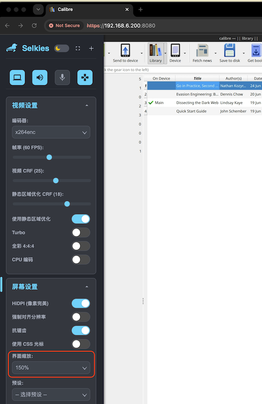

.. _selkies_scaling:

===================
Selkies屏幕缩放
===================

我在部署 :ref:`linuxserver_docker-calibre` 遇到一个问题: 显示器是4k屏幕，由于浏览器直接把物理分辨率传输给容器，导致Selkies显示的桌面应用UI和字体极小，甚至看不清文字。

实际上Selkies底层的WebRTC渲染引擎自带了物理缩放层(Scaling)，不过默认是1:1。但是可以通过侧边栏的悬浮菜单进行选项调整：

- 点击展开侧边栏，爱 ``Display Setting`` (屏幕设置)找到 **界面缩放** 功能，默认是 ``100%`` ，修改为 ``150%`` 就能完美处理4k显示器的UI显示:

Qt应用缩放
============

.. note::

   Calibre 是用 Qt 框架编写的。QT_SCALE_FACTOR=1.5 会让容器内的 Calibre 进程在渲染文本、菜单栏、图标时，直接在内存里以 1.5 倍（或 2 倍，可根据需要调整）的物理高密度进行绘制。

Linuxserver 的 Calibre 镜像底层依赖 X11 服务，可以通过注入环境参数来强制放大: 调整 ``docker-compose.yml`` 为 ``calibre-backend`` 服务添加如下环境变量:

.. literalinclude:: selkies_scaling/docker-compose.yml
   :caption: 注入Qt框架的环境变量来缩放Calibre程序
   :emphasize-lines: 8,9
   :language: yaml
