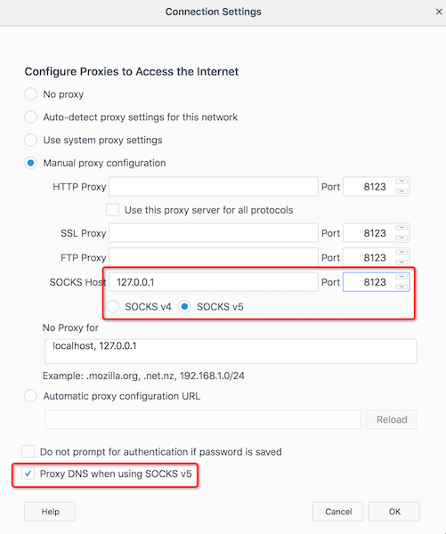

.. _ssh_tunneling_dynamic_port_forwarding:

=================================
SSH Tunneling: 动态端口转发
=================================

动态端口转发可以在本地(ssh 客户端)主机上创建一个socket作为一个SOCKS代理服务器。当客户端连接这个端口，连接就被转发到远程(ssh服务器)主机，然后被转发成为ssh服务器的动态端口，数据流就会主机转发到目标主机时显示为ssh服务器上的动态端口和IP。数据返回也会通过这个加密通道返回给连接ssh客户端上socket的应用。

这个加密隧道对于客户端程序(ssh客户端主机上的应用)是透明的，为客户端程序提供了加密VPN通道。

一条简单的命令
=================

- 在Linux, macOS 或其他Unix系统上，只需要如下命令 ( ``-D`` 参数 )::

   ssh -D [LOCAL_IP:]LOCAL_PORT [USER@]SSH_SERVER

其中参数:

  - ``[LOCAL_IP:]LOCAL_PORT`` 是本地主机IP地址和端口，如果没有提供 ``LOCAL_IP`` 则ssh客户端绑定到回环地址 ``localhost`` 
  - ``[USER@]SERVER_IP`` 远程SSH服务器地址和用户名

例如我经常使用的::

  ssh -D 8123 -C huatai@vpn.huatai.me

则建立起本地socks加密代理

设置Firefox浏览器使用代理
============================

Firefox浏览器支持通过 socks 代理访问internet，即可以通过上述ssh动态端口转发先建立加密通道。然后设置Firefox通过加密通道访问internet即可以科学上网。

不过，需要注意的是， ``ssh -D`` 构建的是socks代理，不是 ``ssl/http/ftp`` 代理，所以设置Firefox的时候需要去除 ``ssl/http/ftp`` 代理配置，只保留 ``socks`` 代理配置，否则不能正确工作。

.. note::

   必须同时配置 ``Proxy DNS when using SOCKS v5`` ，这是因为必须将DNS解析也通过加密转发通过墙外的VPS进行域名解析，以避免GFW对DNS的污染。

   现代最新版本的Firefox/Chrome都支持 ``DNS over HTTPS`` ，则启用了 ``DNS over HTTPS`` 就不许此设置。

设置操作系统网络通过socks代理
================================

通过ssh动态端口转发可以让firefox这样的浏览器通过socket代理自由访问internet （

参考
=====

- `How to Set up SSH Tunneling (Port Forwarding) <https://linuxize.com/post/how-to-setup-ssh-tunneling/>`_
