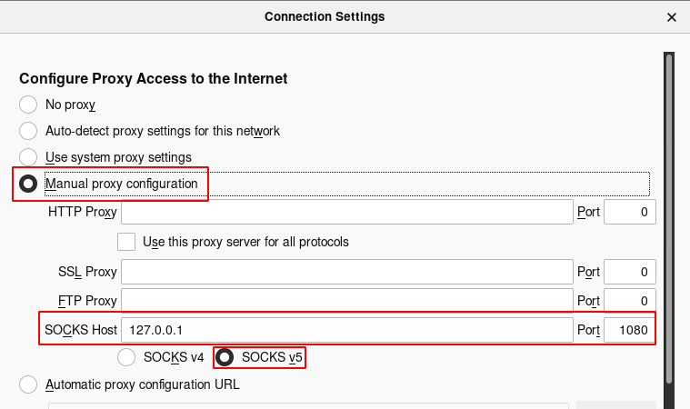

.. _ssh_tunneling_dynamic_port_forwarding:

=================================
SSH Tunneling: 动态端口转发
=================================

动态端口转发可以在本地(ssh 客户端)主机上创建一个socket作为一个SOCKS代理服务器。当客户端连接这个端口，连接就被转发到远程(ssh服务器)主机，然后被转发成为ssh服务器的动态端口，数据流就会主机转发到目标主机时显示为ssh服务器上的动态端口和IP。数据返回也会通过这个加密通道返回给连接ssh客户端上socket的应用。

这个加密隧道对于客户端程序(ssh客户端主机上的应用)是透明的，为客户端程序提供了 **加密VPN通道** 。

一条简单的命令
=================

- 在Linux, macOS 或其他Unix系统上，只需要如下命令 ( ``-D`` 参数 )::

   ssh -D [LOCAL_IP:]LOCAL_PORT [USER@]SSH_SERVER

其中参数:

  - ``[LOCAL_IP:]LOCAL_PORT`` 是本地主机IP地址和端口，如果没有提供 ``LOCAL_IP`` 则ssh客户端绑定到回环地址 ``localhost`` 
  - ``[USER@]SERVER_IP`` 远程SSH服务器地址和用户名

例如使用的:

.. literalinclude:: ssh_tunneling_dynamic_port_forwarding/ssh_tunnel_dynamic
   :caption: 执行一条命令建立起动态端口转发的翻墙ssh tunnel

则建立起本地socks加密代理

配置方法
===========

上述命令行实际上可以设置为ssh配置文件，就不需要复杂的命令:

.. literalinclude:: ssh_tunneling_dynamic_port_forwarding/ssh_config
   :caption: 配置动态端口转发的 ~/.ssh/config
   :emphasize-lines: 12

则只需要执行 ``ssh MyProxy`` 就立即建立起动态端口转发

优化配置方法
=============

我在构建 :ref:`colima_socks_proxy` 使用了本文的 ``DynamicForward`` 方式来构建SSH Tunneling。但是偶然发现在执行 ``nerdctl build`` 命令构建 :ref:`colima_images` 出现报错:

.. literalinclude:: ssh_tunneling_dynamic_port_forwarding/apt_error
   :caption: 构建镜像时出现 ``apt`` 下载错误
   :emphasize-lines: 2,7

这个报错反复出现，让我很是头疼。看起来像是GFW防火墙干扰了SSH Tunnel。询问了Gemini，提出了一些改进意见:

- ``Compression yes`` （开启压缩）是SSH基于gzip算法在CPU曾对数据进行压缩以后再传输，但是对于我的古老的 :ref:`mbp15_late_2013` 这种性能较差的老旧主机，需要瞬间分出大量时钟去解压缩数据流。而且， **压缩会显著增加TCP包的延迟(latency)** 在本来就不稳定的跨境链路上，高延迟极易出发防火墙的"超时阻断"或TCP窗口溢出，导致连接半路断开
- ``ControlMaster`` :ref:`ssh_multiplexing` 让多个独立终端窗口共享一个TCP长连接，，免去重复握手的开销。但是， ``ssh -D`` 时，所有SOCKS5流量(特别是apt会发起十几个连接)会全部从一条唯一的TCP隧道内部的通道(Channels)进行多路复用。此时如果网络波动，主干TCP连接(Master Connection)被防火墙干扰了一下，那么 ``ControlMaster`` 内部的所有子通道会 **瞬间全部卡死或产生严重的粘包**

所以针对恶劣网络环境的SSH隧道调优方案:

.. literalinclude:: ssh_tunneling_dynamic_port_forwarding/ssh_config_tunning
   :caption: **优化的** 配置动态端口转发的 ~/.ssh/config
   :emphasize-lines: 12-21

说明:

- ``ServerAliveInterval 15`` : 将探测从 60 秒缩短到 15 秒。防火墙（GFW）对于长期没有数据交互的 TCP 链接采用的是“静默丢弃”策略（直接从路由表抹除）。15 秒一次的“心跳”能极大地保住这个连接不被悄悄断掉。
- ``IPQoS throughput`` : 告诉 内核，这个 SSH 连接是用来跑大流量数据传输的，优先保证吞吐量，减少由于系统调度导致的丢包。

设置Firefox浏览器使用代理
============================

Firefox浏览器支持通过 socks 代理访问internet，即可以通过上述ssh动态端口转发先建立加密通道。然后设置Firefox通过加密通道访问internet即可以科学上网。

不过，需要注意的是， ``ssh -D`` 构建的是socks代理，不是 ``ssl/http/ftp`` 代理，所以设置Firefox的时候需要去除 ``ssl/http/ftp`` 代理配置，只保留 ``socks`` 代理配置，否则不能正确工作。

.. note::

   必须同时配置 ``Proxy DNS when using SOCKS v5`` ，这是因为必须将DNS解析也通过加密转发通过墙外的VPS进行域名解析，以避免GFW对DNS的污染。

   现代最新版本的Firefox/Chrome都支持 ``DNS over HTTPS`` ，则启用了 ``DNS over HTTPS`` 就不许此设置。

奇谈怪论: 打通中国网络运营商网络
=================================

**这是一个匪夷所思的方案** ，作为中国网络用户，不仅受到防火墙的折磨，而且还必须忍受三大电信运营商 "互联互不通" 的摧残:

我使用的是中国移动的宽带，虽然大多数国内网站还行，但是我万万没有想到 2023 年开始居然难以访问 "中国区icloud" (参考  `云上贵州是如何打败三大运营商拿下苹果iCloud大单？ <https://finance.sina.cn/2019-02-25/detail-ihrfqzka8890592.d.html?cre=wappage&mod=r&loc=3&r=9&rfunc=69&tj=none&cref=cj>`_ 云上贵州是 ``服务器从浪潮和华为采购的，云计算架构来自阿里巴巴，机房用的是三大运营商`` 的 **大杂烩** ，网络应该是三大运营商提供
`三大运营商齐了！中国联通与云上贵州签署基础设施协议 <https://www.ucloud.cn/yun/5289.html>`_ )，特别是Photos同步，几乎纹丝不动...

2023年双十一阿里云优惠云主机99元/一年，突然给了我一个启发，类似电信运营商角色的阿里云，机房虚拟机的网络到各大电信运营商的网络比个人的家用宽带要好很多。果然，简简单单使用 **动态端口转发** ，然后设置 :ref:`macos` 操作系统级别的 socks 代理通过 SSH tunnel 动态端口方式访问互联网。立刻马上，Photos同步一下子就跑满了 1MB/s ，终于可以顺畅下载iCloud数据了。

**呸!**

设置操作系统网络通过socks代理
================================

通过ssh动态端口转发可以让firefox这样的浏览器通过socket代理自由访问internet，但是并不是所有应用软件默认都会使用上述Socks代理，例如 ``npm`` 。解决这种问题，即让整个操作系统都使用 ``sockes`` 代理，需要使用第三方工具，如 ``dscoks`` (BSD/macOS) 或 ``tsocks`` (Linux)。

我现在找到了一个非常好的工具 :ref:`proxychains` ，通过hooks网络相关的libc函数，能够实现Linux软件网络连接通过  Socks4a/5  或着 HTTP代理(如 :ref:`squid` )，非常实用。

商业软件 `proxifiler <https://www.proxifier.com>`_ 提供了在Windows和Mac下的proxy client，提供了1个月试用期，每个访问代理的服务进程的监控，可以看到自己客户端每个访问连接和数据流量。此外，提供了一个规则编辑器，可以设置哪些需要代理，哪些不需要代理，确实非常方便使用。

如果简单的WEB代理方式，可以使用 :ref:`macos` 内建代理设置（在网络设置中有个Proxy设置）。但是，这个代理设置通常只有应用程序使用系统代理才能工作，例如safari浏览器就使用系统代理配置，而很多应用程序，则不会使用系统代理，例如ssh等客户端。

不过，需要注意的是， :ref:`oclp_macos` 的OCLP是基于 :ref:`python` 编写核心，上述 :ref:`macos` 内建代理设置是不生效的，所以需要 :ref:`clash-verge-rev` 来实现网络流量通过SOCKS5隧道发送。

参考
=====

- `How to Set up SSH Tunneling (Port Forwarding) <https://linuxize.com/post/how-to-setup-ssh-tunneling/>`_
