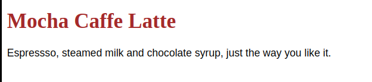

.. _css_startup:

===============
CSS快速起步
===============

CSS是一组规则，其中每条规则制定了网页中的元素及其样式:

.. literalinclude:: css_startup/css_demo.html
   :language: html
   :caption: css_demo.html 使用外部css
   :emphasize-lines: 4

.. literalinclude:: css_startup/styles.css
   :language: css
   :caption: 指定网页元素及其样式 styles.css

可以看到:

- ``css_demo.html`` 引用外部 ``styles.css`` : ``<link rel="stylesheet" href="styles.css">``
- ``styles.css`` 配置的 ``h1.drink`` 是对象 ``<h1 class="drink"></h1>`` 配置为棕色； ``p`` 对象设置字体 ``sans-serif``

显示效果如下:

   采用 styles.css 后页面显示效果

参考
=======

- `w3schools.com: HTML Styles - CSS <https://www.w3schools.com/html/html_css.asp>`_
- ``Head First JavaScript``
