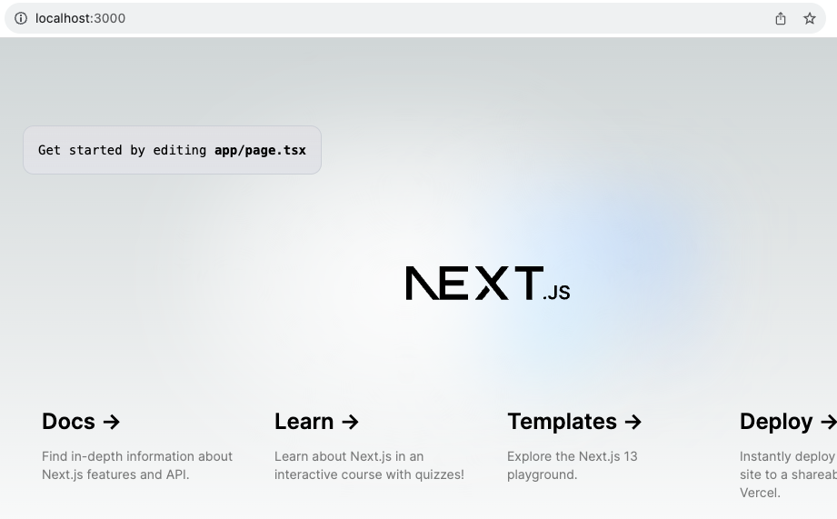

.. _install_nextjs:

===================
安装Next.js
===================

系统要求
================

运行Next.js的要求是:

- :ref:`nodejs` 16.14 或更高版本
- macOS, Windows (包括 WSL)和Linux

安装步骤
=========

安装Node.js可以采用 :ref:`nodejs_dev_env` 方法

- 安装 ``nvm`` :

.. literalinclude:: ../../nodejs/startup/nodejs_dev_env/install_nvm
   :caption: 安装 ``nvm`` 管理Node.js版本

- 安装 :ref:`nodejs` :

.. literalinclude:: ../../nodejs/startup/nodejs_dev_env/nvm_install_nodejs
   :caption: 使用 ``nvm`` 安装Node.js

自动安装
-----------

- Next.js 提供了一种自动安装方式: 直接运行 ``create-next-app`` 就会既安装软件框架包，同时又交互式创建项目(目录):

.. literalinclude:: install_nextjs/auto_install_nextjs
   :caption: 通过 ``create-next-app`` 就会既安装软件框架包，同时又交互式创建项目(目录)

此时会交互提示(这里我用了默认配置，仅输入 ``site`` 作为自己的项目名):

.. literalinclude:: install_nextjs/auto_install_nextjs_output
   :caption: 通过 ``create-next-app`` 创建了项目 ``site`` ，默认参数
   :emphasize-lines: 5-10

手工安装
-----------

- 手工安装是先安装 next.js 和 react 等:

.. literalinclude:: install_nextjs/manual_install_nextjs
   :caption: 手工安装 Next.js

然后手工创建目录结构(见官方原文，比较繁琐，我这里忽略记录)

目录
-------

通过 ``自动安装`` 之后，会形成一个项目目录，并且提供几种运行模式:

- ``dev`` : 以开发模式启动 Next.js
- ``build`` : 构建生产环境的应用
- ``start`` : 启动一个 Next.js 生产服务器
- ``lint`` : 设置 Next.js 内建的 ESLint 配置

运行
=======

- 运行 ``Next.js`` 程序的 ``dev`` 模式:

.. literalinclude:: install_nextjs/run_dev
   :caption: 运行 Next.js dev模式

此时可以使用浏览器访问 http://localhost:3000/ 可以看到一个简单页面(其中提供了一些导航到官网的文档、模版等)

创建 ``app`` 目录
==================

Next.js 使用文件系统路由( ``file-system routing`` )，也就是说如何在应用程序中路由取决于你如何组织文件:

.. literalinclude:: install_nextjs/app_tree
   :caption: 简单的 Next.js ``app`` 目录

简单的 ``app`` 目录下创建2个文件(如果是上述自动部署则已经自动创建):

- ``app/layout.tsx`` 是确定页面布局的文件:

.. literalinclude:: install_nextjs/layout.tsx
   :caption: ``app/layout.tsx``

- ``app/page.tsx`` 是页面内容

.. literalinclude:: install_nextjs/page.tsx
   :caption: ``app/page.tsx``

参考
=======

- `Jamstack - Next.js <https://jamstack.org/generators/next/>`_ Jamstack提供了很多 `Jamstack web网站案例 <https://github.com/vercel/next.js/tree/canary/examples>`_
- `next.js docs: Installation <https://nextjs.org/docs/app/getting-started/installation>`_
