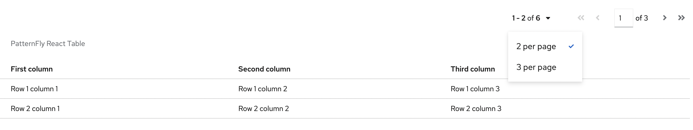

.. _patternfly_table:

==================
PatternFly 表格
==================

在TypeScript中，列被解释成一个字符串的数组或者匹配 ``ICell`` 类型的的对象数组。

ICell 是 TypeScript 接口的名称，表示 <Table> 的一个单元格。 列定义传递给 <Table> 组件的单元格属性，该属性可以采用 Array<ICell | 字符串>。

有两种列定义方式:

- 字符串数组定义列:

.. literalinclude:: patternfly_table/columnsdefinition_array_of_strings.js
   :language: javascript
   :caption: 作为字符串数组定义的列

- ICell对象数组定义列:

.. literalinclude:: patternfly_table/columnsdefinition_array_of_icell_objects.js
   :language: javascript
   :caption: ICell对象数组定义的列

代码案例
==========

.. note::

   你可以按照 `Develop a table component with PatternFly React <https://developers.redhat.com/learning/learn:patternfly-react/resource/resources:develop-table-component-patternfly-react>`_ 完整走一遍案例，可以帮助你加深理解。完成后会形成本文下面的两个代码:

   - App.js 页面渲染，采用React的 Table 和 Pagination(分页)
   - data.js 提供数据

创建以下两个js:

- index.js
- App.js 页面渲染，采用React的 Table 和 Pagination(分页)
- data.js 提供数据

代码:

.. literalinclude:: patternfly_table/index.js
   :language: bash
   :caption: index.js

代码:

.. literalinclude:: patternfly_table/app.js
   :language: bash
   :caption: app.js

代码:

.. literalinclude:: patternfly_table/data.js
   :language: javascript
   :caption: data.js

完成效果:

参考
======

- `Develop a table component with PatternFly React <https://developers.redhat.com/learning/learn:patternfly-react/resource/resources:develop-table-component-patternfly-react>`_
