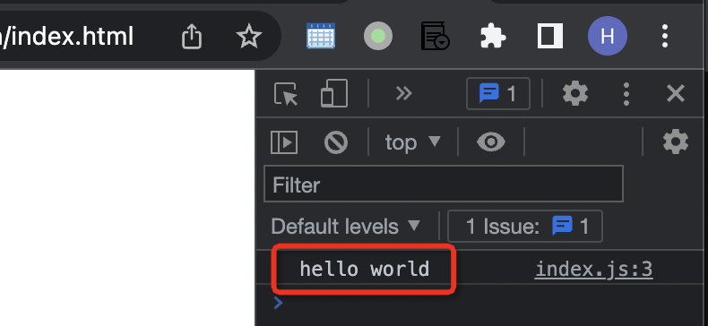

.. _first_js:

=================
第一个JavaScript
=================

作为计算机从业者，你肯定知道JavaScript是一种非二进制执行程序的解释型程序，依赖于解析起(WEB浏览器提供JavaScript解析器)运行。

OK，我也知道上述概念，但是怎么开始运行一段JavaScript脚本呢？

通常我们在浏览器中运行JavaScript，有两种方式:

- 将脚本放在HTML文档中任意位置的 ```` 元素中
- 将脚本放在外部带有 ``.js`` 扩展名的JavaScript文件中，然后在HTML文档中使用 ``<scc></src>`` 元素包含外部脚本

另外一种常见的运行方式是在控制台，例如服务器环境中运行JavaScript: 使用 :ref:`nodejs`

- 我们现在创建一个简单的 ``index.js`` :

.. literalinclude:: first_js/index.js
   :language: javascript
   :caption: 简单的终端打印 index.js ，使用index命名可以作为默认执行

命令行运行js( :ref:`nodejs` )
===============================

- 快速部署一个 :ref:`nodejs_dev_env` ，先 :ref:`install_nvm` :

.. literalinclude:: ../../nodejs/startup/nodejs_dev_env/install_nvm
   :language: bash
   :caption: 安装nvm

- 安装最新版本node:

.. literalinclude:: ../../nodejs/startup/nodejs_dev_env/nvm_install_nodejs
   :language: bash
   :caption: nvm安装node.js

啊哈，我们现在就可以开始运行JavaScript了， ``so easy`` ::

   node .

这里使用 ``.`` ，则默认运行 ``index.js``

可以指定运行::

   node index.js

都会在终端中打印出我们熟悉的 ``hello world``

在浏览器中运行JavaScript
==============================

- 创建一个 ``index.html`` 来包含上述的``index.js`` :

.. literalinclude:: first_js/index.html
   :language: html
   :caption: 引入index.js的简单index.html

.. note::

   HTML <script> ``defer`` 属性: 表示脚本和解析页面 **并行下载** ，并在 ``页面解析完成后执行``

   ``src`` 外部脚本有三种执行方法:

   - ``defer`` 脚本和解析页面并行下载，并在页面解析完成后执行脚本
   - ``async`` 脚本和解析页面并行下载，但是脚本在可用时立即执行(在解析完成前)
   - 没有属性: 立即下载并执行脚本， ``阻塞解析`` 直到脚本完成

- 使用浏览器打开 ``index.html`` ，此时看到的是一个空白页面。这是因为上面这个简单的JavaScript脚本输出信息在 ``console`` 控制台，所以需要打开浏览器的 ``developer console`` ，例如在 chrome 中

在框架内运行JavaScript( :ref:`react` )
=========================================

上述在控制台输出信息，虽然方便调试，但是显然不是面向最终用户的。在 :ref:`real` ，通常会使用框架来运行代码，这样能够不断迭代扩展运行

待续...

参考
=====

- `How to Run JavaScript Code <https://fireship.io/courses/javascript/beginner-js-where-to-run/>`_
- `Your first look at JavaScript <https://webplatform.github.io/docs/tutorials/your_first_look_at_javascript/>`_

