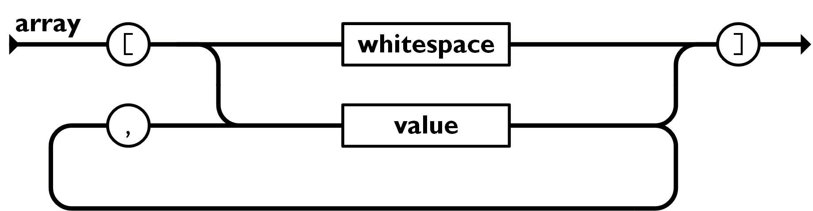

.. _json:

===============
JSON
===============

JSON(JavaScript Object Notation) 是一种轻量级的数据交换格式:

- 易于人阅读和编写
- 易于机器解析和生成

JSON 基于JavaScript Programming Language, Standard ECMA-262 3rd Edition - December 1999的一个子集，采用完全独立于语言的文本格式。

这些特性使JSON成为理想的数据交换语言: 主流语言(C, C++, C#, Java, JavaScript, Perl, Python等)都已经内置了数据结构支持(不同语言采用了不同的术语，例如字典、哈希表、有键列表等)

JSON的形式
===========

JSON数组和对象可以嵌套

JSON对象
---------

对象是一个无序的" ``名称/值`` 对" 集合。一个对象以 ``{`` 左括号 开始， ``}`` 右括号 结束。每个 ``名称`` 后跟一个 ``:`` 冒号 ；" ``名称/值`` 对" 之间使用 ``,`` 逗号 分隔:

.. figure:: ../../_static/javascript/startup/json_object.png

   JSON 对象

JSON数组
----------

数组是值(value)的有序集合，数组以 ``[`` 左中括号 开始， ``]`` 右中括号 结束。值之间使用 ``,`` 逗号 分隔。

   JSON 数组

参考
======

- `json.org > json中文 <https://www.json.org/json-zh.html>`_

