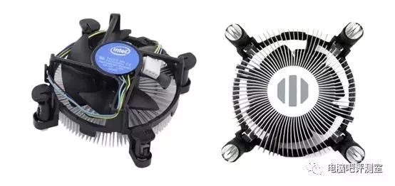
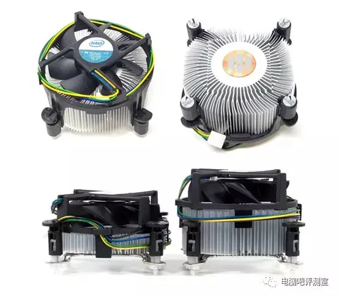
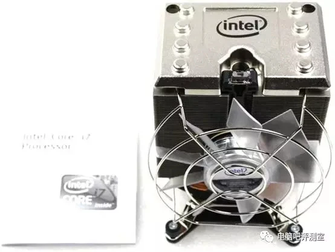
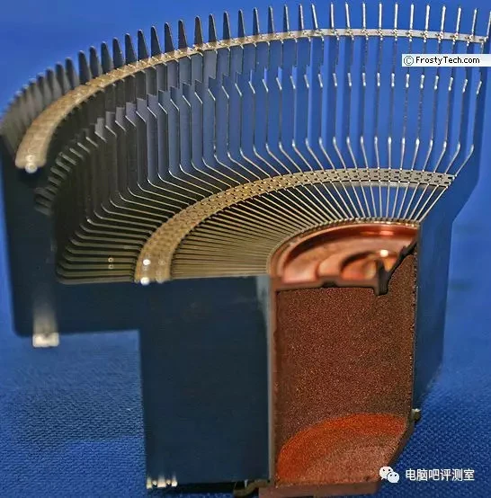
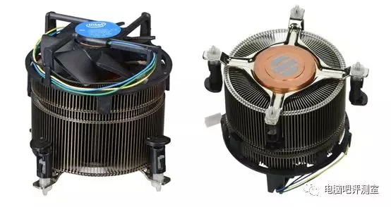
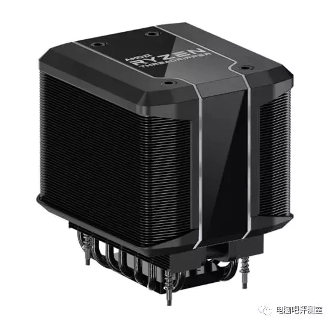
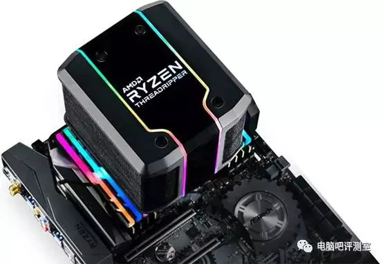
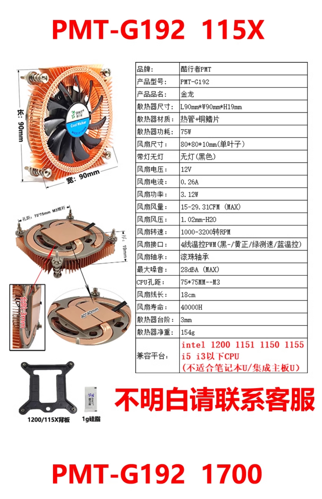
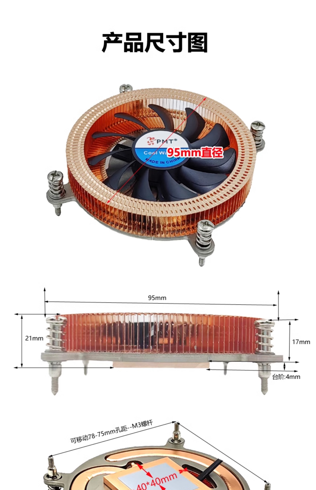
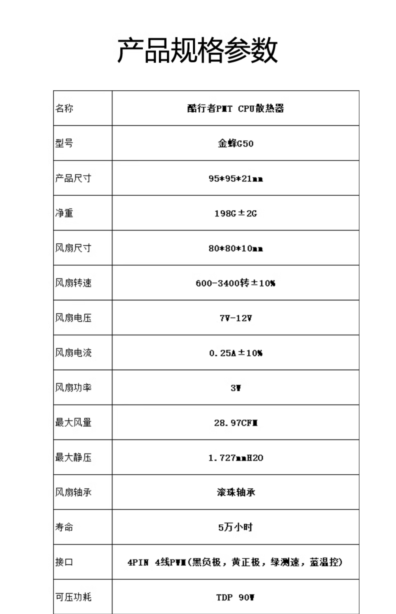

.. _cpu_fan:

=========================
CPU散热器
=========================

.. warning::

   以下Intel/AMD官方散热器摘录自 `有趣or缩水、各式各样的高颜值intel、AMD原装散热器大合集！ <https://post.smzdm.com/p/az5027xr/>`_ ，只是为了我个人对散热器有一个感性认识，以便我按图索骥选购散热器，并非全文。请阅读原文深入了解。

Intel CPU散热器
=================

Intel处理器官方配置了原装散热器:

- ``LGA115x`` TDP<=65W

- ``LGA115x`` TDP<=95W: 在纯铝散热器中心增加了一个铜芯(其实只有一个薄块)来提升散热效果(不过高功耗版本i5/i7也比较吃力)

.. figure:: ../../_static/kernel/cpu/cpu_fan_2.webp

- ``LGA1366`` TDP<=95W: 即X58旗舰平台，通过 "加厚、加大、加铜芯" 版本元转散热器 (高度应该超过了5cm)

- ``i7-98X`` TDP<=150W: X58平台的旗舰级处理器——i7-980X标配了一款四热管塔式原装散热器

- ``酷睿2至尊版散热器`` TDP<=130W: LGA775时代的酷睿2至尊版处理器（TDP≤130W）标配过一款散热器，该散热器由台达代工，除了致密的镀镍叠铝鳍片外，该散热器中心并不是单纯的“铜柱”，而是一根超粗的热管。

- ``LGA115x选配散热器`` TDP≤130W: 代号为TS15A的散热器其实是英特尔为LGA1151接口（其实是LGA115x通用）的第六代Skylake处理器推出的选配散热器，最高TDP可以支持130W。该散热器中心同样是一根超粗热管。

AMD CPU散热器
=================

规格和形制其实和Intel官方散热器相似，不过比较有特色的是 ``幽灵·撕裂者（Ripper）`` 线程撕裂者选配的官方散热器:

- 由酷冷至尊设计制造, 双塔式设计，为了兼顾内存而将风扇放在了双塔中间
- 使用了七根6毫米的纯铜热管。为了应付撕裂者庞大的面积，该散热器底部的尺寸达到了76.4×44.6毫米，可以完整覆盖整个核心
- 加入了流行的RGB灯效，顶部设计了两条长长的灯带，和二者中间AMD LOGO、Ryzen ThreadRipper字样都可以变换不同灯效

我的选择
==========

从原理上来说散热的关键:

- 导热性: 铜好于铝大约3倍，但要考虑同体积铜的质量大所以需要找超薄的散热片以降低自重
- 散热面积: 散热片表面积越大越好，也就是散热片薄且宽为好，只要风扇持续将热空气带走不累积
- 风扇叶片: 风扇叶片大则同等送风量的转速可以降低，相对就静音

考虑因素:

- ITX机箱空间狭小，而且我做了改造将主板安装到空间更小的显卡一侧，所以不能选择正常高度的散热风扇
- 选择超薄形式无形中也降低了散热器的自重，所以可以选择密度更高的纯铜材质散热器来获得更高散热效率
- 超薄散热器往往不能压制高TDP的处理器温度，但也需要考虑机箱的整体通风情况，可以通过加强机箱内部风道的空气对流来辅助散热

最初选择
----------

我最初看中的是 **PMT工厂** ``酷行者金龙CPU散热器`` 也就是ITX超薄纯铜热管CPU散热器:

我参考了这款散热器买家的评论，有人提到能够压住(我估计是机箱内部空气对流较好的环境且没有持续烤机压力的日常使用):

  - i5-12400: 基础功耗65W，最大睿频功耗117W(十二代是大小核，性能核基本频率2.5GHz,最大睿频4.4GHz)
  - i5-10400: 14nm工艺,6核心12线程，基本频率2.9GHz，最大睿频4.3GHz，TDP 65W(2020年Q2发布，比我购买的9代晚一年)
  - i5-13600: intel7工艺,14核心(性能核6，能效核8)，性能核基本频率2.7GHz，最大睿频5GHz，基础功耗65W,最大睿频功耗154W

注意到卖家宣传资料中:

  - 超薄19mm厚度
  - 支持Intel 115x i5/i3等CPU，功耗TDP ``75W`` 以下
  - 风扇转速 1000~3200转
  - 最大风量: 29.31CFM
  - 双滚珠风扇轴承

不过，考虑到我实际购买的是 :ref:`xeon_e-2274g` ，也就是 ``至强E3`` 服务器CPU，功耗TDP达到了 ``83W`` ，略微超出了这款超薄全铜CPU散热器。

最终选择
---------

**PMT工厂** 有一款比上述散热器更适合高TDP的类似散热器:

选择原因:

  - 可压功耗: TDP ``90W`` (这点非常关键，至少参数上满足我购买的 :ref:`xeon_e-2274g` ``83W`` 功耗)
  - 风扇转速 600~3400转
  - 最大风量: 28.97CFM

可以看到这款散热器适合更高TDP的CPU散热

参考
=====

- `有趣or缩水、各式各样的高颜值intel、AMD原装散热器大合集！ <https://post.smzdm.com/p/az5027xr/>`_
