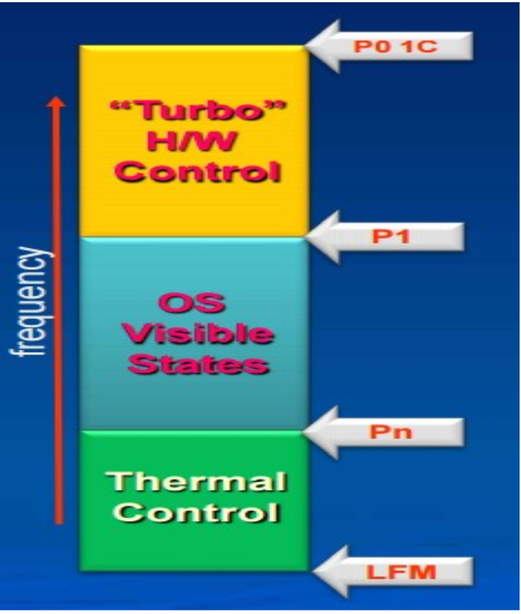
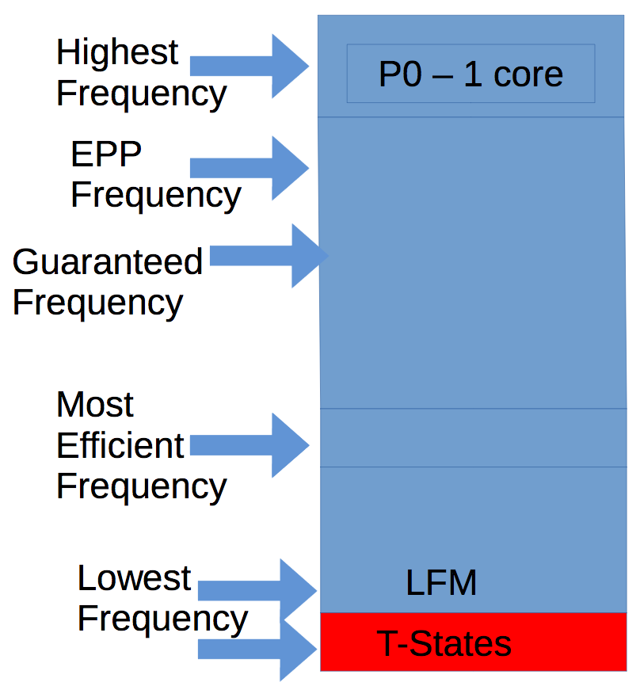
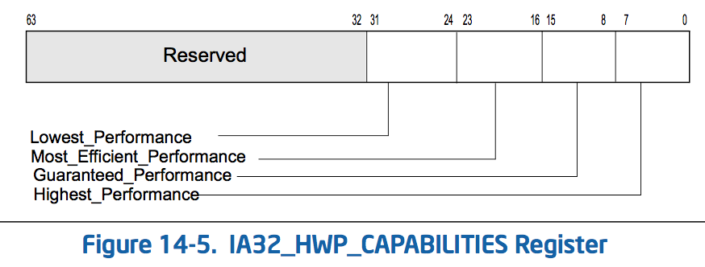

.. _cpu_p-state:

=====================
CPU p-state
=====================

.. note::

   本段为 `Balancing Power and Performance in the Linux Kernel <https://events.linuxfoundation.org/sites/events/files/slides/LinuxConEurope_2015.pdf>`_ 概要摘录

``P-state`` 是CPU频率和操作点电压的结合。

处理器性能和主频是直接相关的。增加主频可以增加处理器性。反之，即哪个低主频则降低性能。如果将主频减半，计算任务就会降低一半速度。不过，如果降低主频，但是增加CPU使用率并且降低idle时间百分比，则会影响电池使用时间。

引入 ``P-state`` 的两个主要原因是：

- 降低尖峰时热能负载
- 降低能耗

Linux内核的能耗和性能平衡
=========================

idle的不同级别
--------------

- runtime idle
- suspended
- off

激活电源管理
------------

- CPU激活电源管理（cpufreq） - P-states 或 DVFS
- 设备激活电源管理 - 一些设备支持PCIe ASPM
- GPU则自我管理

选择正确的p-state
-----------------

- 调节器(Governors)反映了用户策略决定：

  -  ``intel_pstate`` 只支持 ``powersave`` 和 ``performance`` 策略，其他驱动支持更多策略( :ref:`acpi_cpufreq` )
  -  ``intel_pstate`` 是一个调节器，并且hw驱动是一个整体，所以传统上这个governor是和hw驱动隔离的。

- ``intel_pstate`` "performance" 策略总是选择最高的 ``p-state``

  - 完全不考虑节能

- ``intel_pstate`` "powersave" 策略尝试平衡性能和节能
- ``intel_pstate`` 驱动监视使用率并能够决定何时增加或减少 ``p-state`` 。这个方式和其他governors类似。

``p-state`` 划分
=================

- ``P0 - P1`` 是 turbo范围
- ``P1 - Pn`` 是 保证范围（操作系统可见的状态）
- ``Pn - LFM`` 是 温度控制范围

   p-state划分

P-state的硬件协作
=================

- 共享相同电压域的CPU核心对一个 ``p-state`` 投票
- 每个CPU核心的最高 ``p-state`` 赢得投票
- APERF/MPERF必须用于查看哪个 ``p-state`` 被批准

..

   ``acpi_cpufreq`` 已经被废弃(Intel处理器不建议使用 :ref:`acpi_cpufreq` (OS control mode)，而是采用CPU硬件电源管理

P-state的操作系统限制
=====================

- 能力/使用率不足以决定何时伸缩
- 采样率可能导致不正确的使用计算
- 伸缩性的收益不明确

硬件P-state(HWP)
================

Intel Speed Shift Technology (HWP)

- 最有效的主频是运行时计算（Pe） - 基于系统和负载
- EPP表示Energy Performance Perference（能源执行性能优先） - 将决定如何强化算法（Pa） - 基于系统，负载，OS
- 算法将在Pa和Pe之间操作

..

   ``HWP``\ 即 Hardware P-State

   HWP

.. figure:: ../../../../_static/kernel/cpu/intel/cpufreq/hwp_msr.png
   :alt: HWP MSR
   :scale: 50

   HWP MSR

   HWP capabilities MSR

Linux实现
=========

- ``intel_pstate`` 驱动检查CPU flag
- 默认所有白名单CPU都激活
- 只支持自动模式
- 没有EPP输出
- Min和Max pstate是通过min和max perf_pct sysfs文件获取

请参考 :ref:`cpu_p-state_linux`

参考
=======

- `Intel CPUs: P-state, C-state, Turbo Boost, CPU frequency, etc. <https://vstinner.github.io/intel-cpus.html>`_
- `intel_pstate CPU Performance Scaling Driver <https://www.kernel.org/doc/html/v4.19/admin-guide/pm/intel_pstate.html>`_
- `Balancing Power and Performance in the Linux Kernel <https://events.linuxfoundation.org/sites/events/files/slides/LinuxConEurope_2015.pdf>`_ Intel开源中心提供的有关能耗和性能平衡的介绍文档
- `cpu-freq/intel-pstate.txt <https://www.kernel.org/doc/Documentation/cpu-freq/intel-pstate.txt>`_ 内核 ``intel_pstate`` 驱动说明，也是 `Balancing Power and Performance in the Linux Kernel <https://events.linuxfoundation.org/sites/events/files/slides/LinuxConEurope_2015.pdf>`_ 的一个完整阐述
- `What exactly is a P-state <https://software.intel.com/en-us/blogs/2008/05/29/what-exactly-is-a-p-state-pt-1>`_ Intel developer’s Manual: Chapter14 - power and thermal management
- `Power management architecture of the 2nd generation Intel Core microarchitecture formerly codenamed Sandy Bridge <http://www.hotchips.org/wp-content/uploads/hc_archives/hc23/HC23.19.9-Desktop-CPUs/HC23.19.921.SandyBridge_Power_10-Rotem-Intel.pdf>`_
