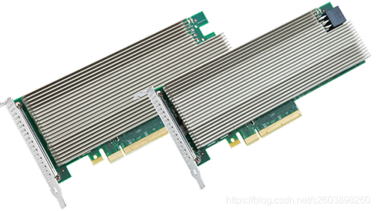

.. _intel_qat-8950:

=============================
Intel QuickAssist适配器8950
=============================

Intel QuickAssist Adapter 8950主要功能:

- Intel 的QAT技术支持IPsec， SSL协议的加解密加速和数据压缩服务
- Intel DH8955控制器具有良好的可扩展性能
- 支持 :ref:`sr-iov` 支持32个VF
- 体积小，薄型，PCIe插槽 PCIe x8 (Gen 3)

   Intel QuickAssist Adapter 8950

.. csv-table:: Intel QAT硬件参数
   :file: intel_qat-8950/tech_spec.csv

我在淘宝上购买了一块 8950-SCCP 卡，因为是已经停产淘汰产品，所以价格非常低廉，只有50元

我的想法是测试对 :ref:`zfs` , :ref:`ceph` 的加速，以及尝试对 :ref:`nginx` 的SSL卸载，至少实现部署方案来验证对负载均衡，VPN等加密解密特性。

硬件初始化
===========

- 安装 QAT 8950 之后，在主机上执行 ``lspci | grep -i qat`` 可以看到该设备:

.. literalinclude:: intel_qat-8950/lspci_output
   :caption: 通过 lspci 观察到 QAT 8950硬件    

上述输出表面QAT 8950物理链路已经建立，Linux内核通过PCIe总线枚举，成功读取到QAT 8950的芯片存储的厂商ID(8086)和设备ID(0435)，并成功为这块50W功耗的加速卡提供了初始电力。

- 检查资源分配:

.. literalinclude:: intel_qat-8950/lspci_output_vv
   :caption: 使用 ``-vv`` 参数检查指定设备 ``b5:00.0`` 的内存地址(Region)

输出显示:

.. literalinclude:: intel_qat-8950/lspci_output_vv_output
   :caption: 输出显示了QAT 8950的多个Region

- ``Region 0(64-bit, prefetchable)`` : QAT **核心控制寄存器空间**
- ``Region 2 & 4(non-prefetchable)`` : 用于SRAM或Ring Banks(工作队列)，当QAT异步处理任务(如SSL加密、解密、压缩)时，指令和结果通过这些内存区域进行高速交换
- 后续的Region 0/2: 通常是QAT 8950内部子组件(如辅助管理芯片)的映射地址

**只要上述Region信息中没有出现[disabled]或[ignored]，就表明物理链路的带宽和供电完全支持该卡全速运行**

接下来就是 :ref:`intel_qat-8960_driver` 安装和验证

参考
======

- `Intel® QuickAssist Adapter 8950 设备简介 <https://www.cnblogs.com/s2603898260/p/14624261.html>`_
- `Intel® QuickAssist Technology (Intel® QAT) <https://www.intel.com/content/www/us/en/developer/topic-technology/open/quick-assist-technology/overview.html>`_
- `英特尔QAT入门指南 <https://intel.github.io/quickassist/GSG/2.X/index.html>`_ 
