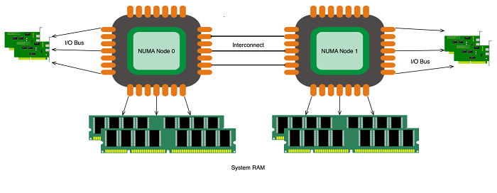

.. _intel_qat_with_numa:

=============================
结合NUMA使用Intel QAT
=============================

Intel QuickAssist Technology (Intel QAT)提供了通用 ``加密/机密`` 和 ``压缩/解压`` 高性能技术。随着Intel Xeon处理器Scale系列上市，一些服务器采用了Intel QAT onboard 作为系统平台控制Hub。所以使用好Intel QAT优化操作对于数据中心运行时非常有利的。

对于多socket服务器的非一致性内存访问( ``non-uniform memory access`` NUMA )，精心部署优化Intel QAT可以获得良好的性能优化。当使用Intel QAT设备标识，通过感应CPU拓扑(NUMA Aware)，可以智能将工作负载导入和导出Intel QAT设备通道，实现性能加速。

为什么NUMA Awareness重要?
=========================

总的来说，当服务器使用2个或更多物理处理器sockets时候，使用 NUMA awareness 对性能非常重要。每个processor socket都有自己连接访问的系统主内存和设备总线。在基于NUMA的架构中，

参考
=======

- `Use Intel® QuickAssist Technology Efficiently with NUMA Awareness <https://software.intel.com/content/www/us/en/develop/articles/use-intel-quickassist-technology-efficiently-with-numa-awareness.html>`_