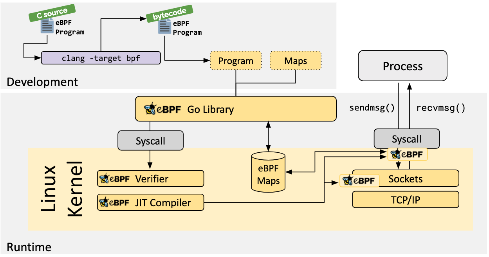

.. _ebpf_arch:

=================
eBPF架构
=================

eBPF被分为两部分: 用户空间程序 和 内核程序

- 用户空间程序负责将 BPF 字节码加载到内核汇总，如果需要，还负责读取内核返回的统计信息或事件详细信息
- 内核中的BPF字节码负责执行内核中的特定事件，并且在需要时通过映射(maps)或者 ``perf-event`` 事件将结果发送到用户空间
- 用户空间程序可以通过 ``map`` 结构与内核BPF字节码程序进行双向通信，这为在内核中运行的BPF字节码程序提供了更为灵活的控制

eBPF整体结构
===================

用户空间程序和内核中BPF字节码的交互流程:

- 使用 LLVM 或 GCC 工具将编写好的 BPF 代码程序编译成 BPF 字节码
- 使用加载器将字节码加载到内核中
- 内核使用 ``Verfier`` 组件来保护字节码的执行，避免给内核带来灾难，并在确认其安全后将字节码加载到相应的内核模块中执行
- 在内核中运行的 BPF 字节码程序可以使用两种方式将数据发送回用户空间

  - ``maps`` 方法可用于将内核中实现的统计摘要信息（例如测量延迟、堆栈信息）等传回用户空间
  - ``perf-event`` 用于将内核收集的事件实时发送到用户空间，由用户空间程序实时读取和分析

eBPF限制
==========

虽然eBPF功能强大，但是内核中的eBPF技术还是使用了很多限制以确保内核处理的安全和及时。但是随着技术的发展和演进，这些限制可能会逐步放宽或者提供了相应的解决方案:

- eBPF程序并不能随意调用内核参数，而是仅仅限制在内核模块列出的 ``BPF Helper`` 函数。不过这个支持函数列表随着内核发展而增长
- eBPF 程序不允许包含无法访问的指令，以防止加载无效代码和延迟程序终止
- eBPF 程序中的循环数量是有限的，并且必须在有限的时间内结束，这主要用于防止在 kprobes 中插入任意循环，从而导致锁定整个系统

  - 解决方案包括扩展循环和为需要循环的常见用途添加辅助函数
  - Linux 5.3 在 BPF 中包含对有界循环的支持，它在运行时具有可验证的上限

- eBPF 堆栈大小限制为 ``MAX_BPF_STACK`` ，这个值从内核5.8开始设置为 512 ; 详细参考 ``include/linux/filter.h`` 

  - 当在堆栈上存储多个字符串缓冲区时，此限制特别相关: 一个 char[256] 缓冲区将消耗此堆栈的一半
  - 注意: 没有增加这个限制的计划 -- 解决方案是切换到 bpf 映射存储，这实际上是无限的

- eBPF字节码大小最初限制为 4096 条指令，但从内核 Linux 5.8 开始，现在已经放宽到 100 万条指令（ ``BPF_COMPLEXITY_LIMIT_INSNS`` ）详细参考 ``include/linux/bpf.h``

  - 4096 条指令限制（ ``BPF_MAXINSNS`` ）仍然是 保留给非特权 BPF 程序
  - 新版本的eBPF还支持级联调用多个eBPF程序(不过传递信息方面存在一定限制)，可以组合起来实现更多强大功能

参考
=======

- `Introduction to eBPF <https://houmin.cc/posts/2c811c2c/>`_ !  **向原著者致敬** 并学习
