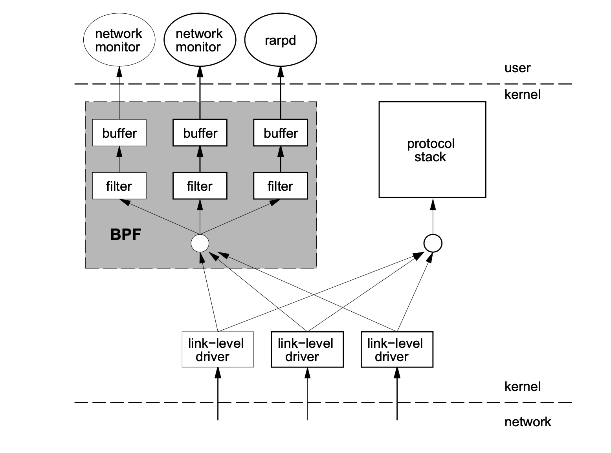

.. _intro_ebpf:

===============================
eBPF简介
===============================

eBPF源自 BPF ( `Berkeley Packet Filter <https://en.wikipedia.org/wiki/Berkeley_Packet_Filter>`_ 伯克利数据包过滤器  ) ，本质上是内核中一个高效灵活等虚拟类虚拟机组件，可以以一个安全方式在内核挂钩点(kernel hook points)执行字节码。

.. note::

   BPF ( `Berkeley Packet Filter <https://en.wikipedia.org/wiki/Berkeley_Packet_Filter>`_ 伯克利数据包过滤器 )是计算机操作系统中用于分析网络流量的程序技术。BPF为数据链路层提供了一个原始接口，允许发送和接收原始数据链路层数据包。

   BPF 支持过滤数据包，允许用户空间进程提供一个过滤程序来指定它想要接收的数据包。例如，tcpdump 进程可能只想接收启动 TCP 连接的数据包。 BPF 只返回通过进程提供的过滤器的数据包。这避免了将不需要的数据包从操作系统内核复制到进程中，从而大大提高了性能。过滤程序采用虚拟机指令的形式，通过即时（JIT）机制解释或编译成机器代码并在内核中执行。

BPF最初为了高效的网络数据过滤，但是eBPF经过重新设计，不再局限于网络堆栈，而是成为内核的顶级子系统，演变成一个通用的执行引擎(general-purpose execution engine)。开发人员可以基于eBPF开发性能分析工具(performance analysis tools / ref:`performance` )，软件定义网络(SDN)，安全等诸多场合。

技术背景
=========

1992 年，Steven McCanne 和 Van Jacobson 写了一篇题为 `BSD Packet Filter: A New Architecture for User-level Packet Capture <http://www.tcpdump.org/papers/bpf-usenix93.pdf>`_  的论文。在论文中，作者描述了他们如何在 Unix 内核中实现网络包过滤，这是一种比当时最先进的包过滤技术快 20 倍的新技术。

BPF在包过滤方面引入了两大创新:

- 新型的虚拟机 (VM) 设计，可在基于寄存器的架构的 CPU 上高效运行。
- 应用程序使用缓存仅复制与过滤数据包相关的数据，而不是所有数据包的信息，这最大限度地减少了 BPF 处理的数据量。

由于这些巨大的改进，所有的 Unix 系统都选择使用 BPF 作为网络包过滤技术，直到今天，许多 Unix 内核（包括 Linux 内核）的衍生产品仍然使用这种实现。

2014 年初，Alexei Starovoitov 实现了eBPF(扩展伯克利包过滤器)。经过重新设计，eBPF 演变成一个通用的执行引擎，可以在其上开发性能分析工具、软件定义网络(SDN)和许多其他场景。 eBPF 最早出现在 3.18 内核中，从那时起最初的 BPF 就被称为经典 BPF（cBPF）。 cBPF 现在在很大程度上已被弃用。现在，Linux 内核只运行 eBPF，内核在执行之前透明地将加载的 cBPF 字节码转换为 eBPF。

eBPF的新设计针对现代硬件做了优化，因此eBPF生成的志林集比旧有的BPF解释器生成的机器码执行得更快。eBPF还增加了虚拟机中的寄存器数量，将原先的2个32位寄存器增加到10个64位寄存器。由于寄存器的数量和宽度增加，开发人员可以更加自由地交换更多信息，并且使用函数参数编写更为复杂的程序。总之，这些改进使得eBPF比原始的BPF快了4倍。

2014年6月，eBPF被扩展到用户空间，这是eBPF技术的转折点。这使得eBPF不再局限于网络栈，而成为了内核的顶层子系统。

与直接修改内核和编写内核模块相比，eBPF 提供了一个新的内核可编程选项:

- eBPF 程序架构强调安全性和稳定性，看起来更像是一个内核模块
- 但是与内核模块不同的是，eBPF 程序不需要重新编译
- 正因为eBPF不是内核模块，所以eBPF程序不会导致系统崩溃

基于ebpf的监控系统
=====================

随着 :ref:`kubernetes` 迅速发展，类似 :ref:`cilium` 和 :ref:`calico` 的网络底层都引入了ebpf作为管控和监控的基础，也涌现了不少基于ebpf的 :ref:`opentelemetry` 实现:

- :ref:`cilium` + :ref:`cilium_hubble` 实现了完整的网络基础架构以及流量观察
- `netdata <https://github.com/netdata/netdata>`_ 安装在节点的agent提供了分布式监控引擎(GPL v3+开源协议)，不过企业级的云计算和Dashboards UI非开源
- `openflow <https://github.com/deepflowio/deepflow>`_ 国内的开源监控项目(Apache 2.0开源协议)，其架构采用了经典的agent采集，server存储到clickhouse，以及结合了现有开源 :ref:`grafana` :ref:`prometheus` :ref:`opentelemetry` ``skywalking`` , :ref:`kafka` 实现展示
- `pixie <https://github.com/pixie-io/pixie>`_

参考
========

- `Introduction to eBPF <https://houmin.cc/posts/2c811c2c/>`_ !  **向原著者致敬** 我最初google到的文章是 `Introduction and practice of eBPF <https://www.sobyte.net/post/2022-04/ebpf/>`_ 非常详尽，我最初以为是英文原著，花费了很多时间翻译。但随着深入阅读，我发现该文作者使用了腾讯云虚拟机并且代码中夹杂中文，所以这篇文章应该是国人著作被翻译成英文。经过了文档蛛丝马迹的搜索(中文互联网copy&paste抹去了太多原著者的痕迹)，终于找到原文(如果没有搞错): `Introduction to eBPF <https://houmin.cc/posts/2c811c2c/>`_ !  **向原著者致敬** 

  - 这篇原文作者 Houmin 写于 2021-03-27 ，我最近才发现原来 2022年 该文被多个网站转载(但没有注明出处)，如 CSDN运维之美(无出处) `万字干货，eBPF 中文入门指南 <https://blog.csdn.net/easylife206/article/details/124054193>`_ 和 云原生实验室(比较厚道,保留了Houmin作者名) `eBPF 完全入门指南.pdf（万字长文） <https://mp.weixin.qq.com/s/zCjk5WmnwLD0J3J9gC4e0Q>`_

我准备进一步从eBPF官网获取原生技术资料，期待能更进一步掌握和深入eBPF技术

- `CFC4N的博客 <https://www.cnxct.com>`_ 美团信息安全研发，对ebpf有很多翻译和研究的博客，非常赞

- `aya-rs/aya <https://github.com/aya-rs/aya>`_ 是针对 Rust 开发的eBPF库，有详细的开发参考文档 `Aya Book <https://aya-rs.dev/book/>`_ 可以作为学习 :ref:`rust` 和 :ref:`ebpf` 的参考

- `Linux Extended BPF (eBPF) Tracing Tools <http://www.brendangregg.com/ebpf.html>`_
- `eBPF Documentation: What is eBPF? <https://ebpf.io/what-is-ebpf/>`_
