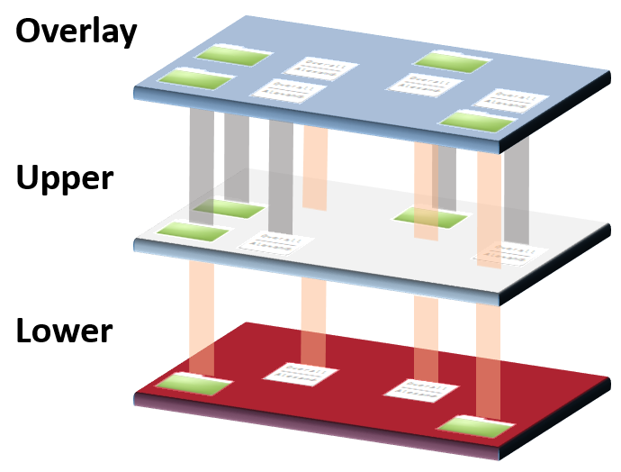

.. _overlayfs:

==================
OverlayFS文件系统
==================

OverlayFS是一种union文件系统，允许在一个文件系统之上再部署一个文件系统，通过修改上层文件系统，可以保持底层的文件系统不被修改。例如，可以让多个用户共享一个文件系统镜像，诸如容器或一个DVD-ROM，底层镜像是一个只读介质。

简单的理解OverlayFS方法是想象以下图景:

- ``Overlay`` 层是 ``Upper`` 层 和 ``Lower`` 层的叠加
- ``Lower`` 层 **目录** 是 ``只读`` 的
- 在 ``OverlayFS`` 中访问文件，首先从 ``Upper`` 层获取文件，如果文件不存在则从 ``Lower`` 层获取文件
- 需要注意，对于Linux内核依然能够直接访问 ``Upper`` 和 ``Lower`` 两个原始目录，但是对于应用程序则有访问限制
- 修改  ``Upper`` 层的目录和常规没有不同，但是修改 ``Lower`` 层则会在 ``Upper`` 目录创建一个副本

Docker和OverfsFS
====================

OverlayFS只作为Docker graph driver，只支持作为容器COW内容，而不能作为持久化存储(OverlayFS性能很差)。所有持久化存储必须存储到非OverlayFS卷，默认Docker配置就使用OverlayFS。此外，底层和上层使用相同文件系统，所以需要注意:

- XFS作为 ``Backing Filesystem`` 时，必须激活 ``d_type=true`` ，也就是格式化时候使用参数 ``-n ftype=1`` ，案例请参考 :ref:`xfs` 实践案例
- Docker的OverlayFS实践见 :ref:`docker_overlay_driver`

参考
======

- `Explaining OverlayFS – What it Does and How it Works <https://www.datalight.com/blog/2016/01/27/explaining-overlayfs-–-what-it-does-and-how-it-works>`_
- `Red Hat Enterprise Linux77.2 Release NotesChapter 21. File Systems <https://access.redhat.com/documentation/en-us/red_hat_enterprise_linux/7/html/7.2_release_notes/technology-preview-file_systems>`_
- `Kernel document: overlayfs.txt <https://www.kernel.org/doc/Documentation/filesystems/overlayfs.txt>`_
- `Use the OverlayFS storage driver <https://docs.docker.com/storage/storagedriver/overlayfs-driver/>`_
