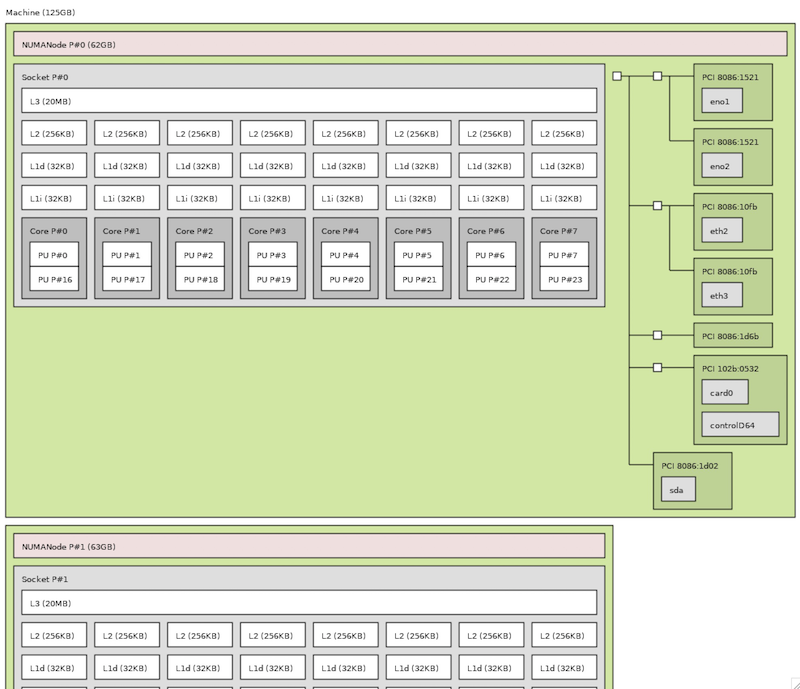

.. _lstopo:

===================
lstopo显示系统拓扑
===================

- 安装软件包::

   yum install hwloc hwloc-gui

.. note::

   ``hwloc`` 软件包提供了获取 ``lstopo`` 工具可以检查系统拓扑，并且该工具支持字符和图形界面运行(图形更为形象)

   lstopo (图形工具) 命令在 :ref:`amd_zen` 国产化海光处理器上，似乎不能正确显示(字符命令可以)，可能和版本有关。

- 检查服务器拓扑:

   lstopo

如果本地有图形界面，或者使用远程X Window ( :ref:`remote_x_from_mac` ) ，则会看到类似下面的拓扑结构图，显示出处理器的缓存:

如果是字符界面，显示如下:

.. literalinclude:: lstopo_2_numanode.output
    :language: bash
    :linenos:
    :caption:

- 对应我们使用 ``numactl`` 检查::

   numactl --hardware

可以看到如下numa节点::

   available: 2 nodes (0-1)
   node 0 cpus: 0 1 2 3 4 5 6 7 16 17 18 19 20 21 22 23
   node 0 size: 63891 MB
   node 0 free: 1222 MB
   node 1 cpus: 8 9 10 11 12 13 14 15 24 25 26 27 28 29 30 31
   node 1 size: 64463 MB
   node 1 free: 1512 MB
   node distances:
   node   0   1
     0:  10  21
     1:  21  10
