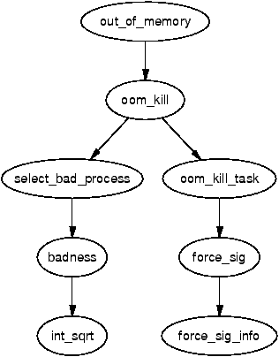

.. _oom_manager:

==========================
Out Of Memory (OOM) 管理器
==========================

Linux虚拟内存管理器(Linux Virtual Memory Manager)在处理内存不足(Out Of Memory)有一整套处理逻辑

检查可用内存
===============

对于某些操作，例如使用 ``brk()`` 扩展堆或使用 ``mremap()`` 重新映射地址空间，系统将检查是否有足够的可用内存来满足请求。

检查可用内存时，所需 ``内存页数量`` 作为参数传递给 ``vm_enough_memory()`` 。 除非系统管理员指定系统应该过量使用内存( :ref:`overcommit-accounting` )，否则将检查主机实际安装的物理内存。

为了确定有多少页可能可用，Linux 汇总了以下数据:

- 总页面缓存(total page cache): 作为页面缓存(page cache)很容易回收
- 可用页面总数(total free pages): 因为它们已经可用
- 可用交换页总数(total free swap pages): 用户空间页可能会被调出
- 由 ``swapper_space`` 管理的总页数(total pages): 会重复计算空闲交换页
- ``dentry`` 缓存使用的总页数(total pages): 因为容易回收
- ``inode`` 缓存使用的总页数(total pages): 因为容易回收

如果上述内存页总数(total pages)满足要求，则 ``vm_enough_memory()`` 返回 ``true`` 。如果返回 ``false`` ，调用者就知道内存不可用，通常决定将 ``-ENOMEM`` 返回给用户空间。

判断OOM状态
============

当机器内存不足时，旧的页面帧( ``old page frames`` )将被回收。不过即使回收页面，也可能会发现无法释放足够的内存页来满足请求。如果确实无法释放页面帧，就调用 ``out_of_memory()`` 以检查系统是否内存补足并需要终止进程:


   
   ``out_of_memory()`` 逻辑

不过，系统有可能并不是内存不足，而是要等待IO完成或者内存页交换回磁盘。这种情况下，因为 ``out_of_memory()`` 函数不必要地调用导致打开的进程可能被杀死。所以，在决定终止进程之前，系统还会做以下判断:

- 是否有足够的交换空间: ``nr_swap_pages > 0`` ? 如果有充足交换空间，则 **不触发** ``OOM``
- 是否距上次内存页释放失败超过 ``5秒`` : 也就是间隔5秒以上的内存页释放失败 **不触发** ``OOM``
- 最后1秒失败么？ : 如果不是最后一秒失败，就 **不触发** ``OOM``
- 最后5秒连续失败10次么？ : 如果不是连续失败(5秒10次)，就 **不触发** ``OOM``
- 最后5秒是否有进程被终止(意味着已经释放出一定内存空间)? : 如果近期(5秒内)有进程终止(并释放出内存)，就 **不触发** ``OOM``

只有上述逻辑都校验通过，才会调用 ``oom_kill()`` 来选择要杀死的进程

选择进程(杀死)
===============

函数 ``select_bad_process()`` 负责选择要杀死的进程。 它通过逐步执行每个正在运行的任务并计算它是否适合使用函数 ``badness()`` 来决定。

badness的计算方式如下，注意平方根是用 ``int_sqrt()`` 计算的整数近似值::

   badness_for_task = total_vm_for_task / (sqrt(cpu_time_in_seconds) * sqrt(sqrt(cpu_time_in_minutes)))

上述计算公式的目的是: **选择一个使用大量内存但寿命不长的进程** (运行时间长的进程不太可能是内存不足的原因)

- 如果该进程是 ``根进程`` 或具有 ``CAP_SYS_ADMIN`` 功能，则分数除以 ``4`` ，因为假定根权限进程运行良好
- 如果它具有 ``CAP_SYS_RAWIO`` 功能（访问原始设备）特权，则该点将进一步除以 ``4`` ，因为不希望终止可以直接访问硬件的进程

杀掉选中的进程
===============

选择任务后，将再次遍历列表，并向与所选进程共享相同 ``mm_struct`` 的每个进程（即它们是线程）发送一个信号。

如果进程具有 ``CAP_SYS_RAWIO`` 功能，则发送 ``SIGTERM`` 以使进程有机会干净地退出，否则发送 ``SIGKILL`` 。

Kernel 2.6对OOM的处理机制
==========================

OOm Manager在Kernel 2.6引入了VM记账对象(VM accounted objects)，这些是标有 ``VM_ACCOUNT`` 标志的VMA。内核进行额外检查以确保设置 ``VM_ACCOUNT`` 标志的VMA上执行操作时有可用内存。这个复杂的设计的主要目的是避免需要 OOM killer。

始终设置了 ``VM_ACCOUNT`` 标志的一些区域是:

- 进程堆栈(process stack)
- 进程堆(process heap)
- 使用 ``MAP_SHARED`` 进行 ``mmap()`` 处理的区域
- 可写的私有区域(private regions)
- 设置了 ``shmget()`` 的区域

也就是大多数用户空间映射都设置了 ``VM_ACCOUNT`` 标志

Linux使用 ``vm_acct_memory()`` 计算提交给这些VMA的内存量，此时内核会递增一个名为 ``committed_space``` 的变量。当释放VMA时，使用 ``vm_unacct_memory()`` 来减少这个值。这是一个相当简单的机制，但是允许Linux在决定是否应该提交更多内存时记住已经提交到用户空间的存量。

检查内存使用量则通过调用 ``security_vm_enough_memory()`` 。Kernel 2.6允许与安全相关的内核模块覆盖某些内核函数。完整的hook列表存在名为 ``security_ops`` 结构的 ``security_operations`` 中。

参考
======

- `Mel Gorman's book "Understanding the Linux Virtual Memory Manager" : Chapter 13  Out Of Memory Management <https://www.kernel.org/doc/gorman/html/understand/understand016.html>`_
