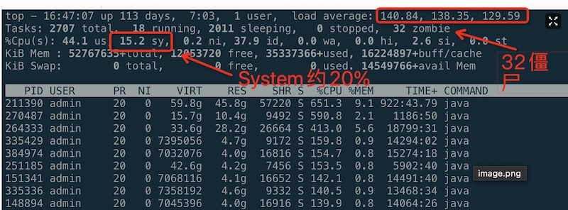
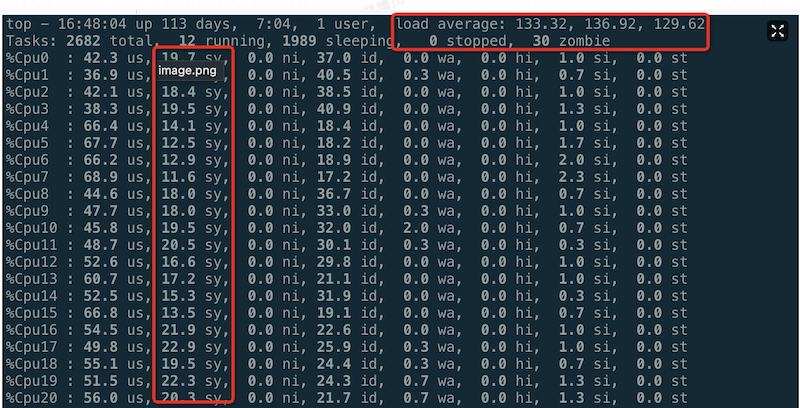

.. _debug_high_sys_process:

===============================
debug占用很高system的进程
===============================

在排查线上系统负载过高时( ``top`` 显示load )，发现CPU实际上还有空闲(idle约40%)，然而Load极高，并且CPU使用率中 ``use`` 仅占 ``40%`` ，剩下的CPU资源约有20%被 ``system`` 吃掉了:

按一下 ``1`` 可以看到每个CPU核心都有极高(20%)的sys消耗:

- 使用 ``sar`` 命令可以概括上述统计信息::

   sar -u 5

显示::

   Linux 4.19.91-007.ali4000.alios7.x86_64 (haiguangxdn011070025023.stl)   08/10/2021      _x86_64_        (128 CPU)

   04:54:06 PM     CPU     %user     %nice   %system   %iowait    %steal     %idle
   04:54:11 PM     all     43.73      0.01     18.10      0.00      0.00     38.16
   04:54:16 PM     all     40.95      0.00     16.54      0.00      0.00     42.50
   04:54:21 PM     all     41.53      0.01     15.76      0.00      0.00     42.70
   04:54:26 PM     all     45.41      0.00     18.05      0.00      0.00     36.53
   04:54:31 PM     all     37.84      0.00     15.65      0.00      0.00     46.51
   04:54:36 PM     all     37.46      0.24     16.84      0.00      0.00     45.46
   04:54:41 PM     all     39.63      0.59     19.08      0.00      0.00     40.70
   04:54:46 PM     all     41.19      0.13     17.72      0.00      0.00     40.96
   04:54:51 PM     all     39.89      0.13     16.74      0.00      0.00     43.24
   04:54:56 PM     all     41.42      0.01     16.46      0.00      0.00     42.10
   ^C

   04:55:10 PM     all     42.26      0.01     18.18      0.00      0.00     39.54
   Average:        all     41.30      0.09     17.40      0.01      0.00     41.20