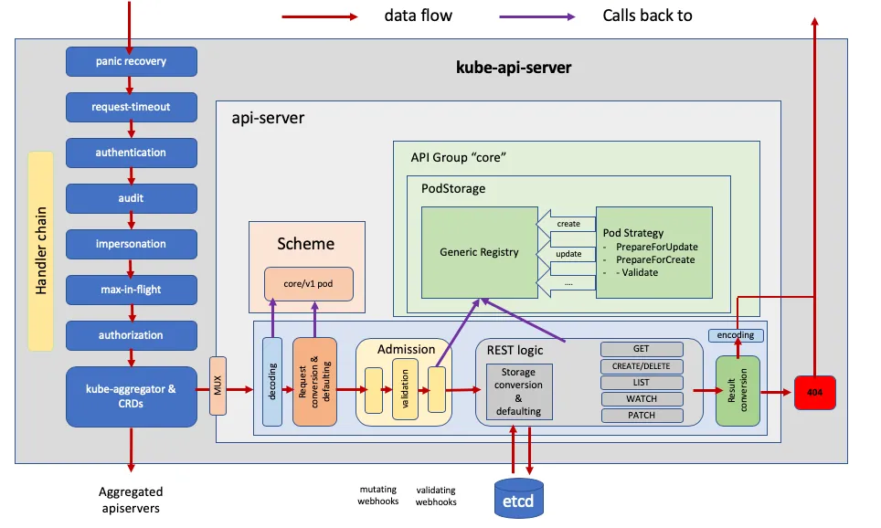

.. _apiserver_request-timeout:

==================================
Kubernetes apiserver 请求超时设置
==================================

   API Server请求处理链路

``--request-timeout`` 参数设置Kubernetes apiserver的全局连接超时时间。这个设置调整可以允许API服务器的请求超时限制延长到适合用户连接速度的持续时间。默认设置是 ``60秒`` ，在比较慢的连接上可能会出现问题: 也就是一旦请求的数据量超过60秒内可以传输的数据量，就会导致集群资源无法访问。但是，如果将这个超时设置调整太大，可能会耗尽API服务器的资源，从而容易遭受拒绝服务攻击(Denial-of-Service attack)。所以，这个参数应该合理设置，并且仅在需要时才更改 ``60秒`` 默认设置。

如果请求超时，客户端将收到错误，则客户端可能会重试请求或相应处理失败。注意，如果客户端因为超时不断重试，反而会加重API服务器的负载，所以设计好的客户端需要有一个自动机制避免不断重复请求。此外，正确配置这个超时参数，能够恰好满足客户端数据下载，同时不至于过分增加API服务器的负担，这对确保Kubernetes集群及其组件的稳定运行非常重要。

调整案例:

.. literalinclude:: apiserver_request-timeout/kube-apiserver_request-timeout.yaml
   :language: yaml
   :caption: 调整 ``kube-apiserver`` 默认运行参数 ``--request-timeout``
   :emphasize-lines: 14

修订apiserver的运行pod配置文件是 ``/etc/kubernetes/manifests/kube-apiserver.yaml``

.. note::

   在大规模的Kubernetes集群，大量的数据传输，上述 ``--request-timeout`` 可能需要调整为 ``5m0`` 或者 ``10m0``

参考
======

- `Ensure the --request-timeout argument is set appropriately <https://docs.bridgecrew.io/docs/ensure-that-the-request-timeout-argument-is-set-as-appropriate>`_
- `DevOps in K8s — API-Server Request Handler Chain, Request Timeout <https://blog.devgenius.io/devops-in-k8s-api-server-request-handler-chain-request-timeout-b0cf597ddcb2>`_
