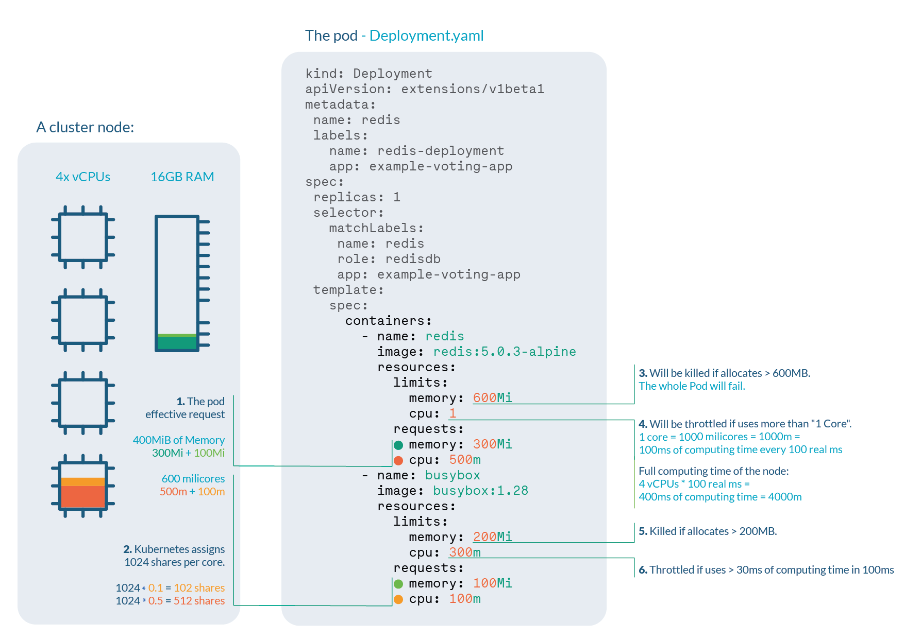
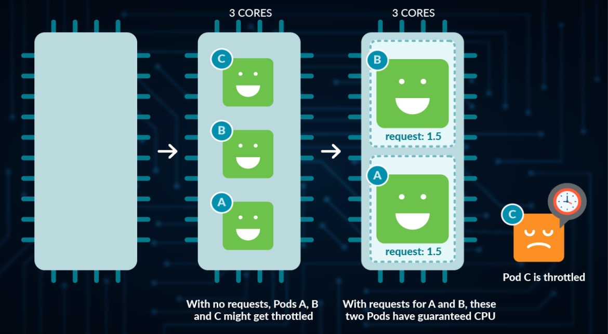

.. _resource_management_for_pods_containers:

=================================
Pod和Container的资源管理
=================================

在定义 ``pod`` 可以选择为每个 ``container`` 设置所需的资源数量:

- CPU
- 内存
- 其他资源

.. _k8s_limits_and_requests:

Kubernetes的 ``limits`` 和 ``requests``
==========================================

- ``requests`` : 当为 ``pod`` 的 ``containter`` 指定了资源( 也就是 ``request`` )， ``kube-scheduler`` 就根据这个配置信息将Pod调度到合适的节点
- ``limits`` : 当为 ``container`` 指定了资源 **限制** ( 也就是 ``limits`` )， ``kubelet`` 就能确保容器不会使用超出限制的资源，并且还会为容器预留 **请求** ( ``requests`` )数量的系统资源供其使用

注意 ``requests`` 决定了Pod的调度，如果 ``requests`` 超出了集群中所有节点中任意节点的最大可供资源，就会导致调度失败。此时 ``pods`` 会保持在 ``pending`` 状态

当集群节点资源满足 ``pods`` 的 ``requests`` 要求，则pod会被调度到合适节点。此时，如果运行的 ``pods`` 使用的内存资源超过 ``limits`` 配置，就会触发 :ref:`k8s_exit_code_137` 

Kubernetes 中的资源单位
=======================

CPU 资源单位
--------------

CPU资源可以是整数或小数，其中小数 ``0.1`` 表示 ``100 millicpu`` 也就是 100毫 cpu core，也就是一个物理/虚拟 CPU 的 10% 计算能力。

CPU资源的最小设置精度是 ``1m`` ，例如，设置 ``5m`` CPU资源

内存资源单位
---------------------

内存的限制和请求以字节为单位，此时可以使用普通的整数:

- 使用 E、P、T、G、M、k 表示内存(以1000为单位跨度)
- 使用 2 的幂数： Ei、Pi、Ti、Gi、Mi、Ki ( **建议** 更为精确)

以下表示大致相同的值::

   128974848、129e6、129M、128974848000m、123Mi

.. note::

   注意内存资源分配的后缀是有大小写区别的， ``M`` 和 ``m`` 不同: 如果设置 ``400m`` 表示的 **不是** ``400Mi`` 字节，而是 ``0.4`` 字节( 因为在Kubernetes资源配置中，小写的 ``m`` 表示 ``毫`` )

配置资源
=========

**案例** : 物理主机是 4 cores 16GB 内存节点

.. literalinclude:: resource_management_for_pods_containers/deployment_resources.yaml
   :caption: 配置资源案例: ``limits`` 和 ``requests``

   解析资源配置( ``请放大图示，非常形象`` )

- **Pod effective request** (Pod的有效请求): ``400Mi`` 内存 + ``600m`` (毫core) CPU (注意是pod中2个container的 ``requests`` 累加)，也就是说集群节点必须具备这些资源才能调度上这个pod
- **CPU shares** : 由于Kubernetes总是对每个CPU core标记为 ``1024`` 个 **CPU shares** ，所以实际上上述 ``requests`` 设置的资源是 ``1024 * 0.5 cores = 512`` (redis) 和 ``1024 * 0.1 cores = 102`` (busybox)
- 注意 ``limits`` 是针对每个 ``containers`` 的:

  - 当 redis 使用内存超出 ``600Mi`` ( ``limits`` )就会触发 OOM killed ( :ref:`k8s_exit_code_137` )
  - 当 busybox 使用内存超出 ``200Mi`` ( ``limits`` )也会触发 OOM killed

- CPU节流 ( **CPU throttle** )

  - CPU计量单位以 ``100ms`` 为细粒度
  - 配置中 redis 的 CPU limits 是 ``1`` ，表示在 ``100ms`` 内如果尝试使用完整的 ``100ms`` CPU(注意，对于4 CPU，则表示 ``每100ms`` 实际可用CPU时间片是 ``400ms`` )，就会遇到 **性能降级** (performance degradation)
  - 配置中 busybox 的 CPU limitis 是 ``300m`` 表示在 ``100ms`` 内如果尝试使用 ``30ms`` CPU(对于4 CPU，则表示 ``每100ms`` 实际可用CPU时间片是 ``120ms`` ) 也会遇到 **性能降级**

requests是资源保障
---------------------

- 下图形象地表示了，如果 3 个pods 都没有设置 ``request`` 系统会平均分配CPU资源，但是如果 2个 pods配置了 ``requests`` 则系统会优先保障这两个设置了 ``requests`` 的pods运行，而导致没有配置 ``requests`` 被挤出资源:

   配置了 ``requests`` 的容器有资源保障，可以挤压没有 ``requests`` 保障的容器

- 下图形象地表示了，Pod B设置了内存 ``requests`` 保障，Pod A设置了内存 ``limits`` 限制，当资源使用上涨后，受到限制的Pod A会被OOM killed

   配置了 ``requests`` 内存的容器有保障，配置了 ``limits`` 内存限制的容器在超限之后会被OOM Killed

Namespace ResourceQuota
===========================

.. note::

   ``Namespace ResourceQuota`` 是指租户所能分配的 ``累计`` **总的资源限制** ，非常方便给某个租户分配总的计算资源限制: 在这个资源范围内，租户可以任意分配，但是 **总量** 不能超出限制!!!

通过 ``namespaces`` ，可以以资源池方式设置不同组(也称为 **租户** ``tenants`` )的内存或CPU资源，此时创建pod到这个namespce时不能超出已有的Quota，否则会被拒绝:

.. literalinclude:: resource_management_for_pods_containers/namespace_resourcequota.yaml
   :language: yaml
   :caption: 限制namespace的资源配置

然后向指定namespace应用这个quota设置:

.. literalinclude:: resource_management_for_pods_containers/namespace_resourcequota_apply
   :language: bash
   :caption: 应用限制namespace的资源配置

可以检查namespace的ResourceQuota:

.. literalinclude:: resource_management_for_pods_containers/namespace_resourcequota_get
   :language: bash
   :caption: 检查限制namespace的资源配置

如果创建pod没有提供明确的资源限制配置，也会出现错误::

   Error from server (Forbidden): error when creating "mypod.yaml": pods "mypod" is forbidden: 
   failed quota: mem-cpu-demo: must specify limits.cpu,limits.memory,requests.cpu,requests.memory

如果创建pod时 **累计总量** 超出namespace配置的ResourceQuota，会收到如下错误::

   Error from server (Forbidden): error when creating "mypod.yaml": pods "mypod" is forbidden: 
   exceeded quota: mem-cpu-demo, requested: limits.memory=2Gi,requests.memory=2Gi, 
   used: limits.memory=1Gi,requests.memory=1Gi, limited: limits.memory=2Gi,requests.memory=1Gi

Namespace LimitRange
========================

``ResourceQuotas`` 是针对namespace的 **总** 资源分配，那么限制单独每个对象的资源策略，就需要使用 ``Limitranges`` :

.. literalinclude:: resource_management_for_pods_containers/namespace_limitrange.yaml
   :language: yaml
   :caption: 限制namespace的对象的具体资源

这样，在这个namespce中的pod如果没有配置 ``requests`` 或 ``limits`` 就会自动加上这个默认配置

当然，如果Container配置超过了 ``Namespace LimitRange`` 就会报错::

   Error from server (Forbidden): error when creating "pods/mypod.yaml": pods "mypod" is forbidden:
   maximum cpu usage per Container is 1, but limit is 1200m

参考
======

- `Resource Management for Pods and Containers <https://kubernetes.io/docs/concepts/configuration/manage-resources-containers/>`_
- `Kubernetes best practices: Resource requests and limits <https://cloud.google.com/blog/products/containers-kubernetes/kubernetes-best-practices-resource-requests-and-limits>`_
- `A Deep Dive into Kubernetes Metrics — Part 3 Container Resource Metrics <https://blog.freshtracks.io/a-deep-dive-into-kubernetes-metrics-part-3-container-resource-metrics-361c5ee46e66>`_
- `Understanding Kubernetes Limits and Requests <https://sysdig.com/blog/kubernetes-limits-requests/>`_ 这篇sysdig的博文非常形象，提供了一个很好的图解案例，值得参考学习; 此外sysdig还有类似文档 `Kubernetes OOM and CPU Throttling <https://sysdig.com/blog/troubleshoot-kubernetes-oom/>`_ 通过图示解析了OOM和CPU节流的原理，后续再学习
- `为命名空间配置默认的内存请求和限制 <https://kubernetes.io/zh-cn/docs/tasks/administer-cluster/manage-resources/memory-default-namespace/>`_ Kubernetes官方文档，补充上文配置namespace设置默认内存限制方法，这个文档系列中也包含对cpu的约束配置案例
