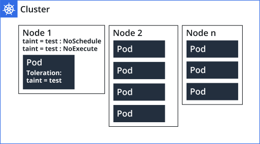

.. _taints_and_tolerations.rst:

=========================================
瑕疵和容忍(Taints and Tolerations)
=========================================

Node affinity(节点亲和性)是设置pod优先分配到一组nodes(例如性能或硬件要求)。而 ``taints`` 则相反，设置节点排斥pod。

taints和tolerations结合起来使用可以确保pod不会调度到不合适到节点。当一个或多个taints被应用到节点，则会标记节点不接受任何不容忍瑕疵的pods (not accept any pods that do not tolerate the tains)。当tolerations（容忍）被应用到节点，则允许（但不强求）pod调度到匹配瑕疵(taints)的节点上。

这个概念在pod调度中非常有用，很多希望专门用途的服务器，可以通过 ``taints`` 设置为只让高优先级( ``tolerations`` )的用户使用。在多租户场景、异构Kubernetes集群( :ref:`arm_k8s` / :ref:`gpu_k8s` )，结合使用污点(taints)和容忍(tolerations)能够将应用容器放到不同的节点组，实现复杂的调度。

.. note::

   ``taints`` 和 ``tolerations`` 是结合使用的：从字面意思上就是 ``瑕疵`` 和 ``容忍`` 。当节点被标记为瑕疵( ``taints`` )，则默认不会调度到该节点。除非pod被标记为容忍( ``tolerations`` )这个瑕疵，则带有容忍这种瑕疵的节点才会被调度到对应有瑕疵的节点上。

污点(taints)和容忍(tolerations)的概念
========================================

在节点(node)上添加污点(taints)可以排斥所有pod，除了那些能够容忍(toleration)污点的pods。一个节点可以有一个或多个关联的污点。

举例:

- 管控平面的节点(master)通常会被主动污点，以便只有管控pods能够调度到master节点，普通用户部署的应用pods就不会调度到master节点，以便专用.
- 服务器首次导入集群，为了能够完成一系列初始化工作，此时需要屏蔽工作负载调度到还没有完成初始化的节点，就可以使用 ``taint``

一个 ``taint`` 可以有3种可能的影响:

- ``NoSchedule`` - Kubernetes调度器只允许将对污点有容忍的pod调度到该节点
- ``PreferNoSchedule`` - Kubernetes调度器将 ``尝试避免`` 将 **没有配置容忍的** pod调度到该节点(但不能保证，假如没有更好的可用节点)
- ``NoExecute`` - 如果pod对污点节点没有容忍度，则Kubernetes会立即驱逐正在运行的pod

污点(taints)和容忍(tolerations)的案例
=======================================

- 对于需要为特定用户准备的工作节点，可以在节点上添加 ``taint`` :

.. literalinclude:: taints_and_tolerations/taint_dedicated_group
   :caption: 为节点添加 ``taint`` 用于特定 ``groupName`` 用户组

然后该组用户的pod中添加 ``taint`` 对应的 ``toleration`` ，就能在这些节点运行。

此外，为了确保这些用户的 pods **仅** 在该组 ``taint`` 节点上运行，还应该在该组节点添加标签，例如 ``dedicated=groupName`` ，然后在部署 pods 的时候使用 ``NodeSelector`` 将用户组的pod绑定到节点上，避免运行到其他地方。

- 特殊硬件的节点(例如 :ref:`arm` 或者 :ref:`nvidia_gpu` )

.. literalinclude:: taints_and_tolerations/taint_special_hardware
   :caption: 为特殊硬件的节点添加 ``taint`` 以便只有使用特定硬件pod才能调度到该节点

基于污点(taints)的驱逐(evict)
================================

如果 pod 对污点没有容忍度，则具有 ``NoExecute`` 效果的污点会将正在运行的 pod 从节点中逐出(evict)。 在某些场景下，Kubernetes 节点控制器会自动将这种污点添加到节点上，以便 **立即驱逐 pod** ，并 :ref:`drain_node` （驱逐所有 pod）。

举例:

- 如果网络中断导致控制器无法访问某个节点，此时最好将所有pod移出故障节点，以便能够重新调度到其他节点

Kubernetes内建的tains
-----------------------

- ``node.kubernetes.io/not-ready`` 节点没有就绪，对应于 ``NodeCondition`` 的 ``Ready`` 属性是 ``False``
- ``node.kubernetes.io/unreachable`` 节点不能从控制器访问，对应于 ``NodeCondition`` 的 ``Ready`` 属性是 ``Unknown``
- ``node.kubernetes.io/memory-pressure`` 节点内存压力高
- ``node.kubernetes.io/disk-pressure`` 节点磁盘IO压力高，此时会影响应用性能，建议重新分布pods
- ``node.kubernetes.io/pid-pressure`` 节点PID压力高，进程ID是一种有限资源，过饱和可能会导致应用程序停机，因此最好将Pod重新定位到其他地方
- ``node.kubernetes.io/network-unavailable`` 节点网络不可访问，此时建议将pod调度出去
- ``node.kubernetes.io/unschedulable`` 节点不可调度，这是控制节点调度的常用taint，例如需要做集群缩容，节点需要删除

污点(taints)和容忍(tolerations)的实践
======================================

- 查询集群的taints配置

.. literalinclude:: taints_and_tolerations/get_nodes_taints
   :caption: 查询集群中节点的taints设置

参考
======

- `Kubernetes Documentation - Concepts: Taints and Tolerations <https://kubernetes.io/docs/concepts/configuration/taint-and-toleration/>`_ 中文文档:  `Kubernetes 文档>概念>调度、抢占和驱逐>污点和容忍度 <https://kubernetes.io/zh-cn/docs/concepts/scheduling-eviction/taint-and-toleration/>`_
- `Kubernetes Tains & Tolerations <https://www.densify.com/kubernetes-autoscaling/kubernetes-taints/>`_ 一个不错的简明教程，比官方文档更清晰易懂，推荐阅读
