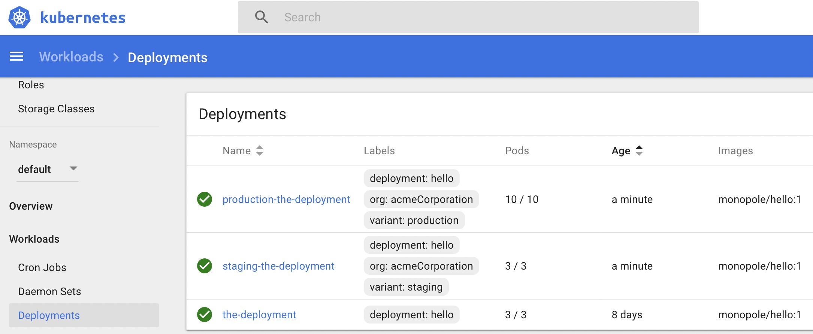

.. _kustomize:

============
kustomize
============

``kustomize`` 可以方便我们为多种目的来定制底层、任意模版的YAML文件，并保持原始YAML文件不需修改。 kustomize 是面向kubernetes的工具，它能够理解并且patch `kubernetes风格 <https://github.com/kubernetes-sigs/kustomize/blob/master/docs/glossary.md#kubernetes-style-object>`_ API对象。类似 ``make`` ，kustomize在文件中申明工作，并且也类似 ``sed`` ，可以编辑文本。

安装
==========

二进制安装
------------

- macOS平台，可以通过Hinebrew包管理器安装（我没有使用这个方法)::

   brew install kustomize

.. note::

   使用 brew 安装的kustomize执行时报错 ``zsh: exec format error: kustomize`` ，所以我安装官方安装文档，采用官方仓库下载二进制可执行文件。

- 在windows平台，可以通过 Chocolatey 包管理器安装（我没有windows，尚未实践）::

   choco install kustomize

- 全系列各平台都可以使用都安装方法是直接从 `kustomize 官方release <https://github.com/kubernetes-sigs/kustomize/releases>`_ 下载。

- 也可以通过Go v.10.1 或更高版本安装::

   go get sigs.k8s.io/kustomize

.. note::

   从 1.14 版本开始，kubectl已经支持使用kustomization文件来管理Kubernetes对象，所以不再需要单独安装kustomize，可以直接 :ref:`install_setup_kubectl` 来实现相同功能。

源代码安装
---------------

不clone代码仓库方式从源代码安装kustomize
~~~~~~~~~~~~~~~~~~~~~~~~~~~~~~~~~~~~~~~~~~

.. note::

   在 :ref:`asahi_linux` ( :ref:`arch_linux` )上验证

- 对于(go版本>= 1.17)::

   GOBIN=$(pwd)/ GO111MODULE=on go install sigs.k8s.io/kustomize/kustomize/v4@latest

完成后，二进制执行文件 ``kustomize`` 位于当前目录下

clone代码仓库方式从源代码安装kustomize
~~~~~~~~~~~~~~~~~~~~~~~~~~~~~~~~~~~~~~~~~~

.. note::

   在 :ref:`fedora` 上验证

- 执行以下编译安装步骤:

.. literalinclude:: kustomize/install_kustomize_from_source_with_clone_repo
   :language: bash
   :caption: 源代码编译安装kustomize

创建base
=========

.. note::

   主要通过 `kustomize examples <https://github.com/kubernetes-sigs/kustomize/tree/master/examples>`_ 学习

kustomize中， ``base`` 是需要通过 ``overlay`` 修订的基础配置，这部分是类似 Docker 镜像的只读层，通常不做修改。

``overlay`` 提供针对 ``base`` 修改的配置部分，覆盖相同的配置项部分，提供不同的配置值。

建立base
-----------

案例是使用 `hello <https://github.com/monopole/hello>`_ ，一个简单的web服务器，提供配置用于实现一些配置验证。

.. note::

   在实验之前，请先 :ref:`install_run_minikube` 和 :ref:`install_setup_kubectl` ，准备好测试环境。

- 下载案例helloworld::

   DEMO_HOME=~/hello
   BASE=$DEMO_HOME/base
   mkdir -p $BASE
   curl -s -o "$BASE/#1.yaml" "https://raw.githubusercontent.com\
   /kubernetes-sigs/kustomize\
   /master/examples/helloWorld\
   /{configMap,deployment,kustomization,service}.yaml"

- 此时目录结构::

   ~/hello
    └── base
        ├── configMap.yaml
        ├── deployment.yaml
        ├── kustomization.yaml
        └── service.yaml

参考 `Using Kubectl's new Kustomize support for per-environment deployment of cert-manager resources <https://blog.jetstack.io/blog/kustomize-cert-manager/>`_ 可以采用如下方法验证 kustomize 配置::

   kustomize build $DEMO_HOME/base

此时会完整合并各个yaml配置，验证语法，合并成最终的配置。以上命令也可以等同采用 ``kubectl kustomize base`` 。

执行完成部署，该用如下命令方法::

   kustomize build $DEMO_HOME/base | kubectl apply -f -

最新kubectl 1.14集成了kustomize功能，也可以采用::

   kubectl apply -k $DEMO_HOME/base

可能需要修改 base/kustomization.yaml 开头添加以下行（ 参考 `require apiVersion/kind in Kustomization.yaml? #738 <https://github.com/kubernetes-sigs/kustomize/issues/738>`_ ）::

   apiVersion: kustomize.config.k8s.io/v1beta1
   kind: Kustomization

.. note::

   配置可参考 `kustomization.yaml案例 <https://github.com/kubernetes-sigs/kustomize/blob/master/docs/kustomization.yaml>`_

存在报错::

   onfigmap/the-map configured
   service/the-service configured
   The Deployment "the-deployment" is invalid: spec.selector: Invalid value: v1.LabelSelector{MatchLabels:map[string]string{"app":"hello"}, MatchExpressions:[]v1.LabelSelectorRequirement(nil)}: field is immutable (字段是不可改变的)

检查 ``service.yaml`` 中设置了::

   spec:
     selector:
         deployment: hello

和 ``kustomization.yaml`` 中设置::

   commonLabels:
     app: hello

是否冲突？我修改 ``kustomization.yaml`` 注释掉 ``commonLabels`` ::

   #commonLabels:
   #  app: hello

则执行报错::

   configmap/the-map unchanged
   service/the-service unchanged
   error: error validating "STDIN": error validating data: ValidationError(Deployment.spec): missing required field "selector" in io.k8s.api.apps.v1.DeploymentSpec; if you choose to ignore these errors, turn validation off with --validate=false

则我重新修改 ``kustomization.yaml`` 将其修改成::

   commonLabels:
      deployment: hello

再次执行则显示成功::

   configmap/the-map configured
   service/the-service configured
   deployment.apps/the-deployment configured

- 检查生成的pod::

   kubectl get pods

由于通过 ``kubectl apply -k $DEMO_HOME/base`` 我们在默认连接的 :ref:`install_run_minikube` 测试环境创建了运行的pod，所以可以看到如下运行::

   NAME                             READY   STATUS    RESTARTS   AGE
   the-deployment-6df7fc786-247gp   1/1     Running   2          6d19h
   the-deployment-6df7fc786-x4zpf   1/1     Running   2          6d19h
   the-deployment-6df7fc786-zk2pw   1/1     Running   2          6d19h

.. note::

   ``kubectl get pods`` 默认只显示 ``default`` namespace中的pod，所以需要注意自己的pod创建在哪个namespace中，如果没有查看到上述输出，则检查一下 ``kubectl`` 访问配置。

最终的base配置
----------------

- ``base/deployment.yaml``

.. literalinclude:: kustomize_example/hello/base/deployment.yaml
   :language: yaml
   :linenos:

- ``base/configMap.yaml``

.. literalinclude:: kustomize_example/hello/base/configMap.yaml
   :language: yaml
   :linenos:

- ``base/service.yaml``

.. literalinclude:: kustomize_example/hello/base/service.yaml
   :language: yaml
   :linenos:

- ``base/kustomization.yaml``

.. literalinclude:: kustomize_example/hello/base/kustomization.yaml
   :language: yaml
   :linenos:

overlays
=============

:ref:`continuous_integration` 中，我们通常会创建一个模拟环境(staging)和一个生产环境(production) overlay:

- staging环境激活production环境没有激活的一个有风险功能
- production环境设置一个较高的副本数量
- web服务器的集群变量设置不同

::

   OVERLAYS=$DEMO_HOME/overlays
   mkdir -p $OVERLAYS/staging
   mkdir -p $OVERLAYS/production

staging环境
---------------

在和 ``base`` 并列的 ``overlay`` 目录下创建的 ``staging`` 子目录包含了所有 staging 环境用于覆盖公共 base 配置的内容。简单来说，就是 ``overlay`` 的优先级高于 ``base`` ，所有 ``overlay`` 中配置项只要能够在 ``base`` 中找到，就会覆盖 ``base`` 中配置值。

kustomization
~~~~~~~~~~~~~~~~~~

- 在 ``staging`` 目录下，定义一个新的使用不同标签的配置 - ``staging/kustomizaton.yaml``

.. literalinclude:: kustomize_example/hello/overlays/staging/kustomization.yaml
   :language: yaml
   :linenos:

Staging补丁
~~~~~~~~~~~~~~~~

- 添加 ``configMap`` 定制staging环境服务的消息，并且激活 ``risky`` 标记 - ``staging/map.yaml``

.. literalinclude:: kustomize_example/hello/overlays/staging/map.yaml
   :language: yaml
   :linenos:

production环境
-----------------

kustomization
~~~~~~~~~~~~~~~

- ``production/kustomiaztion.yaml``

.. literalinclude:: kustomize_example/hello/overlays/production/kustomization.yaml
   :language: yaml
   :linenos:

production补丁
~~~~~~~~~~~~~~~~

- ``production/deployment.yaml``

.. literalinclude:: kustomize_example/hello/overlays/production/deployment.yaml
   :language: yaml
   :linenos:

对比overlays
--------------

现在的目录结构如下::

   ~/hello
    ├── base
    │   ├── configMap.yaml
    │   ├── deployment.yaml
    │   ├── kustomization.yaml
    │   └── service.yaml
    └── overlays
        ├── production
        │   ├── deployment.yaml
        │   └── kustomization.yaml
        └── staging
            ├── kustomization.yaml
            └── map.yaml

对比目录可以看到 staging 和 production 的差异::

   diff \
     <(kustomize build $OVERLAYS/staging) \
     <(kustomize build $OVERLAYS/production) |\
     more

部署
========

- 通过以下独立命令可以检查资源设置输出::

   kustomize build $OVERLAYS/staging

   kustomize build $OVERLAYS/production

- 现在我们可以部署到kubernetes集群中::

   kustomize build $OVERLAYS/staging |\
       kubectl apply -f -

   kustomize build $OVERLAYS/production |\
       kubectl apply -f -

- 通过 :ref:`k8s_dashboard` 我们观察部署可以看到针对不同环境

   Figure 1: 创建staging和production环境的overlays的不同pod

- 通过 ``kubectl get pods`` 可以看到系统中运行的这些pod::

   $ kubectl get pods
   NAME                                         READY   STATUS    RESTARTS   AGE
   production-the-deployment-79599bddf6-7db6n   1/1     Running   0          14m
   production-the-deployment-79599bddf6-g66cz   1/1     Running   0          14m
   production-the-deployment-79599bddf6-gbxlm   1/1     Running   0          14m
   production-the-deployment-79599bddf6-hwtzc   1/1     Running   0          14m
   production-the-deployment-79599bddf6-jjbsr   1/1     Running   0          14m
   production-the-deployment-79599bddf6-jqflw   1/1     Running   0          14m
   production-the-deployment-79599bddf6-kprtr   1/1     Running   0          14m
   production-the-deployment-79599bddf6-qfhsl   1/1     Running   0          14m
   production-the-deployment-79599bddf6-vdhtd   1/1     Running   0          14m
   production-the-deployment-79599bddf6-vx2bd   1/1     Running   0          14m
   staging-the-deployment-5549c68f4b-k27jb      1/1     Running   0          14m
   staging-the-deployment-5549c68f4b-tbnzt      1/1     Running   0          14m
   staging-the-deployment-5549c68f4b-vx42w      1/1     Running   0          14m
   the-deployment-6df7fc786-247gp               1/1     Running   2          8d
   the-deployment-6df7fc786-x4zpf               1/1     Running   2          8d
   the-deployment-6df7fc786-zk2pw               1/1     Running   2          8d

参考
=========

- `kustomize官方 <https://github.com/kubernetes-sigs/kustomize>`_
- `Using Kubectl's new Kustomize support for per-environment deployment of cert-manager resources <https://blog.jetstack.io/blog/kustomize-cert-manager/>`_
