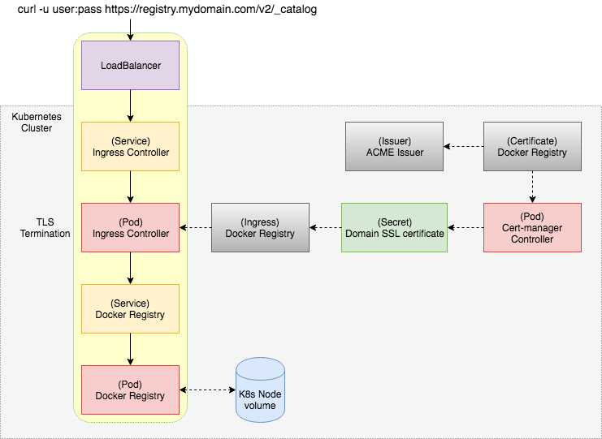

.. _deploy_private_docker_registry_in_kubernetes:

========================================
在Kubernetes中部署私有Docker镜像仓库
========================================

在生产环境中，不论是简单运行Docker容器还是部署Kubernetes集群，都需要使用私有镜像中心来实现中心化都镜像存储和分发:

- 定制私有镜像，不需要把镜像推送到公共镜像服务器，避免安全隐患
- 加速本地镜像的分发和容器部署

私有镜像仓库架构
==================

准备工作
==========

.. note::

   部署需要使用Helm包管理器，分为两部分: 本地客户端安装Helm，远程Kubernetes集群安装Tiller。详细请参考 :ref:`helm` 。

安装Helm和Tiller
-----------------

- 本地安装helm工具（linux版本） ::

   wget https://get.helm.sh/helm-v2.14.1-linux-amd64.tar.gz
   tar -zxvf helm-v2.14.1-linux-amd64.tar.gz
   sudo mv linux-amd64/helm /usr/local/bin/helm

- 使用 ``kubectl config view`` 确认当前连接的是目标 kubeernetes 集群

- 在Kubernetes集群安装服务端组件 ``tiller`` ::

   kubectl -n kube-system create serviceaccount tiller
   kubectl create clusterrolebinding tiller --clusterrole cluster-admin --serviceaccount=kube-system:tiller
   helm init --service-account tiller

激活Nginx ingress controller
------------------------------

.. note::

   本次部署采用的是 :ref:`minikube_deploy_nginx_ingrerss_controller` ，所以激活Nginx ingress controller非常简单。详细可参考 :ref:`deploy_nginx_ingress_controller` 。 

- 执行以下命令激活NGINX Ingress controller::

   minikube addons enable ingress

.. note::

   对于常规Kubernetes集群，可以使用以下 ``helm`` 命令安装 Nginx Ingress controller ::

      helm install stable/nginx-ingress --name quickstart

- 验证NGINX ingress controller已经运行::

   kubectl get pods -n kube-system

.. note::

   确认在 ``kube-system`` namespace中正确运行了 ``nginx-ingress-controller``

在DNS provider中创建域名
==========================

- 首先需要创建一个域名解析记录指向Kubernetes Cluste，这个IP地址是 ``nginx-ingress-controller`` 服务的 ``EXTERNAL-IP`` ::

   kubectl get svc -n kube-system

.. note::

   这个IP地址我理解是 nginx-ingress 输出的对外IP地址，但是这个IP地址和Node节点的IP地址应该是不绑定的，而是Kubernetes对外输出负载均衡的访问VIP。

   待确认

安装 ``cert-manager`` addon
===============================

构建Docker Registry需要具备一个TLS证书。这个工作可以结合Let's Encrypt和 ``cert-manager`` Kubernetes addon来完成。这个addon自动管理和发布TLS证书，确保证书周期更新。并且会在证书过期之前尝试renew。

- 安装 ``cert-manager`` CRDs，这个步骤必须在Helm chart安装cert-manager之前完成::

   kubectl apply -f https://raw.githubusercontent.com/jetstack/cert-manager/release-0.8/deploy/manifests/00-crds.yaml

- 将标签添加到 ``kube-system`` namespace (对于已经存在的namespace此步骤必须) ::

   kubectl label namespace kube-system certmanager.k8s.io/disable-validation="true"

- 添加 `Jetstack Helm repository <https://hub.helm.sh/charts/jetstack>`_ 到Helm，这个仓库包含了 cert-manager Helm chart ::

   helm repo add jetstack https://charts.jetstack.io

- 更新 repo （如果已经存在) ::

   helm repo update

- 最后安装 chart 到 ``kube-system`` namespace ::

   helm install \
    --name cert-manager \
    --namespace kube-system \
    --version v0.8.1 \
    jetstack/cert-manager

.. note::

   详细的解释和遇到过的异常排查过程，请参考 :ref:`deploy_nginx_ingress_controller`

获取TLS证书
================

通过 cert-manager 我们可以创建证书，创建以下文件 ``acme-issuer.yaml`` ::

   apiVersion: certmanager.k8s.io/v1alpha1
   kind: Issuer
   metadata:
     name: acme-issuer
   spec:
     acme:
       email: huatai@huatai.me
       server: https://acme-v02.api.letsencrypt.org/directory
       privateKeySecretRef:
         name: acme-issuer-account-key
       http01: {}

Issuer表示一个证书通过签名的x509证书签发，例如Let's Encrypt。这里需要设置ACME账号邮件地址，这个地址是从Let's Encrypt获取过期通知和其他通知的。这允许在丢失证书私钥的时候回收证书。

- 创建Issuer::

   kubectl apply -f acme-issuer.yaml

- 检查创建的Issuer::

   kubectl describe issuer acme-issuer

.. note::

   acme-issuer 申请如果遇到错误，在上述 ``describe issuer`` 中会显示错误信息。例如， `How to run a Public Docker Registry in Kubernetes <https://www.nearform.com/blog/how-to-run-a-public-docker-registry-in-kubernetes/>`_ 原文使用的配置 ``server: https://acme-v01.api.letsencrypt.org/directory`` 现在已经不能使用，显示::

      Message:               Your ACME server URL is set to a v1 endpoint (https://acme-v01.api.letsencrypt.org/directory). You should update the spec.acme.server field to "https://acme-v02.api.letsencrypt.org/directory"
      Reason:                InvalidConfig
      Status:                False

   需要修订成 ``https://acme-v02.api.letsencrypt.org/directory`` 重新执行。最终成功后显示::

      Status:
        Acme:
          Uri:  https://acme-v02.api.letsencrypt.org/acme/acct/59821427
        Conditions:
          Last Transition Time:  2019-06-23T08:35:08Z
          Message:               The ACME account was registered with the ACME server
          Reason:                ACMEAccountRegistered
          Status:                True
          Type:                  Ready
      Events:                    <none>

.. note::

   对于域名验证，我们有两种选项:
   
   - http01 challenge
   - dns01 challenge
   
   这里使用 http01 challenge机制因为它更简单。而Dns01 challenge需要进一步的DNS provideer来自动创建校验值的DNS记录。

- 创建 ``docker-registry-tls-certificate.yaml`` 配置::

   apiVersion: certmanager.k8s.io/v1alpha1
   kind: Certificate
   metadata:
     name: docker-registry
   spec:
     secretName: docker-registry-tls-certificate
     issuerRef:
       name: acme-issuer
     dnsNames:
     - registry.xcloud.huatai.me
     acme:
       config:
       - http01:
           ingressClass: nginx
         domains:
         - registry.xcloud.huatai.me

.. note::

   这里的证书定义基础含义

   - ``dnsNames`` 是Issuer使用的用于签发TLS证书
   - ``secretName`` 是TLS获得以后的存储
   - ``acme config`` 是域名校验使用(http01 challenge机制)

   通过 HTTP-01 challenge 就可以通过一个在域名中的特定文件来提供域名的所有权证明。

- 通过执行上述 ``docker-registry-tls-certificate.yaml`` ，集群的 cert-manager-controller 会启动来验证证书::

   kubectl apply -f docker-registry-tls-certificate.yaml

- 检查证书的处理情况::

   kubectl describe certificate docker-registry

当前面 issuer ``acme-issuer`` 就绪以后，cert-manager正确生成了自签名证书::

   Events:
     Type     Reason              Age                  From          Message
     ----     ------              ----                 ----          -------
     Warning  IssuerNotReady      7m33s (x3 over 62m)  cert-manager  Issuer acme-issuer not ready
     Normal   Generated           7m22s                cert-manager  Generated new private key
     Normal   GenerateSelfSigned  7m21s                cert-manager  Generated temporary self signed certificate
     Normal   OrderCreated        7m20s                cert-manager  Created Order resource "docker-registry-4118901981"

当所有工作就绪以后，就能获得自己的证书::

   kubectl describe secret docker-registry-tls-certificate

设置htpasswd用于基本认证
========================

对于Docker Registry基本认证，可以创建一个 htpasswd ，可以使用 apache-tuils 提供的 htpasswd 或者 docker registry contrainer。这里假设使用 admin 密码 admin123 ::

      docker run --entrypoint htpasswd --rm registry:2 -Bbn admin admin123 | base64

**奇怪** 每次执行上述指令获得的BASE64密文是不同的，待学习研究。

- 创建加上htpasswd的BASE64格式密文的 ``docker-registry-secret.yaml`` ::

   apiVersion: v1
   kind: Secret
   metadata:
     name: docker-registry
   type: Opaque
   data:
     HTPASSWD: YWRtaW46JDJ5JDA1JDI5Ri95VlNhbDJsQkoxNGI1VmRycHVkREdKanV6SXBxU1Q1RTZhdDVZQTdEdWtObEN2RmM2Cgo=

.. note::

   ``docker run --entrypoint htpasswd --rm registry:2 -Bbn admin admin123 | base64`` 输出的是2行内容，这里我合在一行，待测试

.. note::

   通过 htpasswd 命令可以不断添加新的用户名和密码，我们通过检查 htpasswd_file 文件中对应行，就可以获得我们所需要的加密后密文。这个密文将用于后续创建 Docker registry时候修订 ``chart_value.yaml`` 的密文部分。这部分验证我暂时跳过::

      # 先安装 apache2-utils
      sudo apt install apache2-utils -y
   
      # 在 htpasswd_file 中添加用户名和密码
      htpasswd -B htpasswd_file username

- 创建 ``secret/docker-registry`` ::

   kubectl apply -f docker-registry-secret.yaml

配置Docker Registry
===========================

配置文件 ``config.yaml`` 定义如何挂载 安全文件到我们的Pod::

   apiVersion: v1
   kind: ConfigMap
   metadata:
     name: docker-registry
   data:
     registry-config.yml: |
       version: 0.1
       log:
         fields:
           service: registry
       storage:
         cache:
           blobdescriptor: inmemory
         filesystem:
           rootdirectory: /var/lib/registry
       http:
         addr: :5000
         headers:
           X-Content-Type-Options: [nosniff]
       auth:
         htpasswd:
           realm: basic-realm
           path: /auth/htpasswd
       health:
         storagedriver:
           enabled: true
           interval: 10s
           threshold: 3

.. note::

   设置解析：

   这里使用了ConfigMap中的存储配置 ``rootdirectory: /var/lib/docker/registry`` 是为了能够使用之前使用btrfs存储卷 ``/var/lib/docker`` 以便能够更好存储数据::

      sudo mkdir /var/lib/docker/registry

- 执行创建 ``configmap/docker-registry`` ::

   kubectl apply -f config.yaml

要验证是否正确::

   kubectl get configmap docker-registry

Docker Registry Pod定义
=========================

定义Docker Registry Pod如下 ``docker-registry.yaml`` ::

   apiVersion: v1
   kind: Pod
   metadata:
     name: docker-registry
     labels:
       name: docker-registry
   spec:
     volumes:
       - name: config
         configMap:
           name: docker-registry
           items:
             - key: registry-config.yml
               path: config.yml
       - name: htpasswd
         secret:
           secretName: docker-registry
           items:
           - key: HTPASSWD
             path: htpasswd
       - name: storage
         emptyDir: {}
     containers:
       - name: docker-registry
         image: registry
         imagePullPolicy: IfNotPresent
         ports:
           - name: http
             containerPort: 5000
             protocol: TCP
         volumeMounts:
           - name: config
             mountPath: /etc/docker/registry
             readOnly: true
           - name: htpasswd
             mountPath: /auth
             readOnly: true
           - name: storage
             mountPath: /var/lib/registry

执行创建Docker Registry Pod命令::

   kubectl apply -f docker-registry.yaml

.. note::

   这里 ``docker-registry.yaml`` 包含引用了 ``config.yaml`` ::

         configMap:
           name: docker-registry
           items:
             - key: registry-config.yml
               path: config.yml

   并且设置了 ``key`` 是 ``config.yaml`` 中的 ``registry-config.yml`` 部分（嵌套）

请使用 ``kubectl describe pod docker-registry`` 来检查创建过程是否报错，并相应做调整。例如，我发现有漏做创建 ``configmap/docker-registry`` 的异常。

.. note::

   注意configMap类型卷中 ``mountPath`` 是从容器外映射到容器内的目录，而 ``configMap`` 则是该目录下的子目录映射。详细参考 :ref:`kubernetes_volumes`

异常排查
---------

- ``kubectl describe pod docker-registry`` 显示Pod状态 ``CrashLoopBackOff`` ::

   docker-registry             0/1     CrashLoopBackOff   6          6m19s

通过 ``describe pod`` 可以看到最后的消息::

   Events:
     Type     Reason     Age                     From               Message
     ----     ------     ----                    ----               -------
     ...
     Warning  BackOff    4m35s (x25 over 9m42s)  kubelet, minikube  Back-off restarting failed container

通过 ``kubectl get pod docker-registry -o yaml`` 显示::

        message: Back-off 5m0s restarting failed container=docker-registry pod=docker-registry_default(f8a4eb4f-95cb-11e9-9327-b8e85633e48a)
                reason: CrashLoopBackOff

通过Kubernetes 的 GUI dashboard检查，发现pod有log报错::

   configuration error: open /etc/docker/registry/config.yml: no such file or directory
    Usage: 
     registry serve <config> [flags]
   Flags:
     -h, --help=false: help for serve
    Additional help topics:

这说明前面我的配置存在错误，原来我误以为需要修改的部分实际上是默认配置部分不能修改::

         configMap:
           name: docker-registry
           items:
             - key: registry-config.yml
               path: config.yml

上述配置我推测应该是从 ``ConfigMap`` 中读取 ``registry-config.yml`` 注入到容器中成为 ``config.yml`` ，所以需要修正之前的 ``config.yaml`` 配置。

输出Docker Registry
=====================

- 创建一个服务以及相应的端口绑定 ``docker-registry-service.yaml`` ::

   apiVersion: v1
   kind: Service
   metadata:
     name: docker-registry
   spec:
     type: ClusterIP
     ports:
       - name: http
         protocol: TCP
         port: 5000
         targetPort: 5000
         
     selector:
       name: docker-registry

- 执行创建 ``docker-registry`` 服务::

   kubectl apply -f docker-registry-service.yaml

创建Ingress
=============

- 最后（终于到了最后一步），创建 Ingress 配置 ``docker-registry-ingress.yaml`` ::

   apiVersion: extensions/v1beta1
   kind: Ingress
   metadata:
     name: docker-registry
     annotations:
       kubernetes.io/ingress.class: nginx
       nginx.ingress.kubernetes.io/proxy-body-size: "0"
       certmanager.k8s.io/issuer: acme-issuer
   spec:
     tls:
     - hosts:
       - registry.xcloud.huatai.me
       secretName: docker-registry-tls-certificate
     rules:
     - host: registry.xcloud.huatai.me
       http:
         paths:
         - backend:
             serviceName: docker-registry
             servicePort: 5000

- 执行创建 ``docker-registry`` Ingress::

   kubectl apply -f docker-registry-ingress.yaml

验证
============

- 测试访问::

   curl -u admin:admin123 https://registry.xcloud.huatai.me/v2/_catalog

- 登陆到私有仓库::

   docker login https://registry.xcloud.huatai.me -u admin -p admin123

.. note::

   报错::

      WARNING! Using --password via the CLI is insecure. Use --password-stdin.
      Error response from daemon: Get https://registry.xcloud.huatai.me/v2/: x509: certificate signed by unknown authority

   参考 `access private registry: x509: certificate signed by unknown authority #8849 <https://github.com/moby/moby/issues/8849>`_ 可以采用 ``--insecure-registry`` 参数来用于私有没有自签名证书都镜像仓库::

      docker --insecure-registry=registry.xcloud.huatai.me login https://registry.xcloud.huatai.me -u admin -p admin123

   不过，在新版本 docker 中，不能直接使用这个客户端参数，而是要修改docker启动脚本添加运行参数。例如，对于 CentOS 7.x 修改 ``/usr/lib/systemd/system/docker.service`` ，对于 Debian/Ubuntu 则修改 ``/lib/systemd/system/docker.service`` ::

      ExecStart=/usr/bin/dockerd -H fd:// --containerd=/run/containerd/containerd.sock

   修改成::

      ExecStart=/usr/bin/dockerd --insecure-registry=registry.xcloud.huatai.me -H fd:// --containerd=/run/containerd/containerd.sock

   然后重新加载配置修改，并重启docker::

      sudo systemctl daemon-reload
      sudo systemctl restart docker

   对于不使用systemd的Debian/Ubuntu，可以通过修改 ``/etc/default/docker`` (对于 CentOS/RHEL 则修改 ``/etc/sysconfig/docker`` ) ::

      # Use DOCKER_OPTS to modify the daemon startup options.
      #DOCKER_OPTS="--dns 8.8.8.8 --dns 8.8.4.4"
      DOCKER_OPTS="--insecure-registry=registry.xcloud.huatai.me -H fd:// --containerd=/run/containerd/containerd.sock"

   这里遇到一个问题，发现 minikube 的大量 docker 容器crash了，并且minikube无法启动（实际应该和修改无关，因为发现去除参数也无法启动minikube），最后参考 `Sorry that minikube crashed. #4137 <https://github.com/kubernetes/minikube/issues/4137>`_ 重新安装了一遍minikube。

   另外，可以参考 `Docker Private Registry: x509: certificate signed by unknown authority <https://forums.docker.com/t/docker-private-registry-x509-certificate-signed-by-unknown-authority/21262>`_ 注册主机的证书方法，还没有测试该方法。

- 测试推送一个docker镜像::

   docker pull busybox:latest
   docker tag busybox:latest registry.xcloud.huatai.me/busybox:latest
   docker push registry.xcloud.huatai.me/busybox:latest

WEB UI
=========

`What are the best docker image private registries? <https://www.slant.co/topics/2436/~best-docker-image-private-registries>`_ 提供了多种docker镜像仓库管理平台的对比，可以选择进行部署。待实践...

参考
========

- `How to run a Public Docker Registry in Kubernetes <https://www.nearform.com/blog/how-to-run-a-public-docker-registry-in-kubernetes/>`_
- `How To Set Up a Private Docker Registry on Top of DigitalOcean Spaces and Use It with DigitalOcean Kubernetes <https://www.digitalocean.com/community/tutorials/how-to-set-up-a-private-docker-registry-on-top-of-digitalocean-spaces-and-use-it-with-digitalocean-kubernetes>`_
- `How to Setup Docker Private Registry on Ubuntu 18? <https://geekflare.com/docker-private-registry-ubuntu/>`_ 简化配置，采用Docker运行Registry（无需kubernetes）
