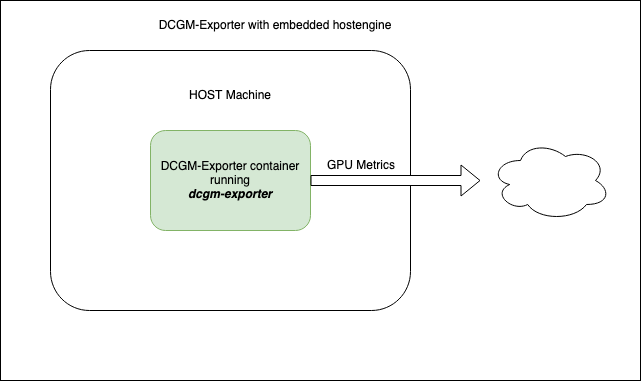

.. _dcgm-exporter:

=================
DCGM-Exporter
=================

``DCGM-Exporter`` 是基于 :ref:`nvidia_dcgm` 的Go API开发的工具，允许用户采集GPU metrics以及了解工作负载或者监控集群中的GPU。 ``dcgm-exporter`` 采用Go语言开发，并且在一个HTTP endpoint( ``/metrics`` )输出GPU指标，用于 :ref:`prometheus` 等监控解决方案。

``dcgm-exporter`` 运行在Kubernetes集群的GPU节点上作为daemonset来运行，也可以直接使用 :ref:`docker` 容器化运行。

.. note::

   物理主机需要安装 :ref:`nvidia_dcgm`

运行 ``dcgm-exporter``
========================

当 ``dcgm-exporter`` 容器作为 :ref:`docker` 的独立运行容器时， ``dcgm-exporter`` 作为一个嵌入进程启动 ``nv-hostengine`` 然后开始发布 metrics:

   ``dcgm-exporter`` 容器化运行

- 容器化运行 ``dcgm-exporter`` :

.. literalinclude:: dcgm-exporter/docker_run_dcgm-exporter
   :language: bash
   :caption: 容器化运行 ``dcgm-exporter`` 命令

此时可以通过以下命令获取 metrics::

   curl localhost:9400/metrics

此时就可以观察到GPU节点的 metrics 数据

.. note::

   `NVIDIA GPU Telemetry <https://docs.nvidia.com/datacenter/cloud-native/gpu-telemetry/dcgm-exporter.html>`_ 官方文档提供了多种安装场景，详情请参考原文。本文只实践常规场景以及用于我个人的 :ref:`priv_cloud_infra`

实际上，通常我们采用 ``dcgm-exporter`` 都是在大规模Kubernetes集群，此时我们会采用 :ref:`nvidia_gpu_operator` :ref:`intergrate_gpu_telemetry_into_k8s`

参考
======

- `NVIDIA GPU Telemetry <https://docs.nvidia.com/datacenter/cloud-native/gpu-telemetry/dcgm-exporter.html>`_
