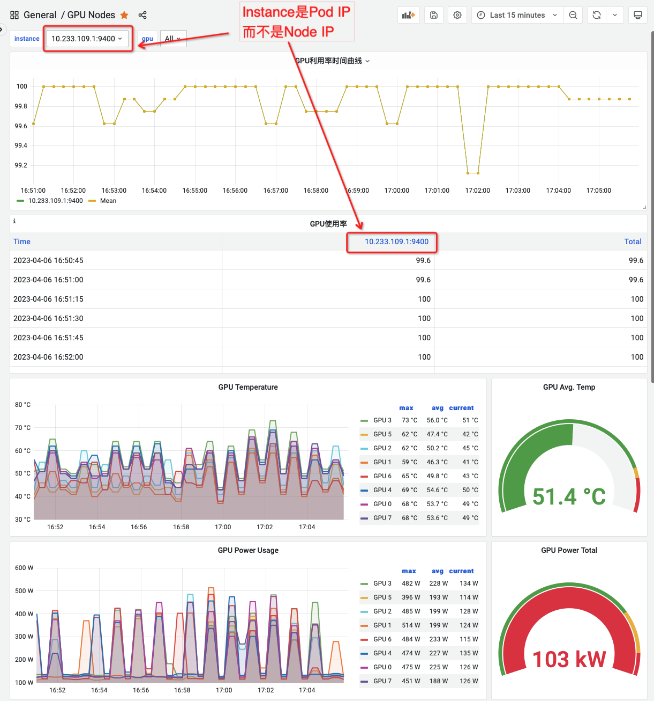
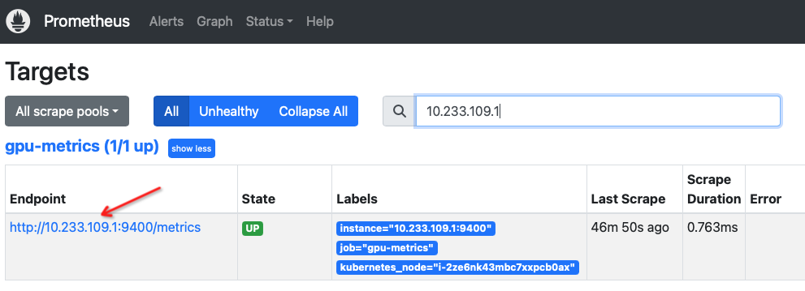
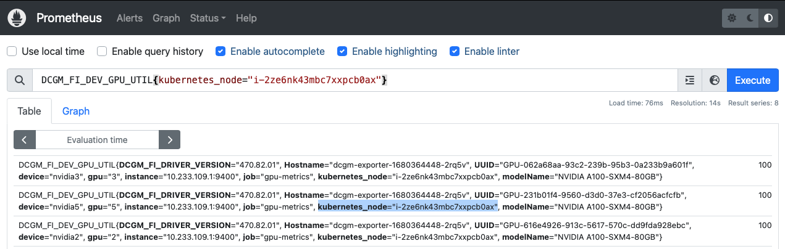
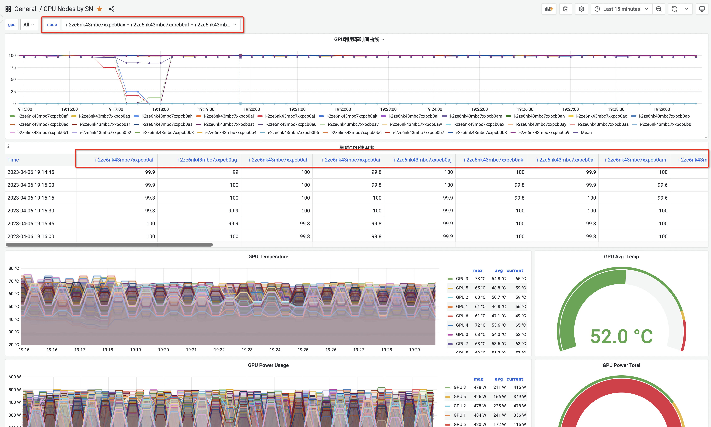

.. _dcgm-exporter_instance_node:

===========================================
DCGM-Exporter Dashboard将instance改成Node
===========================================

困扰
========

在使用 :ref:`dcgm-exporter` 实现 :ref:`intergrate_gpu_telemetry_into_k8s` 发现一个棘手的问题，从 :ref:`grafana` 上观察 NVIDIA 提供的 `NVIDIA DCGM Exporter Dashboard <https://grafana.com/grafana/dashboards/12239-nvidia-dcgm-exporter-dashboard/>`_ 会发现:  ``Instance`` 并不是物理主机( ``node`` )的IP地址，而是 ``dcgm-exporter`` pod的 IP地址::

   # kubectl get pods -o wide | grep i-2ze6nk43mbc7xxpcb0ax | grep dcgm-exporter
   dcgm-exporter-1680364448-2rq5v                           1/1     Running             0          4d17h   10.233.109.1    i-2ze6nk43mbc7xxpcb0ax   <none>           <none>

   # kubectl get nodes -o wide | grep i-2ze6nk43mbc7xxpcb0ax
   i-2ze6nk43mbc7xxpcb0ax   Ready                      <none>   11d     v1.18.12   172.21.44.236   <none>        Alibaba Cloud Linux (Aliyun Linux) 2.1903 LTS (Hunting Beagle)   4.19.91-25.6.al7.x86_64       containerd://1.6.18-1-g64ad7b7ae

这给运维工作带来困扰，因为我们本意是希望知道那台物理主机上的GPU卡存在异常，监控给出 ``dcgm-exporter`` 的pod IP实在没有太大意义，虽然能够反查 pod 对应的 node 名字，但是对于观察监控显然是不利的。

检查 Prometheus 采集的数据就可以看到， ``Endpoint`` 是 Pod IP:

Pod IP改为Node name
======================

仔细检查 Prometheus采集的metrics数据，就可以看到，实际上 :ref:`dcgm-exporter` 每个 metrics 实际上既包含了 ``instance`` ( ``dcgm-exporter`` pod的IP )页包含了物理主机的SN ( ``kubernetes_node`` ): 例如 ``instance="10.233.109.1:9400"`` 和 ``kubernetes_node="i-2ze6nk43mbc7xxpcb0ax"`` 。不过并没有包含 Node IP:

既然数据已经采集，那么只需要定制 :ref:`grafana` 的 dashboard 查询语句就可以实现我们期望: 将物理主机信息和GPU监控数据关联起来

- 打开NVIDIA提供的 `NVIDIA DCGM Exporter Dashboard <https://grafana.com/grafana/dashboards/12239-nvidia-dcgm-exporter-dashboard/>`_ 所制作的Dashboard，点击 ``Settings`` ，在 ``Variables`` 面板可以看到有两个变量:

=============  =================================================
变量           Query表达式
=============  =================================================
**instance**   ``label_values(DCGM_FI_DEV_GPU_TEMP, instance)``
gpu            ``label_values(gpu)``
=============  =================================================

模仿上述 **instance** 变量，创建一个 **node** 变量

=============  =======================================================
变量           Query表达式
=============  =======================================================
**node**       ``label_values(DCGM_FI_DEV_GPU_TEMP, kubernetes_node)``
=============  =======================================================

- 点击Dashboard中面板，例如 ``GPU Utilizatiion`` 面板，点击 ``Edit`` 进行修改:

原先的查询表达式是::

   DCGM_FI_DEV_GPU_UTIL{instance=~"${instance}", gpu=~"${gpu}"}

修改成::

   DCGM_FI_DEV_GPU_UTIL{kubernetes_node=~"${node}", gpu=~"${gpu}"}

此时表头选择变量 ``node`` 就会和这个查询 Graph 关联起来，选择某个Node就会联动这个查询图表

- 依次修改整个Dashboard中的所有图表Query，这样整个Dashboard最终都会把 **instance** 的关联替换成 **node** ，最后就可以删除掉Dashboard的变量 **instance** (只需要 **node** 和 **gpu** )

最后形成的Dashboard就是我们需要的以主机节点 ``SN`` 为查询条件的Dashboard

参考
======

- `Monitoring GPU workloads on GKE with NVIDIA Data Center GPU Manager (DCGM) <https://cloud.google.com/blog/products/containers-kubernetes/monitoring-gpu-workloads-on-gke-with-nvidia-data-center-gpu-manager>`_
