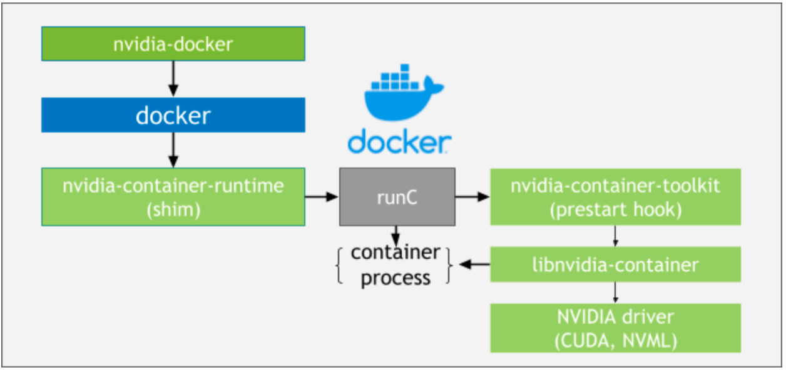
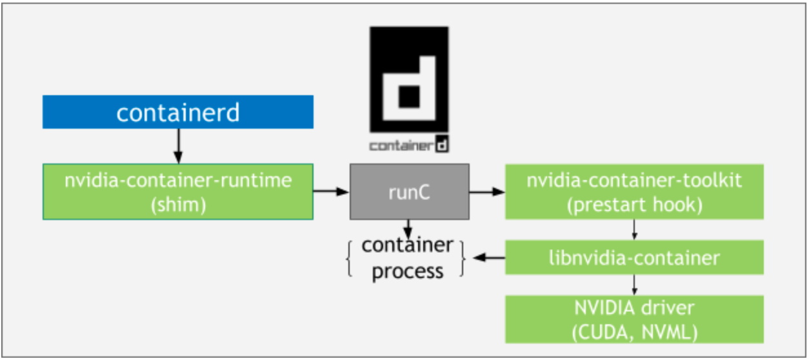
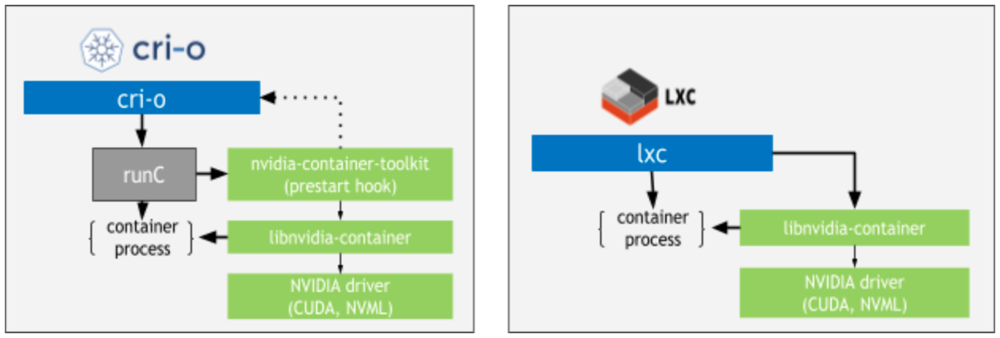

.. _gpu_k8s_arch:

===================
GPU Kubernetes架构
===================

NVIDIA Container Tookit

.. figure:: ../../_static/kubernetes/gpu/nvidia_gpu_container.png
   :scale: 80

结合 Kubernetes技术，实现大规模CPU计算集群:

.. figure:: ../../_static/kubernetes/gpu/kubernetes_stack_0.png
   :scale: 60

- 轻量级运行环境，减少底层(虚拟化)消耗
- 快速调度、大规模部署

.. _nvidia_container_runtimes:

NVIDIA容器运行时
=================

NVIDIA容器运行时(Container Runtime)是一种GPU aware容器运行时，与 :ref:`docker` , :ref:`cri-o` 以及其他流行的容器技术使用的开放容器倡议(Open Containers Initiative, OCI)规范兼容。NVIDIA Container Runtime简化了构建容器化GPU加速应用程序，并且方便部署到桌面、云或数据中心。

NVIDIA容器堆栈(Container Stack)架构目标是支持容器生态系统中的任何容器运行时，堆栈组件包括:

- ``nvidia-docker`` 包装器(wrapper) (注意，现在 ``nvidia-docker`` 已经被替换为 :ref:`nvidia_container_toolkit`
- NVIDIA容器运行时( ``nvidia-container-runtime`` )
- NVIDIA容器运行时Hook( ``nvidia-container-toolkit`` / ``nvidia-container-runtime-hook`` )
- NVIDIA容器库和CLI( ``libnvidia-container1`` , ``nvidia-container-cli`` )

除了 ``nvidia-docker`` 包装器之外，NVIDIA容器堆栈的组件都打包为 NVIDIA Container Toolkit。

- 对于 :ref:`docker` 使用 ``nvidia-docker`` wrapper ，组件流程图如下:

   nvidia-docker wrapper组件流程图

- 对于 :ref:`containerd` ，组件流程图如下:

   containerd组件流程图

- 对于 :ref:`cri-o` 和 LXC 组件流程图如下:

   cri-o和LXC组件流程图

参考
======

- `NVIDIA Cloud Native Documentation <https://docs.nvidia.com/datacenter/cloud-native/contents.html>`_
- `NVIDIA Cloud Native Documentation: Architecture Overview <https://docs.nvidia.com/datacenter/cloud-native/container-toolkit/arch-overview.html>`_
- `Kubernetes on NVIDIA GPUs <https://developer.nvidia.com/kubernetes-gpu>`_
