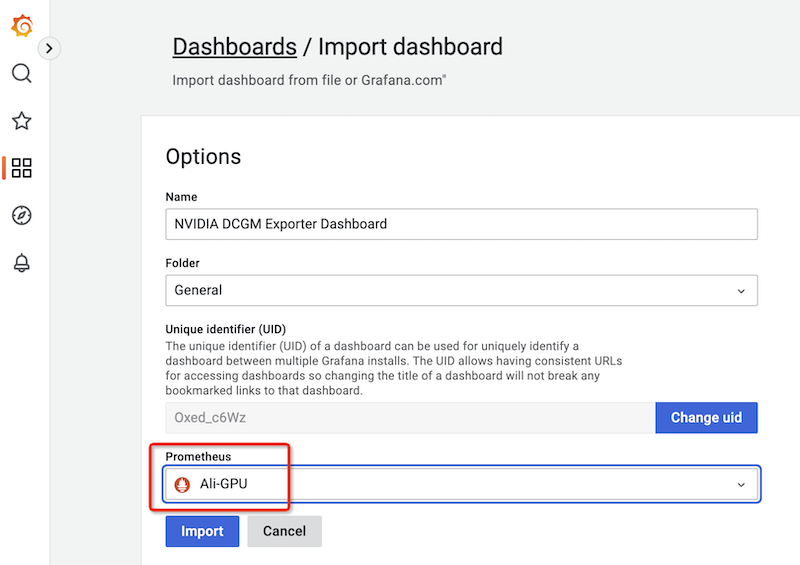
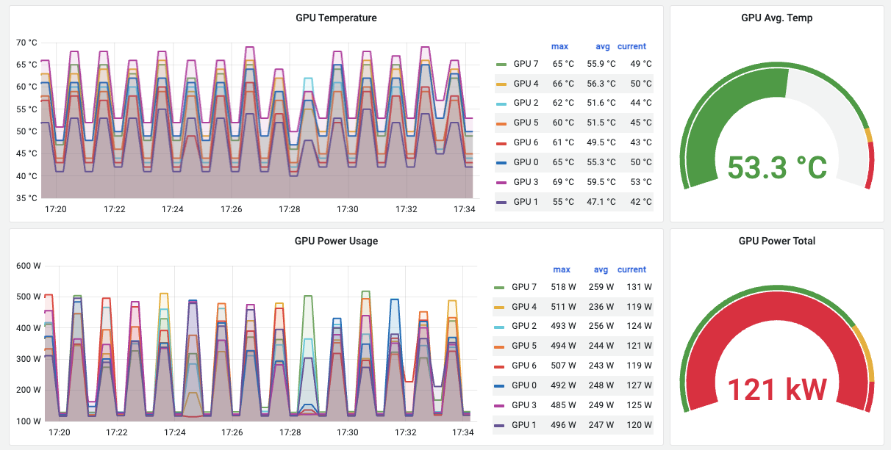
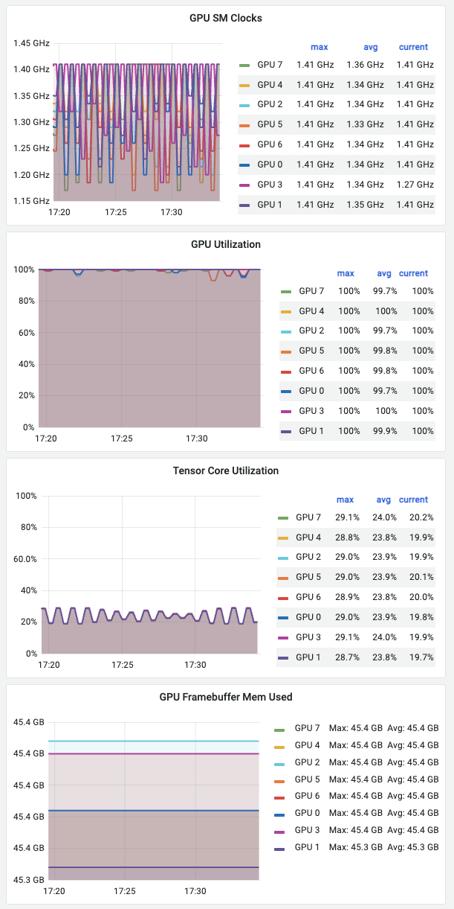

.. _intergrate_gpu_telemetry_into_k8s:

=====================================
在Kuternetes集成GPU可观测能力
=====================================

GPU现在已经成为Kubernetes环境重要资源，我们需要能够通过类似 :ref:`prometheus` 这样的统一监控来访问GPU指标以监控GPU资源，就像传统的CPU资源监控一样。

.. note::

   如果在Kubernetes集群已经部署了 :ref:`nvidia_gpu_operator` ，那么会自动在GPU节点上安装好 :ref:`dcgm-exporter` 。所以，采用 :ref:`nvidia_gpu_operator` 是 `NVIDIA/dcgm-exporter GitHub官方 <https://github.com/NVIDIA/dcgm-exporter>`_ 推荐的部署方式( Note: Consider using the `NVIDIA GPU Operator <https://github.com/NVIDIA/gpu-operator>`_  rather than DCGM-Exporter directly. )。

   实际上，我尝试了 `NVIDIA/dcgm-exporter GitHub官方 <https://github.com/NVIDIA/dcgm-exporter>`_ 提供的通过Helm chart安装 ``DCGM-Exporter`` ，没有成功::

      helm repo add gpu-helm-charts https://nvidia.github.io/dcgm-exporter/helm-charts
      helm repo update
      helm install --generate-name gpu-helm-charts/dcgm-exporter

   提示报错::

      Error: INSTALLATION FAILED: unable to build kubernetes objects from release manifest: resource mapping not found for name: "dcgm-exporter-1679911060" namespace: "default" from "": no matches for kind "ServiceMonitor" in version "monitoring.coreos.com/v1"
      ensure CRDs are installed first

   不过，如果 :ref:`install_nvidia_gpu_operator` 就直接解决了这个问题，会自动完成GPU节点的 ``dcgm-exporter`` 安装。

对于一些生产环境，可能不会部署完整的 :ref:`nvidia_gpu_operator` (而采用自己的解决方案)，这种情况依然可以独立部署 :ref:`dcgm-exporter` ，本文即参考官方文档实现这种部署模式。此时在GPU节点上本机安装，也就是既不使用 :ref:`nvidia_gpu_operator` 也不容器化驱动程序( :ref:`nvidia-docker` )

NVIDIA驱动
=============

在物理主机或者虚拟机(GPU PassThrough)中，需要安装 NVIDIA Drivers(驱动) ，采用 :ref:`install_nvidia_linux_driver_by_repo`

.. note::

   根据操作系统版本不同，主要分为 :ref:`redhat_linux` 和 :ref:`ubuntu_linux` 系，采用不同的包管理方式

Ubuntu安装NVIDIA驱动
-----------------------

- 执行Ubuntu添加仓库:

.. literalinclude:: ../../machine_learning/cuda/install_nvidia_cuda/cuda_toolkit_ubuntu_repo
   :language: bash
   :caption: 在Ubuntu 22.04操作系统添加NVIDIA官方软件仓库配置

- 安装 NVIDIA CUDA 驱动:

.. literalinclude:: ../../machine_learning/hardware/nvidia_gpu/install_nvidia_linux_driver/cuda_driver_debian_ubuntu_repo_install
   :language: bash
   :caption: Ubuntu使用NVIDIA官方软件仓库安装CUDA驱动

RHEL/CentOS 7安装NVIDIA驱动
-----------------------------

- 执行RHEL/CentOS 7仓库添加:

.. literalinclude:: ../../machine_learning/cuda/install_nvidia_cuda/cuda_toolkit_rhel7_repo
   :language: bash
   :caption: 在RHEL/CentOS 7操作系统添加NVIDIA官方软件仓库配置

- 安装 NVIDIA CUDA 驱动:

.. literalinclude:: ../../machine_learning/hardware/nvidia_gpu/install_nvidia_linux_driver/cuda_driver_rhel7_repo_install
   :language: bash
   :caption: RHEL/CentOS 7使用NVIDIA官方软件仓库安装CUDA驱动

安装 :ref:`container_runtimes`
=================================

NVIDIA提供了多种 :ref:`nvidia_container_runtimes` 支持，可以选择:

- :ref:`docker`
- :ref:`containerd`
- :ref:`cri-o` 

上述任意一种 :ref:`container_runtimes` 都支持，选择安装了runtime之后，就需要安装对应的NVIDIA Container Toolkit

安装NVIDIA Container Toolkit
=============================

NVIDIA提供了多种 :ref:`nvidia_container_runtimes` 支持，例如 :ref:`docker` , :ref:`containerd` , :ref:`cri-o` ，请按照你的Kubernetes集群实际 :ref:`container_runtimes` 对应安装 NVIDIA Container Toolkit:

- :ref:`install_nvidia_container_toolkit_for_containerd` (已实践)
- :ref:`install_nvidia_container_toolkit_for_docker` (待实践)

安装Kubernetes
=================

部署 :ref:`vanilla_k8s` :

- :ref:`bootstrap_kubernetes_ha` (以及相关实践)

安装 NVIDIA Device Plugin
============================

:ref:`install_nvidia_device_plugin` (独立安装 ``nvida-device-plugin`` )

- 部署 helm:

.. literalinclude:: ../deploy/helm/helm_startup/linux_helm_install
   :language: bash
   :caption: 在Linux平台安装helm

- 添加 ``nvidia-device-plugin`` ``helm`` 仓库:

.. literalinclude:: install_nvidia_gpu_operator/helm_add_nvdp_repo
   :language: bash
   :caption: 添加nvidia-device-plugin helm仓库

- 部署 ``NVIDIA Device Plugins`` :

.. literalinclude:: install_nvidia_gpu_operator/helm_install_nvidia-device-plugin
   :language: bash
   :caption: 使用helm安装nvidia-device-plugin

**正式开始**

GPU可观测性
=============

NVIDIA的GPU可观测性也是建立在 :ref:`prometheus` 基础上，构建的完整数据采集，时序数据库存储metrics，并通过 :ref:`grafana` 实现可视化。此外， :ref:`prometheus` 包含了 :ref:`alertmanager` 提供了告警创建和管理。Prometheus 通过 :ref:`kube-state-metrics` 和 :ref:`node_exporter` 分别为Kubernetes API对象输出集群级别的 :ref:`metrics` 和节点级别的 :ref:`metrics` (例如CPU使用率)。

.. figure:: ../../_static/kubernetes/monitor/prometheus/prometheus_architecture.png
   :scale: 50

   Prometheus 架构

要从Kubernetes采集GPU可观测性数据，建议使用 :ref:`dcgm-exporter` : 基于 :ref:`nvidia_dcgm` 的 :ref:`dcgm-exporter` 为 :ref:`prometheus` 输出了GPU :ref:`metrics` 并且能够被 :ref:`grafana` 可视化。 :ref:`dcgm-exporter` 架构充分发挥了 ``KubeletPodResources`` API 并且采用 ``Prometheus`` 能够抓取的格式输出 GPU metrics。此外，还包括了一个 ``ServiceMonitor`` 的公开endpoints。

部署Prometheus
------------------

实际上NVIDIA官方文档中介绍的 ``GPU可观测性`` 方案所采用的 ``Prometheus`` 部署方式就是采用社区提供的 :ref:`helm3_prometheus_grafana` 。NVIDIA做了一些微调:

- 安装 :ref:`helm` :

.. literalinclude:: ../deploy/helm/helm_startup/helm_install_by_script
   :language: bash
   :caption: 使用官方脚本安装 helm

- 添加 Prometheus 社区helm chart:

.. literalinclude:: ../monitor/prometheus/helm3_prometheus_grafana/helm_repo_add_prometheus
   :language: bash
   :caption: 添加 Prometheus 社区helm chart

- NVIDIA对社区方案参数做一些调整(见下文)，所以先导出 chart 使用的变量(以便修订):

.. literalinclude:: intergrate_gpu_telemetry_into_k8s/helm_inspect_values_prometheus-stack
   :language: bash
   :caption: ``helm inspect values`` 输出Prometheus Stack的chart变量值

- 将metrics端口 ``30090`` 作为 ``NodePort`` 输出在每个节点(实际建议修订)

.. literalinclude:: ../monitor/prometheus/z-k8s_gpu_prometheus_grafana/values.yaml
   :language: bash
   :caption: 修订输出端口30090
   :emphasize-lines: 38

- 修改了 ``prometheusSpec.serviceMonitorSelectorNilUsesHelmValues`` 设置为 ``false``

.. literalinclude:: intergrate_gpu_telemetry_into_k8s/change_value
   :language: bash
   :caption: 修改 ``prometheusSpec.serviceMonitorSelectorNilUsesHelmValues`` 设置为 ``false``

- 在 ``configMap`` 配置 ``additionalScrapeConfigs`` 添加 ``gpu-metrics`` :

.. literalinclude:: intergrate_gpu_telemetry_into_k8s/add_gpu-metrics_config
   :language: bash
   :caption: 在 ``configMap`` 配置 ``additionalScrapeConfigs`` 添加 ``gpu-metrics``

- 最后执行部署，部署中采用自己定制的values:

.. literalinclude:: intergrate_gpu_telemetry_into_k8s/deploy_prometheus-stack
   :language: bash
   :caption: 使用定制helm chart values来安装部署 ``kube-prometheus-stack``

.. note::

   上述手工编辑替换的方法比较繁琐，实际上 :ref:`helm` 支持命令行直接替换变量参数:

   .. literalinclude:: intergrate_gpu_telemetry_into_k8s/deploy_prometheus-stack_override
      :language: bash
      :caption: 使用参数覆盖方式定制变量来安装部署 ``kube-prometheus-stack``

.. note::

   实际上我已经完成了 :ref:`helm3_prometheus_grafana` ，而且我也是将 :ref:`prometheus` 的服务端口映射为 ``NodePort`` (安装后手动修订部署)，所以不再需要执行官方文档安装

   不过，我在 :ref:`z-k8s_gpu_prometheus_grafana` 采用了NVIDIA的部署方案，请参考那次实践。

(可选方法)独立安装 :ref:`nvidia_dcgm` 和 :ref:`dcgm-exporter`
--------------------------------------------------------------

`Prometheus + Grafana 监控 NVIDIA GPU <https://www.yaoge123.com/blog/archives/2709>`_ 采用了另外一种直接在物理主机部署 :ref:`nvidia_dcgm` 和 :ref:`dcgm-exporter` 的方法，也就是直接采用 :ref:`systemd` 来运行这两个程序。

:ref:`dcgm-exporter` 在GitHub官方介绍了通过 :ref:`docker` 来运行 ``dcgm-exporter`` 的方法。

.. note::

   对比之下，我感觉采用NVIDIA官方的手册更符合最新的部署模式，所以我在NVIDIA官方部署方式上进行一些调整

部署DCGM
-----------

.. note::

   需要部署 ``dcgm-exporter`` 就可以，物理主机上无需再安装 :ref:`nvidia_dcgm`

   我在 ``dcgm-exporter`` 容器内部检查，容器内部已经安装了 ``nvidia-dcgm`` ，只不过似乎没有以服务方式运行。参考 `Monitor Your Computing System with Prometheus, Grafana, Alertmanager, and Nvidia DCGM <https://ajaesteves.medium.com/monitor-your-computing-system-with-prometheus-grafana-alertmanager-and-nvidia-dcgm-ea9f142d2e21>`_ ::

      # nv-hostengine
      Started host engine version 2.4.6 using port number: 5555

      # dcgmi discovery -l
      1 GPU found.
      +--------+----------------------------------------------------------------------+
      | GPU ID | Device Information                                                   |
      +--------+----------------------------------------------------------------------+
      | 0      | Name: NVIDIA Graphics Device                                         |
      |        | PCI Bus ID: 00000000:09:00.0                                         |
      |        | Device UUID: GPU-794d1de5-b8c7-9b49-6fe3-f96f8fd98a19                |
      +--------+----------------------------------------------------------------------+
      0 NvSwitches found.
      +-----------+
      | Switch ID |
      +-----------+
      +-----------+

   注意，容器内部必须先启动 ``nv-hostengine`` 才能运行 ``dcgmi discovery -l`` 检查主机的GPU卡

   在容器内部可以执行 ``curl localhost:9400/metrics`` 获得GPU的 metrics数据

- 添加 ``dcgm-exporter`` :ref:`helm` repo:

.. literalinclude:: intergrate_gpu_telemetry_into_k8s/helm_repo_add_dcgm-exporter
   :language: bash
   :caption: 添加 ``dcgm-exporter`` :ref:`helm` repo

- 安装 ``dcgm-exporter`` chart:

.. literalinclude:: intergrate_gpu_telemetry_into_k8s/helm_install_dcgm-exporter
   :language: bash
   :caption: :ref:`helm` 安装 ``dcgm-exporter``

这里可能会遇到报错，原因是 ``dcgm-exporter`` 要求 Kubernetes >= 1.19.0-0 :

.. literalinclude:: ../deploy/helm/helm_startup/dcgm-exporter_version_err
   :caption: 安装 :ref:`dcgm-exporter` 遇到Kubernetes版本不满足要求(需要安装低版本 ``dcgm-exporter`` )

则采用 :ref:`helm_install_specific_chart_version` 方法完成低版本安装:

安装指定 ``2.6.10`` 版本 ``dcgm-exporter`` chart:

.. literalinclude:: ../deploy/helm/helm_startup/helm_install_dcgm-exporter_specific_chart_version
   :caption: 安装指定版本helm chart

安装成功的输出信息:

.. literalinclude:: ../deploy/helm/helm_startup/helm_install_dcgm-exporter_specific_chart_version_output
   :caption: 安装指定版本helm chart成功的信息

``third-party Profiling module`` 错误
~~~~~~~~~~~~~~~~~~~~~~~~~~~~~~~~~~~~~~

我在生产环境的依次一次部署中，先部署了 :ref:`dcgm-exporter` (系统已经安装了 ``nvidia-device-plugin`` ，但是还没有部署 ``prometheus-stack`` )，非常奇怪， ``dcgm-exporter`` 的pod不断crash::

   # kubectl -n nvidia-gpu get pods
   NAME                             READY   STATUS             RESTARTS   AGE
   dcgm-exporter-1680885308-2ttq6   0/1     CrashLoopBackOff   241        20h
   dcgm-exporter-1680885308-5rzsf   0/1     CrashLoopBackOff   0          20h
   dcgm-exporter-1680885308-5w29s   0/1     CrashLoopBackOff   241        20h
   dcgm-exporter-1680885308-68sv7   0/1     CrashLoopBackOff   0          119m
   ...

检查 ``kubelet`` 日志显示仅显示容器不断 ``CrashLoopBackOff`` ::

   ...
   E0408 18:51:25.676318   41268 pod_workers.go:191] Error syncing pod 4c56555f-1b97-4d68-965b-af67cd99df48 ("dcgm-exporter-1680885308-68sv7_nvidia-gpu(4c56555f-1b97-4d68-965b-af67cd99df48)"), skipping: failed to "StartContainer" for "exporter" with CrashLoopBackOff: "back-off 1m20s restarting failed container=exporter pod=dcgm-exporter-1680885308-68sv7_nvidia-gpu(4c56555f-1b97-4d68-965b-af67cd99df48)"
   ...

此时检查pod日志，显示第三方profiling模块返回错误导致::

   # kubectl logs dcgm-exporter-1680885308-68sv7 -n nvidia-gpu
   time="2023-04-08T10:50:50Z" level=info msg="Starting dcgm-exporter"
   time="2023-04-08T10:50:50Z" level=info msg="DCGM successfully initialized!"
   time="2023-04-08T10:50:51Z" level=info msg="Collecting DCP Metrics"
   time="2023-04-08T10:50:51Z" level=info msg="No configmap data specified, falling back to metric file /etc/dcgm-exporter/dcp-metrics-included.csv"
   time="2023-04-08T10:50:53Z" level=fatal msg="Error watching fields: The third-party Profiling module returned an unrecoverable error"

在一个韩文 `GPU Operator on CentOS <https://1week.tistory.com/45>`_ 提示解决方法是: GPU Operator v1.3.0 升级到 v1.4.0

不过，同样操作系统和硬件( :ref:`nvidia_a100` ) 以及驱动 ( ``Driver Version: 470.103.01   CUDA Version: 11.4`` )，我之前部署的集群却没有问题。

.. note::

   这个错误故障后来解决: 原因是阿里云租用的服务器部署Kubernetes，已经购买使用了阿里云的基于 ``prometheus-stack`` 魔改的监控，所以系统中有了一个 :ref:`systemd` 模式运行的 :ref:`dcgm-exporter` 。但是阿里云把 ``dcgm-exporter`` 的运行名改成了 ``starship`` ，导致没有注意到物理主机上已经运行了相同的程序。由于 ``starship`` 和我部署的 ``dcgm-exporter`` :ref:`daemonset` 都是定时采集，很容易同时采集数据造成冲突。

.. note::

   Kubernetes官方有一篇和NVIDIA合作的技术文档 `Third Party Device Metrics Reaches GA <https://kubernetes.io/blog/2020/12/16/third-party-device-metrics-reaches-ga/>`_ 详细解析了NVIDIA GPU  metrics采集的方案，我后续在 :ref:`k8s_third_party_devices_metrics` 汇总研究 

配置 Grafana
----------------

`共享Grafana dashboards <https://grafana.com/dashboards>`_ 中有NVIDIA公司提供的一个专用dashboard `NVIDIA DCGM Exporter Dashboard <https://grafana.com/grafana/dashboards/12239-nvidia-dcgm-exporter-dashboard/>`_ ，将该面板的JSON文件对应 URL ``https://grafana.com/grafana/dashboards/12239`` 添加:

- 选择菜单 ``Dashboards >> Import``

- (没有成功)将 ``https://grafana.com/grafana/dashboards/12239`` 直接填写到 ``Import via grafana.com`` 栏，然后点击 ``Load`` 

- 或者(我实际采用此方法)先从 `共享Grafana dashboards <https://grafana.com/dashboards>`_ 下载 ``https://grafana.com/grafana/dashboards/12239`` 对应的JSON文件，然后点击 ``Load`` ，此时会提示信息如下

配置prometheus
-----------------

此时虽然配置了Grafana，但是还拿不到 ``dcgm-exporter`` 数据，原因是 ``prometheus`` 尚未配置抓取数据(针对 ``9400`` 端口)

在 ``prometheus`` 的配置文件中添加 ``scrape_config`` 配置(具体参考 `prometheus_configuration_scrape_config <https://prometheus.io/docs/prometheus/latest/configuration/configuration/#scrape_config>`_ )，采用 :ref:`update_prometheus_config_k8s` :

:ref:`helm` 支持 ``upgrade`` 指令，可以更新原先的 helm chart，也就说，可以在后面重新更新一些配置来添加Prometheus部署后的更新配置(比直接修订 ``prometheus.yml`` 方便)

.. note::

   我最终采用 :ref:`update_prometheus_config_k8s` 方式，将NVIDIA官方文档的 ``configMap`` 配置 ``additionalScrapeConfigs`` 添加 ``gpu-metrics`` 整合成功。这样就能够初步显示出GPU的监控

- 输出 ``kube-prometheus-stack`` 参数配置:

.. literalinclude:: intergrate_gpu_telemetry_into_k8s/helm_inspect_values_prometheus-stack
   :language: bash
   :caption: ``helm inspect values`` 输出Prometheus Stack的chart变量值

- 修改 ``/tmp/kube-prometheus-stack.values`` 的 ``configMap`` 配置 ``additionalScrapeConfigs`` 添加 ``gpu-metrics`` :

.. literalinclude:: ../monitor/prometheus/update_prometheus_config_k8s/add_gpu-metrics_config
   :language: bash
   :caption: 在 ``configMap`` 配置 ``additionalScrapeConfigs`` 添加 ``gpu-metrics`` (namespace由于部署原因设为default)
   :emphasize-lines: 21

- 更新:

.. literalinclude:: ../monitor/prometheus/update_prometheus_config_k8s/helm_upgrade_gpu-metrics_config
   :language: bash
   :caption: 使用 ``helm upgrade`` prometheus-community/kube-prometheus-stack

完成上述 ``helm upgrade`` 之后，就会在NVIDIA GPU Grafana Dashboard看到监控数据采集成功，显示类似如下:

   通过 ``dcgm-exporter`` 采集NVIDIA GPU监控数据: 温度和功率

   通过 ``dcgm-exporter`` 采集NVIDIA GPU监控数据: GPU时钟频率、GPU使用率、Tensor Core使用率、Framebuffer内存使用量

参考
=====

- `Integrating GPU Telemetry into Kubernetes <https://docs.nvidia.com/datacenter/cloud-native/gpu-telemetry/dcgm-exporter.html#integrating-gpu-telemetry-into-kubernetes>`_
- `Monitoring GPUs in Kubernetes with DCGM <https://developer.nvidia.com/blog/monitoring-gpus-in-kubernetes-with-dcgm/>`_ 
- `Prometheus + Grafana 监控 NVIDIA GPU <https://www.yaoge123.com/blog/archives/2709>`_ yaoge123 在 `共享Grafana dashboards <https://grafana.com/dashboards>`_ 提供了一个基于 :ref:`dcgm-exporter` 数据采集的Grafana面板 `GPU Nodes v2 <https://grafana.com/grafana/dashboards/11752-hpc-gpu-nodes-v2/>`_ ，比NVIDIA官方提供的面板 `NVIDIA DCGM Exporter Dashboard <https://grafana.com/grafana/dashboards/12239-nvidia-dcgm-exporter-dashboard/>`_
  更多信息，不过我结合本文实践没有实现数据展示，需要再仔细研究研究。
