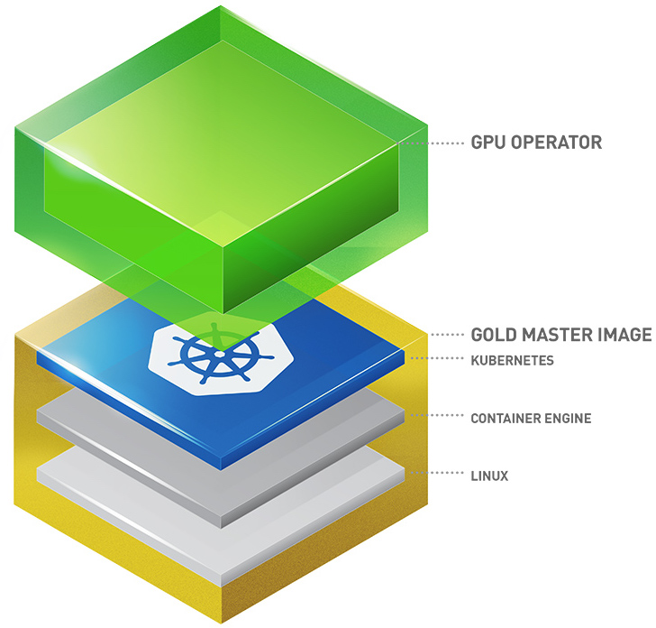

.. _nvidia_gpu_operator:

========================
NVIDIA GPU Operator
========================

Kubernetes 通过设备插件框架提供度特殊硬件资源的访问，例如 NVIDIA GPU, NIC, Infiniband适配器和其他设备。但是，这些硬件资源配置和管理节点需要配置多个软件组件，如 驱动程序,  :ref:`container_runtimes` 或其他库。这些软件组件配置困难且容易出错，例如NVIDIA软件组件管理就非常复杂。

NVIDIA GPU :ref:`operator` 使用了 Kubernetes 的 Operator框架来自动化管理配置 GPU 所需的所有NVIDIA软件组件:

- NVIDIA 驱动程序（用于启用 CUDA）
- GPU 的 Kubernetes 设备插件
- NVIDIA 容器工具包(Container Toolkit)
- 使用GFD( ``gpu-feature-discovery`` )的自动节点标记(node labeling)
- 基于DCGM(Data Center GPU Manager)的监控

NVIDIA GPU Operator集成
===========================

NVIDIA GPU Operator可以集成到多种云计算平台:

- Red Hat :ref:`openshift` 4
- VMware vSphere with Tanzu
- Google Cloud Anthos
- :ref:`vanilla_k8s`

我在 :ref:`priv_cloud_infra` 通过 :ref:`ovmf_gpu_nvme` 将 :ref:`tesla_p10` passthrogh 给虚拟机 ``z-k8s-n-1`` ，并完成了 :ref:`install_nvidia_linux_driver_in_ovmf_vm` ，已经准备好运行环境。

接下来:

- 部署 :ref:`z-k8s`
- :ref:`install_nvidia_gpu_operator`

参考
=========

- `NVIDIA GPU OPERATOR Overview <https://docs.nvidia.com/datacenter/cloud-native/gpu-operator/overview.html>`_
