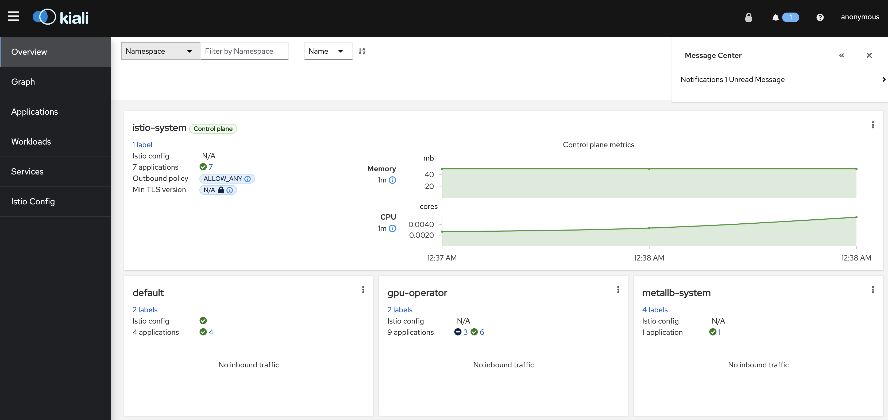
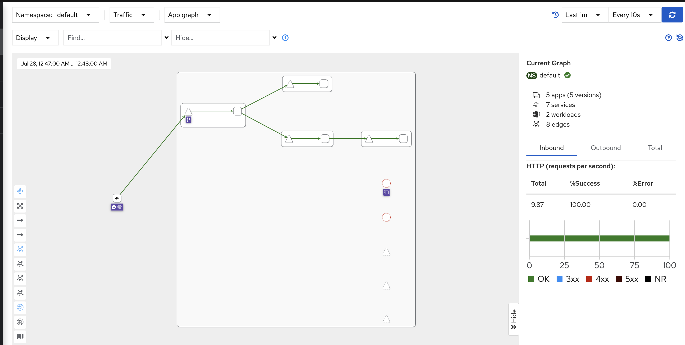
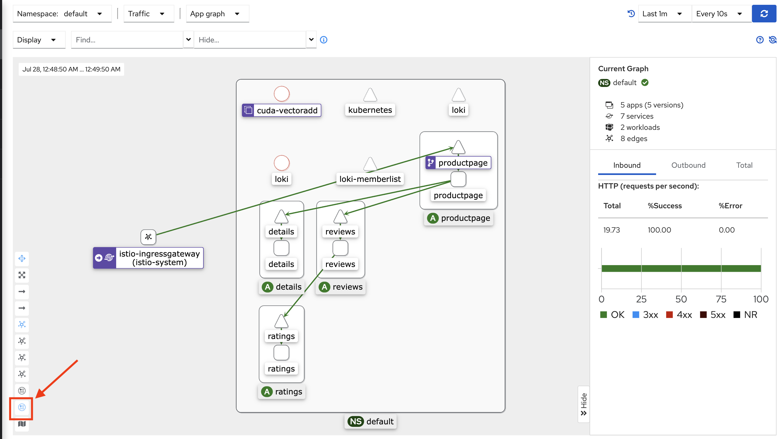
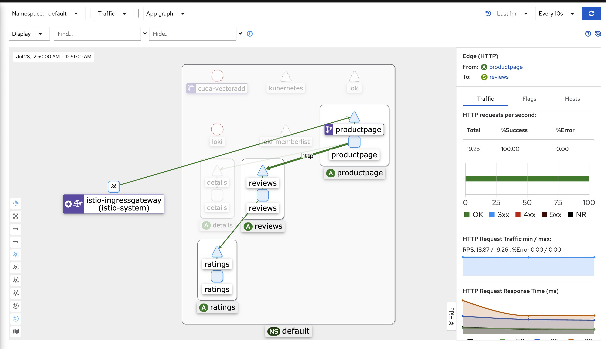

.. _istio_startup:

=========================
Istio起步
=========================

下载
======

- 从 `Istio releases页面 <https://github.com/istio/istio/releases>`_ 可以找到对应操作系统和架构的安装包文件，也可以直接通过以下命令下载:

.. literalinclude:: istio_startup/download_istio
   :language: bash
   :caption: 下载Istio最新release版本

如果要指定版本和架构，例如 :ref:`arm` ，则使用如下下载案例:

.. literalinclude:: istio_startup/download_istio_arm
   :language: bash
   :caption: 下载Istio的release 1.18.2 ARM版本

- 按照安装脚本提示执行:

.. literalinclude:: istio_startup/istioctl_bin
   :language: bash
   :caption: 按照安装脚本设置环境变量并执行预检查

如果顺利，则提示信息:

.. literalinclude:: istio_startup/istioctl_bin_output
   :language: bash
   :caption: 按照安装脚本设置环境变量并执行预检查，提示信息

安装
=======

Istio提供了多个 `Istio configuration profile <https://istio.io/latest/docs/setup/additional-setup/config-profiles/>`_ ，对于生产环境建议使用 ``default`` ，对于测试环境，建议使用 ``demo`` (两者的差异是 ``demo`` 增加了安装 ``istio-egressgateway`` 组件，并且安装了  :ref:`istio_bookinof_demo` 方便学习研究)

.. literalinclude:: istio_startup/istioctl_install_demo
   :caption: 执行 ``istioctl install`` 安装 profile=demo

- 添加一个namespace label让istio自动注入Envoy sidecar proxy:

.. literalinclude:: istio_startup/label_namespace_istio
   :caption: 在默认namespace上标记 ``istio-injection=enabled`` 方便后续部署应用自动注入Envoy sidecar

部署案例应用
=============

- 部署 :ref:`istio_bookinof_demo` :

.. literalinclude:: istio_startup/deploy_bookinfo_demo
   :caption: 部署 :ref:`istio_bookinof_demo`

输出显示:

.. literalinclude:: istio_startup/deploy_bookinfo_demo_output
   :caption: 部署 :ref:`istio_bookinof_demo` 输出显示

- 检查服务和pods，可以看到 services 启动(注意没有 ``EXTERNAL-IP`` 是因为缺乏 :ref:`metallb` 部署)

.. literalinclude:: istio_startup/kubectl_get_services
   :caption: 检查服务输出

.. literalinclude:: istio_startup/kubectl_get_services_output
   :caption: 检查服务输出

.. literalinclude:: istio_startup/kubectl_get_pods
   :caption: 检查pods

.. literalinclude:: istio_startup/kubectl_get_pods_output
   :caption: 检查pods

- 执行以下命令可以检查应用是否正确运行(实际上就是通过在容器内部检查curl页面):

.. literalinclude:: istio_startup/kubectl_exec_curl_check
   :caption: 检查应用运行

输出显示:

.. literalinclude:: istio_startup/kubectl_exec_curl_check_output
   :caption: 检查应用运行输出

- 设置应用对外流量: 创建 :ref:`istio_traffic_management` Ingress Gateway:

这里我们简单解析一下案例 ``samples/bookinfo/networking/bookinfo-gateway.yaml`` :

.. literalinclude:: istio_startup/bookinfo-gateway.yaml
   :language: yaml
   :caption: 部署Ingress的 ``bookinfo-gateway.yaml``

可以看到这是一个类似 :ref:`nginx_reverse_proxy` 的配置( ``VirtualService`` )

- 创建Istio gateway:

.. literalinclude:: istio_startup/kubectl_apply_istio_gateway
   :caption: 执行创建 Istio gateway: gateway (相当于声明反向代理对外服务端口) 以及 virtualservice (相当于配置反向代理)

此时提示输出

.. literalinclude:: istio_startup/kubectl_apply_istio_gateway_output
   :caption: 执行创建 Istio gateway 的输出信息

检测Ingress的IP和端口
=======================

- 执行检查 Ingress 服务:

.. literalinclude:: istio_startup/kubectl_get_svc
   :caption: 检查上文创建的名为 ``istio-ingressgateway`` 的service(svc)

输出显示:

.. literalinclude:: istio_startup/kubectl_get_svc_output
   :caption: 检查上文创建的名为 ``istio-ingressgateway`` 的service(svc): 输出显示 ``EXTERNAL-IP`` 没有分配

可以看到 ``EXTERNAL-IP`` 始终是 ``pending`` 状态，表示没有分配外部访问IP地址

这个 ``EXTERNAL-IP`` 是云计算厂商提供的负载均衡，因为 Kubernetes 设计架构就是部署在云计算厂商的环境，直接调用云厂商的负载均衡(LoadBalancer)的API接口来获得负载均衡外部访问IP地址。

对于个人部署的 ``Barmetal`` 裸金属服务器，需要部署 :ref:`metallb` 来实现云厂商提供的外部负载均衡功能: :ref:`metallb_with_istio`

安装和配置 :ref:`metallb`
---------------------------

- 按照 :ref:`install_metallb` 步骤完成 ``MetalLB`` 安装(这里步骤不再复述)

- 创建 ``MetalLB`` 的IP资源池来对外提供服务:

.. literalinclude:: ../network/metallb/metallb_with_istio/y-k8s-ip-pool.yaml
   :language: yaml
   :caption: 创建 ``y-k8s-ip-pool.yaml`` 设置对外提供负载均衡服务的IP地址池

- 然后执行创建:

.. literalinclude:: ../network/metallb/metallb_with_istio/kubectl_create_metallb_ip-pool
   :caption: 创建名为 ``y-k8s-ip-pool`` 的MetalLB地址池

- 一旦完成 ``MetalLB`` 的负载均衡服务的IP地址池，再次检查 Ingress 服务:

.. literalinclude:: istio_startup/kubectl_get_svc
   :caption: 再次检查 ``istio-ingressgateway`` 的service(svc)

**Binggo** ，现在可以看到对外服务的IP地址已经分配:

.. literalinclude:: ../network/metallb/metallb_with_istio/kubectl_get_svc_metallb_ip_output
   :caption: 可以看到完成 ``MetalLB`` 地址池配置后， ``istio-ingressgateway`` 的service(svc) 正确获得了对外服务负载均衡IP

获得访问URL
--------------

- 执行以下命令获得访问URL:

.. literalinclude:: istio_startup/get_ingress_ip_port_url
   :caption: 获取Ingress的IP和Port，拼接出访问URL

按照上文实践，我获得的URL输出如下:

.. literalinclude:: istio_startup/get_ingress_ip_port_url_output
   :caption: 获取Ingress的IP和Port，拼接出访问URL

.. note::

   上述访问URL是我部署 ``zcloud`` 的内部网络IP地址池，所以对外 ``public`` 网段不能直接访问。有两种简便方式:

   - 方法一: 通过 ``iptables`` 端口转发:

   .. literalinclude:: istio_startup/iptables_port_forwarding_bookinfo
      :language: bash
      :caption: 通过 ``iptables`` 端口转发实现访问内网 Kubernetes 的 :ref:`metallb` 输出入口

   - 方法二: 构建 :ref:`nginx_reverse_proxy`

Dashboard
================

Istio提供了一个Dashboard来实现可观测性

- 默认 ``kiali`` 采用了 ``ClusterIP`` ，所以外部无法访问，官方采用了 ``istioctl dashboard kiali`` 方式在 ``127.0.0.1`` 上开启 ``20001`` 端口访问(但是我是在服务器上部署，所以转换为 LoadBalancer 模式，结合 :ref:`metallb` 就非常容易实现访问)

- 修改 ``kubectl -n istio-system edit svc kiali`` ::

   type: ClusterIP

改为::

   type: LoadBalancer

此时 ``svc`` 从如下::

   kiali                  ClusterIP      10.233.63.114   <none>          20001/TCP,9090/TCP                                                           15m

自动修改成::

   kiali                  LoadBalancer   10.233.63.114   192.168.8.152   20001:32561/TCP,9090:32408/TCP                                               20m

- 再次创建一个简单的端口转发脚本 ``iptables_port_forwarding_kiali`` :

.. literalinclude:: istio_startup/iptables_port_forwarding_kiali
   :language: bash
   :caption: 通过 ``iptables`` 端口转发实现访问 ``kiali``

则可以通过访问 http://10.1.1.111:20001/kiali 来访问 ``kiali`` 服务

此时就可以看到 ``kiali`` Dashboard:

简单使用
------------

- 点击 ``Graph`` 导航图标，然后在终端执行以下压测命令::

   for i in $(seq 1 10000); do curl -s -o /dev/null "http://$GATEWAY_URL/productpage"; done

- 此时在 ``Graph`` 页面就会看到图形化流量演示:

此时点击 ``Namespace Layout 2 kiali-breathfirst`` 按钮就会看到监控组件关系(注意需要选择 ``default`` namespace)

此外点击某个链路还能看到详细流量分析

.. note::

   目前仅仅完成搭建，还有很多需要学习实践

参考
======

- `Istio Documentation > Setup > Getting Started <https://istio.io/latest/docs/setup/getting-started/>`_
