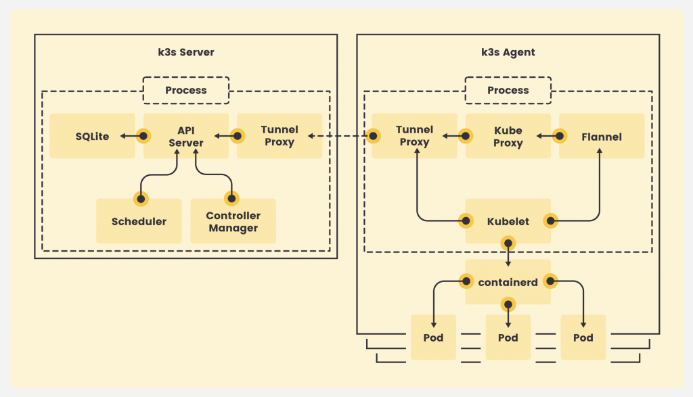
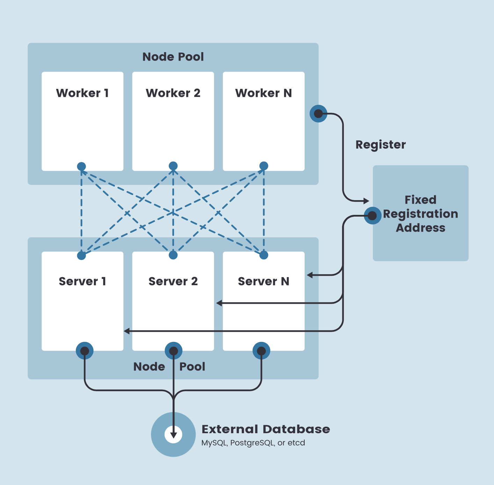

.. _k3s_arch:

==============
K3s架构
==============

在k3s集群中，一个节点运行控制平面的节点被称为 ``server`` ，而一个节点只运行 ``kubelet`` 则被称为 ``agent`` 。

在 ``server`` 和 ``agent`` 上都有容器运行时( ``container runtime`` ) 和对应 ``kubeproxy`` 来管理集群间的网络流量和tunneling。

不过，和传统的 :ref:`kubernetes` 架构不同，在K3s中没有清晰区别 ``master`` 和 ``worker`` 节点。Pods可以调度到任何能运行的角色的节点上进行管理。所以在K3s集群中，通常不命名 ``master`` 节点和 ``worker`` 节点，而是统称为 ``node`` 。

.. note::

   也就是说，对于 K3s 这样面向有限硬件的 :ref:`edge_cloud` 集群，要构建高可用Kubernetes集群，理论上只需要3个节点的硬件。

   后续我将尝试在3个节点上构建 :ref:`pi_stack` ，部署3节点 ``k3s`` 实现最小化高可用集群。

K3s为了实现轻量级的Kubernetes，对Kubernetes的大量可选组件做了裁剪，然后添加了一些基础组件，也就是 :ref:`introduce_k3s` 所述的基础依赖:

- :ref:`containerd`
- :ref:`flannel`
- :ref:`coredns`
- :ref:`cni`
- 主机工具
- 本地存储提供
- :ref:`traefik` Ingress控制器
- 内嵌服务负载均衡
- 内嵌网络策略控制器

所有上述组件都被打包到一个单一二进制运行程序中，并且以一个相同进程运行。

除了上述经过精心选择和精简的组件， ``K3s`` 也可以通过 ``batteries included but replaceable`` 方式(一切皆备但可替换升级)扩展。例如，容器运行时可以由 :ref:`containerd` 替换成 Docker CE运行时， :ref:`flannel` 可以替换成 :ref:`calico` ，本地存储可以替换成 :ref:`longhorn` 等等，以适应更大更复杂的应用场景。

.. note::

   ``k3s`` 支持不同的持久化方案，除了传统的 :ref:`etcd` 还支持不同的数据库如 :ref:`mysql` 和 :ref:`pgsql` 。在早期版本，还实验性支持过 :ref:`dqlite` ，但在最近版本放弃支持。

   我个人对嵌入式系统比较感兴趣，在轻量级的 :ref:`raspberry_pi` 环境，我觉得基于 :ref:`sqlite` 的分布式 :ref:`dqlite` 可能是更为精巧的解决方案。

.. note::

   在 :ref:`pi_k3s_deploy` 初期采用标准精简模式，然后再扩展采用 :ref:`longhorn` 

K3s发行版支持不同的架构:

- AMD64
- ARM64
- ARMv7

.. note::

   我最初没有注意到 ``k3s`` 发行版支持的ARM最低架构是 ``ARMv7`` (虽然软件包打包为 ``armhf`` 看上去也是32位架构)，所以规划采用 :ref:`pi_1` 来构建 :ref:`the_most_smallest_cheapest_k8s` 。但是， :ref:`pi_1` 是 :ref:`armv6` 微架构，导致运行出现 :ref:`arm_illegal_instruction` 。

   最终，我采用 :ref:`build_k3s` 自己构建 :ref:`armv6` 的 ``k3s`` 执行程序。

作为轻量级Kuberntes发行版， ``K3s`` 可以运行在:

- :ref:`pi_zero` (这么低的硬件让我有点吃惊)
- :ref:`jetson_nano`
- `Intel NUC <https://www.intel.com/content/www/us/en/products/details/nuc.html>`_ (NUC即 ``Next Unit of Computing`` 参考 `Intel NUC产品介绍及应用 <https://www.wpgdadatong.com/cn/blog/detail?BID=B3678>`_ )
- Amazon `EC2 a1 <https://aws.amazon.com/ec2/instance-types/a1/>`_ xlarge实例 (64位ARM架构4c8g)

伸缩性的部署
==============

使用嵌入式DB的单节点部署
-------------------------

- 可以在单节点部署最小化的K3s，使用相同的流程来部署验证，使用 :ref:`helm` 或 YAML文件来构建，可以使用CI/CD pipelines和容器镜像来实现

  - 单节点部署时采用内嵌 :ref:`sqlite` 替代 :ref:`etcd` 实现数据存储

.. figure:: ../../_static/kubernetes/k3s/k3s-architecture-single-server.png
   :scale: 10

使用外部DB实现高可用部署
--------------------------

- 对于有高可用要求的 :ref:`edge_cloud` ，可以部署3节点 :ref:`etcd` 以及3节点 ``K3s`` 的 ``server`` 实现容灾，并且可以通过不断扩展 ``agent`` 来扩大集群规模

  - ``K3s`` 高可用外部DB: 

    - 采用 3节点 :ref:`etcd` 实现管控平面高可用
    - 也可以部署高可用 :ref:`mysql` 或 :ref:`pgsql` 代替 :ref:`etcd` 实现管控平面高可用
    - ``K3s`` 开发了一个 ``kine`` 组件将etcd api转换成 :ref:`sqlite` , :ref:`pgsql` , :ref:`mysql` , :ref:`dqlite` 操作

.. figure:: ../../_static/kubernetes/k3s/k3s-architecture-ha-server.png
   :scale: 10

对Agent节点的固定注册地址
~~~~~~~~~~~~~~~~~~~~~~~~~~

在上述高可用服务器配置，每个node必须使用一个固定的注册地址注册到Kubernetes API，完成注册之后，agent node就会和server node直接通讯:

每个Agent节点通过 ``k3s agent`` 进程发起一个websocket连接进行注册，然后这个连接由 agent 进程在客户端的负载均衡维护:

- agent注册时候使用的 ``fixed registration address`` 可以是DNS(其实就是DSN轮转)或者负载均衡(负载均衡到API服务器)

  - 通过DNS轮询(相当于负载均衡)agent可以注册到K3s API server上
  - 通过负载均衡(分发到后端的K3s API server)agent也可以注册到K3s API server上
  - 一旦agent完成注册，agent就会获得完整的K3s API server服务器列表(例如3台高可用)

    - 后续agent将在本地维护一个负载均衡(因为agent知道完整的K3s API server地址)，并直接和API Server通讯
    - 后续agent将不会访问 ``fixed registration address`` (这个地址仅在注册时使用)，这种方式可以避免 ``fixed registration address`` (负载均衡)的瓶颈
    - 如果某个API Server宕机，agent依然可以访问剩余的API Server(客户端维护负载均衡)

参考
======

- `K3s Architecture <https://rancher.com/docs/k3s/latest/en/architecture/>`_
- `How Rancher Labs’ K3s Makes It Easy to Run Kubernetes at the Edge <https://thenewstack.io/how-rancher-labs-k3s-makes-it-easy-to-run-kubernetes-at-the-edge/>`_
- `Question about k3s agent load balancer #4488 <https://github.com/k3s-io/k3s/discussions/4488>`_
