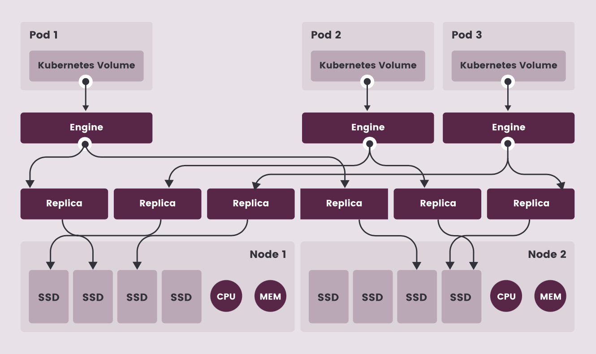

.. _longhorn_arch:

========================
Longhorn分布式存储架构
========================

`Longhorn项目 <https://longhorn.io>`_ 是Rancher公司(即 :ref:`k3s` 开发公司)捐献给CNCF的分布式存储，提供了简便易部署易维护的特性，是一个云原生( ``cloud-native`` )持久化块存储。

Longhorn是采用Go开发的面向Kubernetes的分布式存储，和历史悠久的分布式 :ref:`ceph` 比较而言功能和结构较为简单:

- 主要实现 NFS 和 iSCSI 存储服务(块存储)
- 底层实现3副本存储复制
- 内建了增量快找和备份功能，确保Kubernetes卷数据安全
- 从设计和开发初始就面向 :ref:`kubernetes` ，提供了 :ref:`helm` 部署的便利方式
- 结构简化可能有助于在 :ref:`k3s_arch` 中承担高可用分布式存储，有可能更为适合硬件较弱的 :ref:`edge_cloud`

.. note::

   ``Longhorn`` 和 :ref:`ceph` 的区别概念请参考 :ref:`block_vs_object_storage`

参考
=======

- `Longhorn项目 <https://longhorn.io>`_

