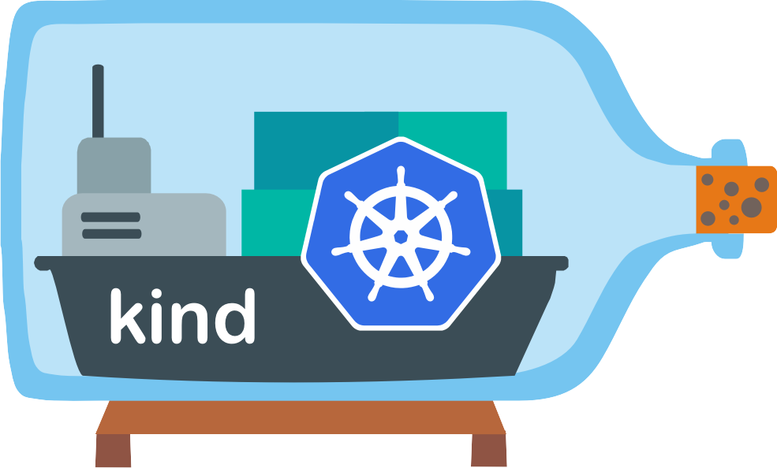
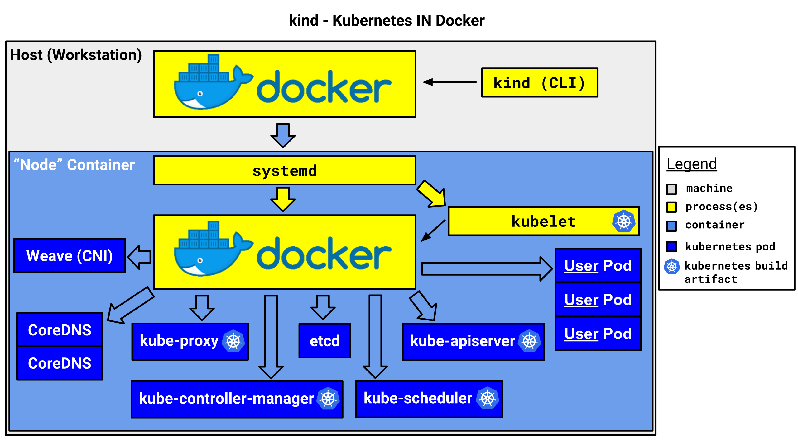

.. _intro_kind:

===============
kind集群简介
===============

在 :ref:`docker_in_docker_arch` 中，可以通过一个单节点Docker主机运行多个Docker容器，而在Docker容器中运行Docker容器。这种方式可以模拟
  一个大规模的Kubernetes集群。

在早期的GitHub项目 `Mirantis/kubeadm-dind-cluster <https://github.com/Mirantis/kubeadm-dind-cluster>`_ 上发展出一个非常灵活的 `本地Kubernetes集群部署工具kind <https://kind.sigs.k8s.io>`_ ，简单的命令就能够在一台物理机上构建出多个Kubernetes集群，完全模拟生产环境部
  。这对Kubernetes开发、测试、部署演练有非常大的帮助。

   Kind的Logo是一个非常形象化的漂流瓶里的Kubernetes/Docker集装箱船模型

概述
=======

``kind`` 的每个 ``node`` 都是一个Docker容器，这个特殊的Docker容器是一个比较完整的操作系统，提供了 :ref:`systemd` 来管理该容器中运行的 ``Docker`` 容器。

简而言之， ``kind`` 的目标是在本地集群测试，虽然不是所有的测试都能在没有 ``real`` 集群的情况下完成

.. _kind_diagram:

``kind`` 运行示意图
---------------------

kubernetes版本
------------------

Kind支持所有官方支持的Kubernetes版本，可以实现极低硬件环境的开发和部署测试。

CRI功能
-------------

当前Kind支持 :ref:`containerd` 运行时，并且实验性支持 :ref:`podman` ，通过使用容器运行时来直接创建节点容器。

同时Kind为了实现多个容器运行时的支持并且避免不必要的耦合，Kind努力实现Kubernetes CRI(容器运行时接口)涵盖的功能。

参考
=======

- `本地Kubernetes集群部署工具kind <https://kind.sigs.k8s.io>`_
- `kind Design: Initial design <https://kind.sigs.k8s.io/docs/design/initial/>`_
