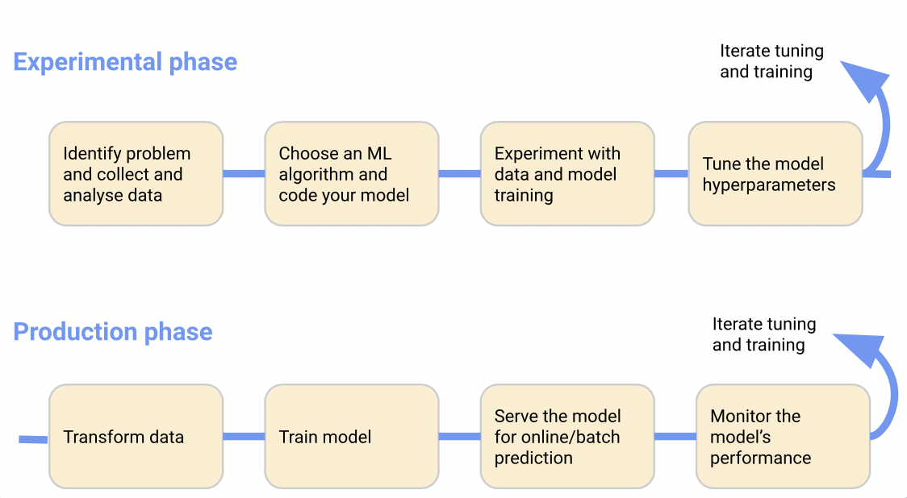
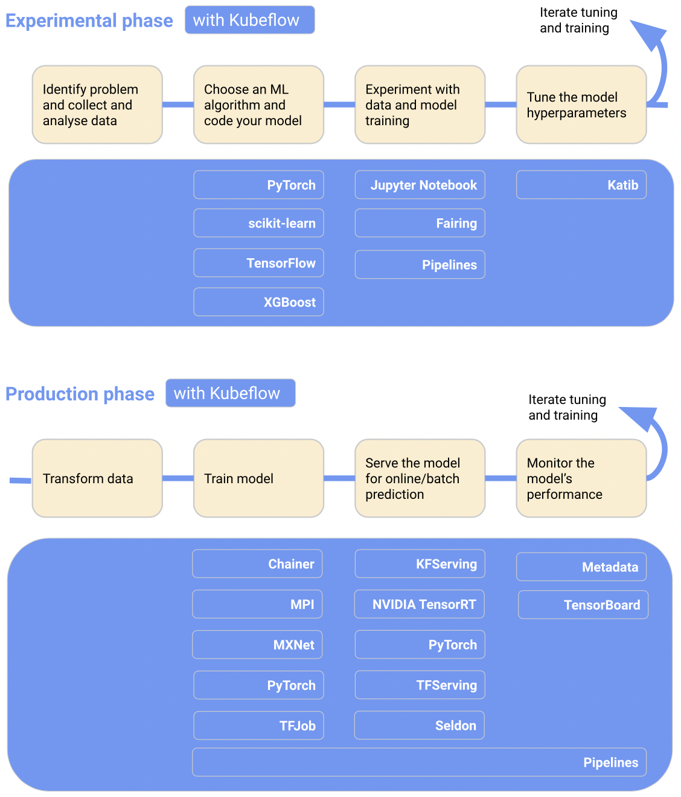
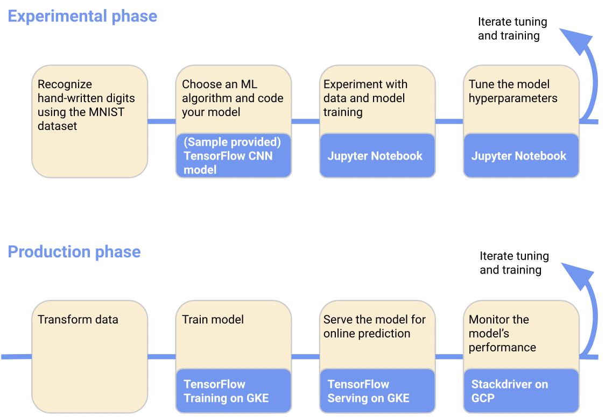
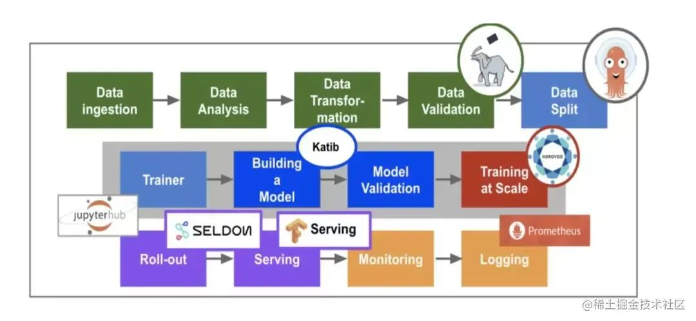

.. _intro_kubeflow:

==================
Kubeflow简介
==================

`Kubeflow项目 <https://www.kubeflow.org/>`_ 是一个简化机器学习(ML)工作流部署到Kubernetes的开源项目，提供了可移植性和可扩展性。也就是说，只要部署了Kubernetes，就能够部署和运行Kubeflow。

功能
========

Kubeflow提供基本工作流:

- 下载和运行Kubeflow部署执行程序
- 定制配置文件
- 运行指定脚本来部署特定环境的容器

可以通过修改配置来选择平台和服务，用于机器学习工作流的每个状态:

- 数据准备(data preparation)
- 模型训练(model training)
- 预测服务(prediction serving)
- 服务管理(service management)

Kubeflow的目标是尽可能简化机器学习( :ref:`machine_learning` )模型部署到Kubernetes的方法:

- 在不同设备上可重复、可移植(从笔记本电脑到集群或云端)，管理松散耦合的微服务
- 集成不同的工具满足数据科学需求，实现一个易于使用的 :ref:`machine_learning` 软件堆栈

架构
=======

Kubeflow是一个面向数据科学的机器学习工作流平台，用于开发、测试和生产级别服务:

基于Kubernetes之上，结合了一系列开源组件来实现机器学习系统

.. figure:: ../../_static/kubernetes/kubeflow/kubeflow_arch.png
   :scale: 50

   Kubeflow架构

Kubeflow在 :ref:`kubernetes` 之上部署、扩展和管理复杂的机器学习系统。通过Kubeflow配置界面可以指定工作流所需的机器学习工具，并且可以将工作流部署到各种云、本地和本地平台，以提供实验和生产使用。

ML工作流简介
-------------

机器学习系统是一个迭代过程，在机器学习工作流的各个阶段需要不断评估输出，并在必要时对模型和参数进行更改，以确保模型持续稳定产生所需的结果:

   机器学习工作流的不同阶段

- 实验阶段(experimental phase): 开发模型，并进行迭代测试和更新模型

  - 确定机器学习系统要解决的问题
  - 收集和分析训练ML模型所需的数据
  - 选择ML框架和算法，并对模型的初始版本进行编码
  - 试验数据并训练模型
  - 调整规模参数(tune the model hyperparameters)来确保最高效的处理和最准确的结果

- 生产阶段(production phase): 部署系统

  - 将数据转换成训练系统所需的格式: 为确保模型在训练和预测阶段表现移植，转换过程在实验和生产阶段必须相同
  - 训练ML模型
  - 为在线预测或批处理模式运行的模型提供服务
  - 监控模型的性能，并将结果输入流程以调整或重新训练模型

ML工作流中的Kubeflow组件
-------------------------

   在机器学习工作流的不同阶段加入Kubeflow提供软件堆栈

在ML的工作流中引入Kubeflow组件能够提供以下价值:

- Kubeflow可以生成和管理 :ref:`jupyter` 的服务，使用Jupyter笔记本进行交互式数据科学和ML工作流程试验
- Kubeflow Piplines: 构建、部署和管理基于 :ref:`docker` 容器的多步骤ML工作流的平台
- 提供了多个组件可以实现跨多个平台构建ML训练、参数调整和服务工作负载

以下是一个特定机器学习工作流的案例:

   在机器学习工作流的不同阶段加入Kubeflow的案例

Kubeflow核型组件
-----------------

   Kubeflow组件

- Jupyter: 创建和管理多用户交互式Jupyter notebooks
- Tensorflow/PyTorch: 当前主要支持的机器学习引擎
- Seldon: 提供在 Kubernetes 上对机器学习模型的部署
- TF-Serving: 提供对 Tensorflow 模型的在线部署，支持版本控制及无需停止线上服务切换模型等功能
- Argo: 基于 Kubernetes 的工作流引擎
- Pipelines: 是一个基于Argo实现了面向机器学习场景的工作流项目，提供机器学习流程的创建、编排调度和管理，还提供了一个Web UI。
- Ambassador: 对外提供统一服务的网关(API Gateway)
- Istio: 提供微服务的管理，Telemetry 采集监控数据
- Ksonnet: Kubeflow 使用 ksonnet 来向 kubernetes 集群部署需要的 k8s 资源
- Operator：针对不同的机器学习框架提供资源调度和分布式训练的能力（TF-Operator，PyTorch-Operator，Caffe2-Operator，MPI-Operator，MXNet-Operator）
- Katib：基于各个Operator实现的超参数(hyperparameters)搜索和简单的模型结构搜索的系统，支持并行搜索和分布式训练等
- Pachyderm：Pachyderm版本控制数据，类似于Git对代码的处理。 可以跟踪一段时间内的数据状态，对历史数据进行回溯测试，与队友共享数据，以及恢复到以前的数据状态

参考
======

- `Kubeflow Getting Started >> Introduction <https://www.kubeflow.org/docs/started/introduction/>`_
- `浅析机器学习工作流Kubflow Pipelines <https://zhuanlan.zhihu.com/p/435663183>`_ 这篇文档参考翻译了 `Machine Learning Pipelines with Kubeflow <https://towardsdatascience.com/machine-learning-pipelines-with-kubeflow-4c59ad05522>`_ 其中案例可以后续深入学习研究
