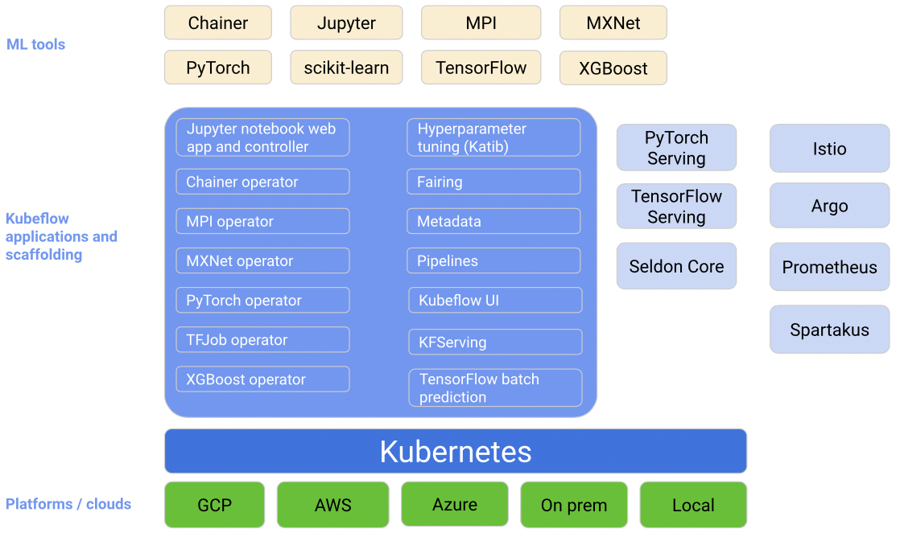

.. _intro_kubeflow:

==================
Kubeflow简介
==================

`Kubeflow项目 <https://www.kubeflow.org/>`_ 是一个简化机器学习(ML)工作流部署到Kubernetes的开源项目，提供了可移植性和可扩展性。也就是说，只要部署了Kubernetes，就能够部署和运行Kubeflow。

功能
========

Kubeflow提供基本工作流:

- 下载和运行Kubeflow部署执行程序
- 定制配置文件
- 运行指定脚本来部署特定环境的容器

可以通过修改配置来选择平台和服务，用于机器学习工作流的每个状态:

- 数据准备(data preparation)
- 模型训练(model training)
- 预测服务(prediction serving)
- 服务管理(service management)

Kubeflow的目标是尽可能简化机器学习( :ref:`machine_learning` )模型部署到Kubernetes的方法:

- 在不同设备上可重复、可移植(从笔记本电脑到集群或云端)，管理松散耦合的微服务
- 集成不同的工具满足数据科学需求，实现一个易于使用的 :ref:`machine_learning` 软件堆栈

架构
=======

Kubeflow是一个面向数据科学的机器学习工作流平台，用于开发、测试和生产级别服务:

基于Kubernetes之上，结合了一系列开源组件来实现机器学习系统

   Kubeflow架构

参考
======

- `Kubeflow Getting Started >> Introduction <https://www.kubeflow.org/docs/started/introduction/>`_
