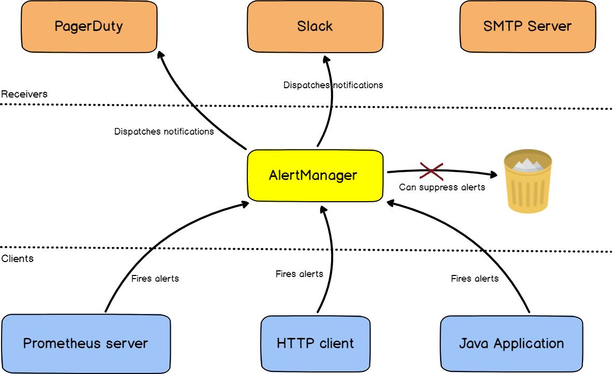
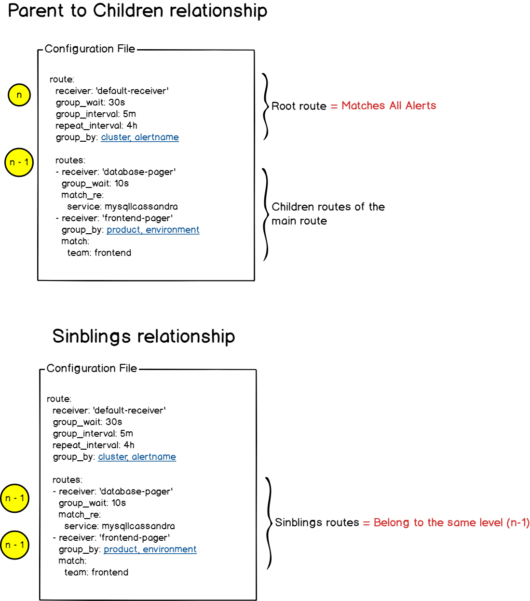
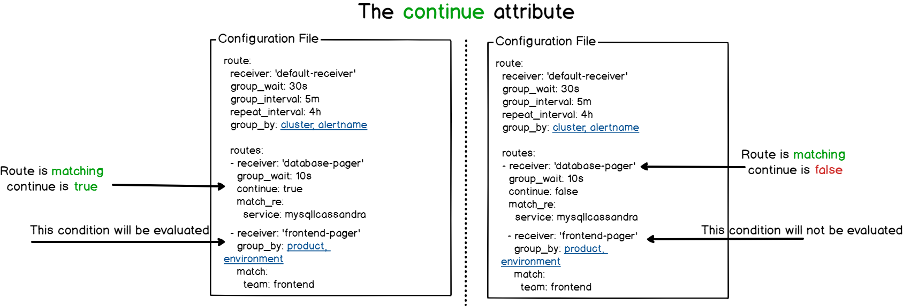
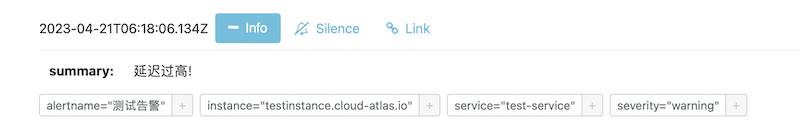

.. _alertmanager_startup:

====================
Alertmanager起步
====================

.. note::

   实践环境采用 :ref:`z-k8s_gpu_prometheus_grafana` ，服务访问端口采用 ``NodePort`` 简化配置，本文测试脚本配置端口按照 ``NodePort`` 配置

   :ref:`kube-prometheus-stack_alertmanager`

Prometheus 通常与处理警报和警报路由的 AlertManager 结合使用: 

- AlertManager 支持各种报警传输(例如电子邮件或 ``slack`` )
- AlertManager 报警功能可以通过自定义 ``webhookss`` 扩展，也就是企业可以开发自己的告警平台，然后结合到 AlertManager 的 webhook

.. note::

   `Swatto/promtotwilio <https://github.com/Swatto/promtotwilio>`_ 提供了一个从 :ref:`prometheus` 接收webooks然后通过 `Twilio <https://www.twilio.com/>`_ 发送短信告警

架构
=======

Alertmanager是一个告警服务器，用于处理从一系列客户端(例如 :ref:`prometheus` )提供的告警，并且分发给预先定义的接收者组(Slack, email 或 Pagerduty)。Alertmanager是Prometheus Stack的一部分，但是也可以作为独立的服务器运行。

通常 :ref:`prometheus` 被配置成直接发送告警给Alertmanager，不过，也可以采用不同的客户端，此时AlertManager提供一个REST路口来提供fire alerts功能.

   AlertManager 工作原理图

AlertManager routes
----------------------

AlertManager 采用YAML格式配置文件:

- 定义 ``路由`` routes:

  - 路由就是告警所采取的一组路径，用于确定和警报关联的操作: 也就是路由与接收者关联起来
  - **初始路由** (initial route)，也称为 "根路由" (root route)，是指 发送到AlertManager的每个告警相匹配的路由
  - 一个路由可以有多个兄弟姐妹(siblings)和子(children)路由，并且它自身也是线路。也就是说，路由可以嵌套任意多次，每个级别都为警报定义一个新操作(或receiver)
  - 每个路由定义接收者(receivers)，这些接收者是告警的接收者: Slack, 邮件服务，Pagerduty...

- 路由案例( ``根路由=>子路由`` / ``根路由=>兄弟姐妹路由`` (也就是同级别路由)):

   ``根路由=>子路由`` / ``根路由=>兄弟姐妹路由`` 案例 

- 评估路由:

  - 在每个路由(route)上，可以定义一个 ``continue`` 属性: ``continue`` 属性值表示，如果同一个级别上的路由已经匹配，是否要继续评估同一级别的其他路由

    - **注意** ``continue`` 属性 **不用于确定是否要遍历子路由** ，而仅用于确定兄弟路由(同一级别路由)

  - Alertmanager会评估 ``子路由`` ，直到没有剩余路由或者给定级别的路由与当前告警不匹配

   AlertManager 的 ``continue`` 属性

安装
======

和 :ref:`prometheus_startup` 类似，采用 :ref:`zcloud_host_install_prometheus` 类似方法完成部署 ``Alertmanger`` : 共用部分 :ref:`prometheus_startup` 配置(运行用户设置为 ``prometheus`` )

- 准备用户账号(已完成过):

.. literalinclude:: ../prometheus/prometheus_startup/add_prometheus_user
   :language: bash
   :caption: 在操作系统中添加 prometheus 用户

- 安装和初始配置复制:

.. literalinclude:: alertmanager_startup/init_alertmanager
   :language: bash
   :caption: 复制和初始化alertmanager

获得三个文件:

  - ``amtool`` : ``amtool`` 用于查看或修改 AlertManager 的当前状态，可以就是可以用来报警静音，使静音过期以及导入静音或查询静音。这是一个Alertmanager的实用陈哥许，而无需直接修改当前告警的配置
  - ``alertmanager`` : ``alertmanager`` 是AlertManager的可执行程序，也就是服务程序
  - ``alertmanager.yml`` : AlertManager的配置文件，定义了一些示例路由

- 配置 :ref:`systemd` 服务 ``/etc/systemd/system/alertmanager.service`` :

.. literalinclude:: alertmanager_startup/alertmanager.service
   :caption: Alertmanager :ref:`systemd` 服务管理配置文件 ``/etc/systemd/system/alertmanager.service``

- 启动服务:

.. literalinclude:: alertmanager_startup/start_alertmanager
   :caption: 启动Alertmanager

测试alert
===========

- 向 ``Altermanager`` 发送一个测试告警:

.. literalinclude:: alertmanager_startup/test_alert
   :language: bash
   :caption: 测试alertmanager

如果正常，终端会收到::

   {"status":"success"}

检查 ``AlertManager`` 管理WEB页面可以看到添加了如下一条信息:

.. note::

   :ref:`curl_post_json` 是通用的 ``curl`` 方法，在 ``alertmanager`` 上可以用来测试数据路由

连接 :ref:`prometheus` 和 AlertManager
=========================================

需要连接起 :ref:`prometheus` 和 AlertManager，才能使Prometheus通过AlertManager发送告警:

- 修改 ``/etc/prometheus/prometheus.yml`` 添加:

.. literalinclude:: alertmanager_startup/prometheus.yml
   :language: yaml
   :caption: 在 ``/etc/prometheus/prometheus.yml`` 中添加连接 Alertmanager 配置

- 重启prometheus::

  sudo systemctl restart prometheus

配置 ``alertmanager.yml``
===========================

Alertmanager的配置主要包含两个部分:

- 路由(route)
- 接收器(receivers)

参考
=======

- `Prometheus docs: Alertmanager <https://prometheus.io/docs/alerting/latest/alertmanager/>`_
- `AlertManager and Prometheus Complete Setup on Linux <https://devconnected.com/alertmanager-and-prometheus-complete-setup-on-linux/>`_ 这篇文章比较详尽，并且有一个系列文章 `The complete Prometheus and Grafana installation <https://devconnected.com/how-to-setup-grafana-and-prometheus-on-linux/>`_
- `How to Install and Configure Prometheus and Alert Manager on CentOS 7?  <https://medium.com/@Dylan.Wang/how-to-install-and-configure-prometheus-and-alert-manager-on-centos-7-78095c2de356>`_
- `prometheus告警流程及相关时间参数说明 <https://blog.csdn.net/ifenggege/article/details/125456836>`_
