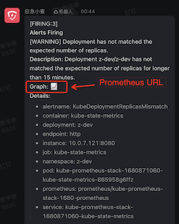

.. _prometheus-webhook-dingtalk:

===============================
prometheus-webhook-dingtalk
===============================

`timonwong / prometheus-webhook-dingtalk <https://github.com/timonwong/prometheus-webhook-dingtalk>`_ 是Prometheus官方推荐的第三方 ``Alertmanager Webhook Receiver`` ，用于支持通过钉钉 ``DingTalk`` 发送告警通知。

安装
=======

- 从 `timonwong / prometheus-webhook-dingtalk <https://github.com/timonwong/prometheus-webhook-dingtalk>`_ GitHub的Release可以下载到官方编译的执行程序

Docker运行
============

.. note::

   `timonwong / prometheus-webhook-dingtalk <https://github.com/timonwong/prometheus-webhook-dingtalk>`_ 原作者已经不再使用钉钉(应该离开了阿里)，所以项目文档没有很好维护，需要根据项目issue中一些线索来自行探索。我尝试 `./contrib/k8s <https://github.com/timonwong/prometheus-webhook-dingtalk/blob/main/contrib/k8s>`_ 没有成功，由于我也没有时间折腾，所以采用最简单的Docker方式来运行，先满足项目的临时要求。

- `timonwong/prometheus-webhook-dingtalk <https://hub.docker.com/r/timonwong/prometheus-webhook-dingtalk>`_ 参考 `Docker运行报错 #168 <https://github.com/timonwong/prometheus-webhook-dingtalk/discussions/168>`_ 的方式来运行:

.. literalinclude:: prometheus-webhook-dingtalk/docker_run
   :language: bash
   :caption: docker方式运行 ``prometheus-webhook-dingtalk``

- 对于 :ref:`containerd` ，将 ``docker`` 命令修订为 :ref:`nerdctl` 执行如下:

.. literalinclude:: prometheus-webhook-dingtalk/nerdctl_run
   :language: bash
   :caption: nerdctl( :ref:`containerd` )方式运行 ``prometheus-webhook-dingtalk``

.. note::

   参数 ``--web.listen-address=0.0.0.0:8060 --web.enable-ui --web.enable-lifecycle`` :

   - ``--web.listen-address=0.0.0.0:8060`` 监听所有网络接口
   - ``--web.enable-ui`` 激活WEB ui功能，这样方便通过WEB页面配置模版
   - ``--web.enable-lifecycle`` 提供了通过 ``curl -XPOST http://localhost:8060/-/reload`` 重新加载配置的功能

.. note::

   :ref:`ctr` 不支持类似 ``docker`` 的很多高级功能，例如不支持端口转发，所以采用改进型工具 :ref:`nerdctl`

.. note::

   这里使用了参数 ``--restart always`` ，这会使得 ``nerdctl stop`` 失效。解决的方法是使用 ``nerdctl rm -f XXXX``

- 这里会使用一个 ``config.yml`` ，从 `timonwong / prometheus-webhook-dingtalk <https://github.com/timonwong/prometheus-webhook-dingtalk>`_ 项目中的案例 ``config.example.yml`` 复制出来修改:

.. literalinclude:: prometheus-webhook-dingtalk/config.yml
   :language: yaml
   :caption: ``config.yml`` 配置访问DingTalk的token

.. note::

   这里我简单配置了3个 ``target`` (相当于值班组)，当 :ref:`kube-prometheus-stack_alertmanager` 配置了对应的 ``receivers`` ，关联的webhook是根据URL中的路径来识别出哪个 ``target`` ，对应的钉钉机器人就会被通知到。

   下文我将配置 :ref:`kube-prometheus-stack_alertmanager` ，添加对应的接受人关联到这个 webhook

``kube-prometheus-stack`` 配置
===========================================

``kube-prometheus-stack`` 通过 :ref:`helm`  的 ``values.yaml`` 添加对应的 ``receivers`` ，来和 ``prometheus-webhook-dingtalk`` 关联:

.. literalinclude:: ../kube-prometheus-stack_alertmanager/kube-prometheus-stack.values
   :language: yaml
   :caption: 简单配置alertmanager的接收者就能够收到通知，这里采用 :ref:`prometheus-webhook-dingtalk`
   :emphasize-lines: 39,41,45-47

然后执行 :ref:`update_prometheus_config_k8s` :

.. literalinclude:: ../../prometheus/update_prometheus_config_k8s/helm_upgrade_gpu-metrics_config
   :language: bash
   :caption: 使用 ``helm upgrade`` prometheus-community/kube-prometheus-stack

此时更新后的 ``alertmanager.yaml`` 之后，钉钉群机器人就会立即收到通知

.. _prometheus_web.external-url:

Prometheus的 ``web.external-url``
===================================

默认通知中 ``Graph`` 是使用 :ref:`prometheus` 的内部域名 ``http://kube-prometheus-stack-1680-prometheus.prometheus:9090/graph`` ，这个URL通常在外部无法访问(当然你也可以在公司内部增加这个域名解析)。比较好的解决方法是采用 ``--web.external-url`` 参数传递给 :ref:`prometheus` ( :ref:`alertmanager` 也有这样一个参数) 。对于 :ref:`z-k8s_gpu_prometheus_grafana` 所采用的 ``kube-prometheus-stack`` 修订配置: 参考 `f663fb6
<https://github.com/prometheus-operator/kube-prometheus/commit/f663fb6062c1d345ee7719ad82ec36ed650a943e>`_ 修订位置应该是 ``prometheus.prometheusSpec.externalURL`` (是的，我想到了 :ref:`kube-prometheus-stack_tsdb_retention` 曾经设置过向 prometheus 传递运行参数 ``--storage.tsdb.retention.time=180d`` )

.. literalinclude:: ../../prometheus/kube-prometheus-stack_tsdb_retention/vaules.yaml
   :language: yaml
   :caption: 配置 ``kube-prometheus-stack`` 的 Prometheus外部访问URL
   :emphasize-lines: 13

多个群通知
===============

参考 `如果是发送给多个群怎么配置？ #198 <https://github.com/timonwong/prometheus-webhook-dingtalk/issues/198>`_ 可以尝试将钉钉消息发给多个群::

   - name: 'rx'
     webhook_configs:
     - url: 'http://monitor-alertmanager-webhook-dingtalk:8060/dingtalk/r1/send'
     - url: http://monitor-alertmanager-webhook-dingtalk:8060/dingtalk/r2/send'

访问设置页面
=============

``prometheus-webhook-dingtalk`` 提供了一个 :ref:`nodejs` 编写的配置页面，可以参考 `prometheus-webhook-dingtalk FAQ <https://github.com/timonwong/prometheus-webhook-dingtalk/blob/main/docs/FAQ_zh.md>`_ 配置模版

参考
======

- `timonwong / prometheus-webhook-dingtalk <https://github.com/timonwong/prometheus-webhook-dingtalk>`_
- `将钉钉接入 Prometheus AlertManager WebHook <https://theo.im/blog/2017/10/16/release-prometheus-alertmanager-webhook-for-dingtalk/>`_ ``prometheus-webhook-dingtalk`` 原作者的blog

