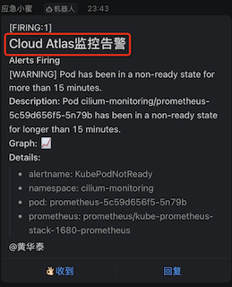

.. _prometheus-webhook-dingtalk_template:

=======================================
``prometheus-webhook-dingtalk`` 模版
=======================================

在部署了 :ref:`prometheus-webhook-dingtalk` 并且正确收到钉钉通知:

.. figure:: ../../../../_static/kubernetes/monitor/alertmanager/alert_dingtalk.png

但是你会发现有些不足:

- 没有展示出属于哪个集群(需要维护多个集群告警)
- 所有label都是英文(如果能够定制一些中文更好)

定制模版
============

:ref:`prometheus-webhook-dingtalk` 新版本在 ``config.yml`` 中提供了指定模版的方法，所以对于 :ref:`prometheus-webhook-dingtalk` 中我所采用 :ref:`containerd` 运行容器，可以直接将模版配置映射进容器

在 `配置使用自定义模板不生效 #86 <https://github.com/timonwong/prometheus-webhook-dingtalk/issues/86>`_ 有人提供了一个模版文件，大致能看出修改的方法，不过这个模版是文本模式，对于Markdown格式发送消息后格式不佳

我的需求比较简单，就是在默认的模版上再增加一个集群的文字说明，当然如果能够将模版中的一些标签修改成中文就更好。

通过 :ref:`inspect_docker_image` 可以提取出 ``prometheus-webhook-dingtalk`` 镜像中默认的模版文件 ``default.tmpl`` ，然后简单添加和集群相关的标记信息(中文)，结合 ``config.yml`` 指定使用自定义模版:

.. literalinclude:: prometheus-webhook-dingtalk_template/template.tmpl
   :caption: ``template.tmpl`` 中添加标记集群信息(中文)
   :emphasize-lines: 30,36

.. literalinclude:: prometheus-webhook-dingtalk_template/config.yml
   :caption: ``config.yml`` 中引用定制模版
   :emphasize-lines: 11,12

- 执行以下命令采用定制模版运行:

.. literalinclude:: prometheus-webhook-dingtalk_template/nerdctl_run
   :language: bash
   :caption: 结合指定模版nerdctl( :ref:`containerd` )方式运行 ``prometheus-webhook-dingtalk``

此时收到的告警就会带上标记的信息(中文)，方便知晓对应的集群信息

参考
======

- `配置使用自定义模板不生效 #86 <https://github.com/timonwong/prometheus-webhook-dingtalk/issues/86>`_
