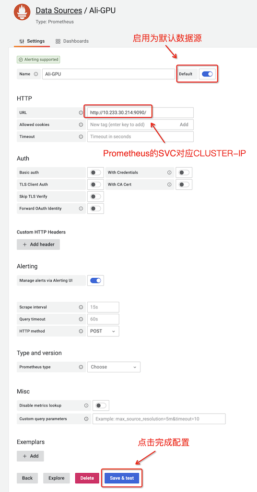
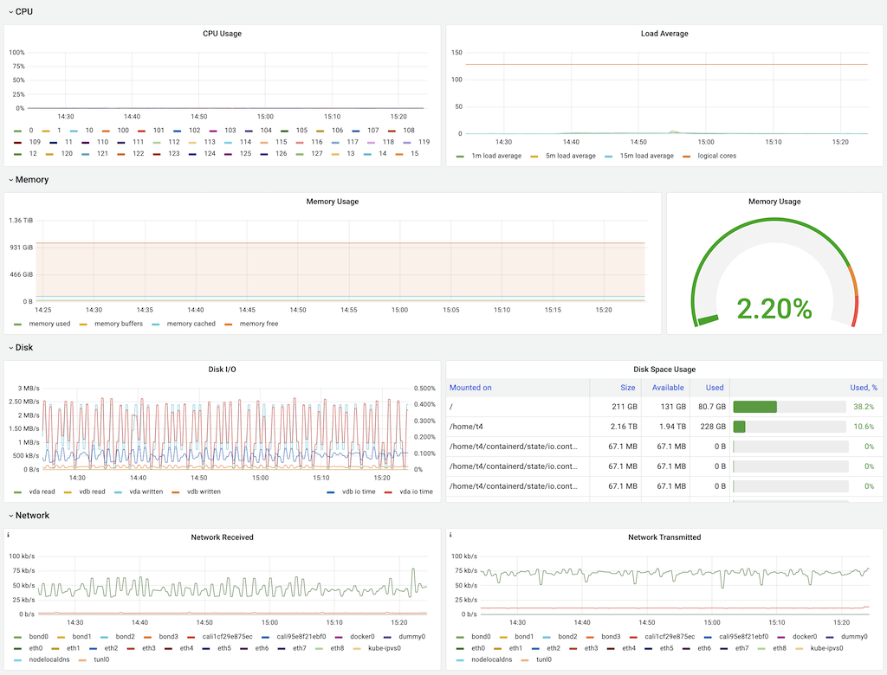
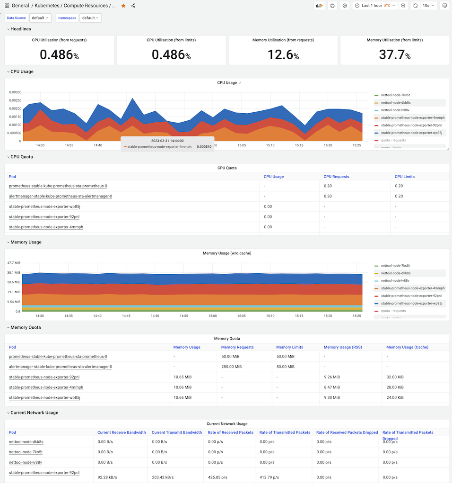

.. _grafana_config_startup:

===========================
Grafana配置快速起步
===========================

完成 :ref:`install_grafana` 或者 :ref:`helm3_prometheus_grafana` 之后，配置Grafana

- :ref:`install_grafana` 使用社区提供的apt软件仓库安装，则默认端口是 ``3000`` 首次登陆用户名和密码都是 ``admin`` ，会立即提示修改密码，请修改并保存密码
- :ref:`helm3_prometheus_grafana` 采用社区提供的 :ref:`helm` 安装在Kubernetes集群，通过 :ref:`grafana_behind_reverse_proxy` ，默认 ``admin`` 密码 ``prom-operator``

添加Prometheus数据源(metrics)
===============================

Prometheus是Grafana默认支持的核心组件，对于同时部署了 Prometheus 和 Grafana，所以添加数据源选择 ``Prometheus`` 类型后:

- 在导航栏，选择 ``Configuration`` 图标，然后点击 ``Data Sources``
- 点击 ``Add data source``
- 在数据源列表中，点击选择 ``Prometheus``
- 在URL栏，填写 http://localhost:9090 ( :ref:`install_grafana` ) 或者 Prometheus实际运行的IP地址，例如 Kubernetes 集群内部地址 http://10.233.30.214:9090/ ( :ref:`helm3_prometheus_grafana` )

这个访问 ``Prometheus`` 的地址可以通过 ``kubectl get svc`` 观察 ``prometheus`` 对应的 ``CLUSTER-IP`` ，例如 在 :ref:`helm3_prometheus_grafana` :

.. literalinclude:: ../prometheus/helm3_prometheus_grafana/get_svc_output
   :emphasize-lines: 8

- 然后点击 ``Save & Test``

Grafana读取Prometheus发生插件错误
-----------------------------------

.. note::

   这段请忽略，我记录是为了后续探索社区提供的helm安装，默认配置的用途。后续再修订...

我在 :ref:`helm3_prometheus_grafana` 遇到一个奇怪的问题，默认内部就有一个 Prometheus 数据源，并且URL是 ``http://stable-kube-prometheus-sta-prometheus.default:9090/`` ，而且在数据源上方有一个提示内容::

   Provisioned data source
   This data source was added by config and cannot be modified using the UI. Please contact your server admin to update this data source.

我以为这是一个需要修改的 ``Prometheus`` 源时，但是我发现这个配置只有一个 ``Test`` 按钮，并且点击是错误提示::

   Error reading Prometheus: An error occurred within the plugin

开始使用
==========

.. note::

   其实我最初是 **迷惘** 的，因为我见过很多美观的 Grafana 监控视图...

社区提供的Grafana+Prometheus组合 :ref:`helm3_prometheus_grafana` 内置了很多针对Kubernetes的监控面板，完全是开箱即用的，其实无需配置。(我最初想多了，以为难以上手)

只需要上文配置好 :ref:`prometheus` 的数据源(这个我倒是遇到一些安全限制导致的采集问题，例如 :ref:`prometheus_metrics_connect_refuse` / :ref:`prometheus_monitor_kubelet` )，然后直接在 ``General`` 搜索栏中选择内置的Kubernetes面板就可以了。以下是一些非常直观的Kubernetes监控面板:

- Node Export / Nodes:

- 基于Namespace的K8s计算资源使用

此外，针对 :ref:`gpu_k8s` ，采用 :ref:`dcgm-exporter` 可以如同采集CPU数据一样采集GPU数据，可以集成到Grafana中实现完善的监控。 

更多dashboards
=================

Grafana.com 维护了一系列 `共享Grafana dashboards <https://grafana.com/dashboards>`_ ，可以下载并用于自己的Grafana部署。

注意，下载的 ``JSON`` 文件需要手工编辑并修正 ``datasource:`` 配置项以便反映正确连接的 :ref:`prometheus` 服务器数据源。然后使用 ``"Dashboards" → "Home" → "Import"`` 导入dashboard。 

Prometheus graph
===================

- 添加一个 ``Metrics`` ，可以使用任意一个 Prometheus 的metircs，例如，之前测试过 ``rate(node_cpu_seconds_total{mode="system"}[1m])`` （也就是节点的system负载)
