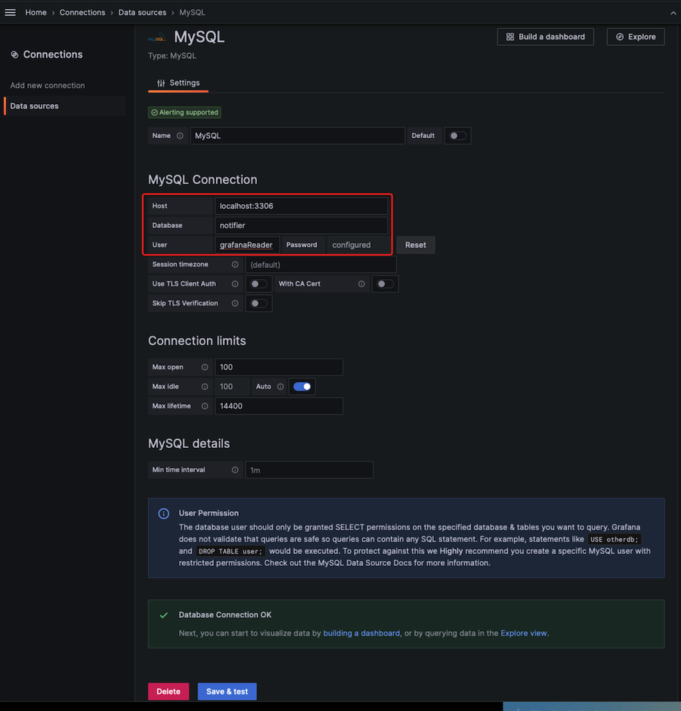
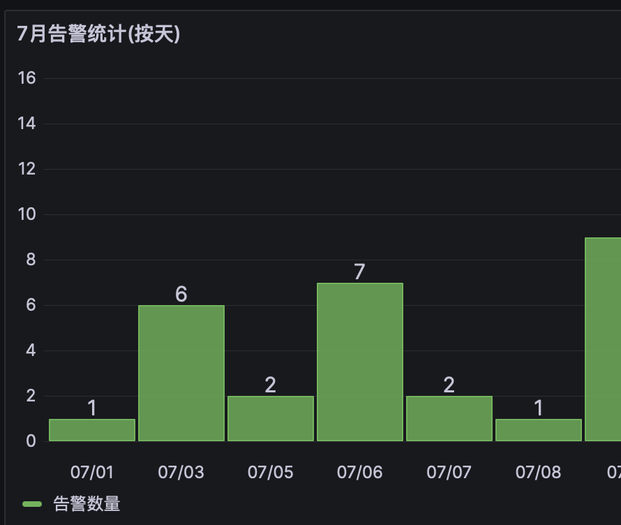

.. _grafana_mysql_data_source:

========================
Grafana使用MySQL数据源
========================

Grafana内置提供了MySQL数据源插件，也就是可以直接查询和可视化MySQL兼容的数据库数据。

这在日常运维工作中非常有用，因为大多数后端开发和运维工程师都不擅长前端开发，自己使用框架开发图表虽然也可行，但是毕竟效率较低，且很难达到Grafana这样专业的水准。虽然各大互联网公司都有自己的大数据平台和可视化报表系统，但是专有闭源平台往往非常沉重使用不变。对于个人和中小型公司，实际上使用 Grafana 结合数据库就能构建非常好的BI系统。

准备工作
==========

- 首先完成 :ref:`install_mariadb` ，获得可运行和访问的MySQL数据库:

.. literalinclude:: ../../../mysql/installation/install_mariadb/mariadb_startup
   :caption: 快速安装、启动和初始化MariaDB

.. literalinclude:: ../../../mysql/installation/install_mariadb/create_db_user
   :caption: 创建一个数据库并创建访问账号及授权

- 比较简单的方式是通过程序脚本、日志系统，向MySQL数据库加载数据

- 创建一个 ``grafanareader`` 只读查询账号并赋予查询权限:

.. literalinclude:: grafana_mysql_data_source/grant_grafana_mysql_account
   :caption: 创建 ``grafanareader`` 只读查询账号并赋予查询权限

配置数据源
============

- 在左方导航菜单选择 ``Connections => Data sources`` ，然后点击 ``Add new data source`` 按钮

- 选择 ``MySQL`` 数据源

- 输入配置:

- 测试通过后保存，然后就可以到dashboard中去构建查询

查询
========

Grafana提供了Query Builder，只需要选择MySQL数据源，就可以依次选择数据表，列进行查询；当然SQL语法可以直接使用，所以也可以在MySQL中先采用标准SQL查询好符合预期的结果，然后再输入到 Grafana 的 Query Code栏进行查询

- 数据查询: 按天纬度查询每日告警数据量

.. literalinclude:: ../../../mysql/query/mysql_query_date_time/count_rows_per_day
   :caption: 按照每天统计告警数量

MySQL查询语句可以直接在Grafana中使用，只需要构建DashBoard的可视化面板时选择MySQL数据源，然后选择正确的Graph就可以(注意：Grafana图表是按时间序列，所以统计数据如果没有时间需要就需要使用表格或特定图表)，效果类似如下:

参考
=======

- `Grafana documentation > Data sources > MySQL <https://grafana.com/docs/grafana/latest/datasources/mysql/>`_
