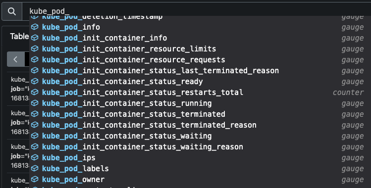

.. _ksm_pod-metrics:

======================================
kube-state-metrics (KSM) Pod Metrics
======================================

在部署了 ``kube-state-metrics`` 的集群中，使用 :ref:`prometheus` 查询，输入 ``kube_pod_`` 开头就可以看到提示有如下一些 metrics:

这些是非常有用的metrics，提供了集群pods不同角度的查询和观察方法，可以通过选择某个metrics来观察 kube-state-metrics (KSM) Pod Metrics 提供了哪些数据信息

``kube_pod_labels``
======================

``kube_pod_info``
=======================

参考
========

- `kube-state-metrics docs: pod-metrics.md <https://github.com/kubernetes/kube-state-metrics/blob/main/docs/pod-metrics.md>`_
