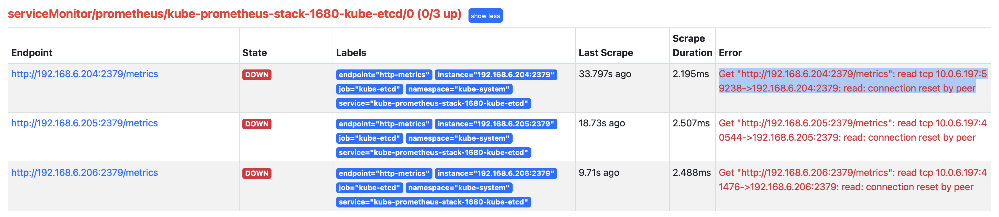

.. _kube-prometheus-stack_etcd:

====================================
``kube-prometheus-stack`` 监控etcd
====================================

默认部署好 ``kube-prometheus-stack`` ，如果Kubernetes集群采用了外部 :ref:`etcd` (例如: :ref:`deploy_etcd_cluster_with_tls_auth` )，那么 :ref:`grafana` 中显示 :ref:`etcd` 的内容是空白的。此时需要定制 ``values`` 并通过 :ref:`update_prometheus_config_k8s` 提交etcd相关配置(包括证书)，这样才能对 ``etcd`` 完整监控。

通过 ``kube-prometheus-stack.values`` 配置 ``etcd`` 访问密钥
=============================================================

对于外部 :ref:`etcd` ，在 ``kube-prometheus-stack.values`` 有一段 ``kubeEtcd`` 配置，修订如下:

.. literalinclude:: kube-prometheus-stack_etcd/kube-prometheus-stack.values
   :language: yaml
   :caption: 通过 ``kube-prometheus-stack.values`` 配置监控外部 ``etcd`` ，使用etcd客户端证书访问(类似apiserver)
   :emphasize-lines: 32-34

这里访问 ``etcd`` 证书我使用了管控服务器上的访问 ``etcd`` 证书

执行更新:

.. literalinclude:: update_prometheus_config_k8s/helm_upgrade_gpu-metrics_config
   :language: bash
   :caption: 使用 ``helm upgrade`` prometheus-community/kube-prometheus-stack

这里我遇到一个报错:

.. literalinclude:: kube-prometheus-stack_etcd/helm_upgrade_gpu-metrics_config_error
   :language: bash
   :caption: 使用 ``helm upgrade`` prometheus-community/kube-prometheus-stack提示etcd相关错误

- 检查 ``endpoints`` :

.. literalinclude:: kube-prometheus-stack_etcd/kube-system_endpoints
   :language: bash
   :caption: 检查 ``kube-system`` namespace中的 ``endpoints`` (ep)

输出显示 ``kube-etcd`` 和 ``kube-proxy`` 这两个 ``endpoints`` 是空的: ``kube-proxy`` 为空是因为我部署 :ref:`cilium_kubeproxy_free`

.. literalinclude:: kube-prometheus-stack_etcd/kube-system_endpoints_output
   :language: bash
   :caption: 检查 ``kube-system`` namespace中的 ``endpoints`` (ep) 输出

备份并删除 ``kube-prometheus-stack-1680-kube-etcd`` ::

   kubectl -n kube-system get ep kube-prometheus-stack-1680-kube-etcd -o yaml > ep_kube-prometheus-stack-1680-kube-etcd.yaml
   kubectl -n kube-system delete ep kube-prometheus-stack-1680-kube-etcd

但是报错依旧一摸一样: 我发现原来刚删除掉 ``ep`` 立即自动生成。

感觉是之前部署的时候默认激活了 ``etcd`` 监控导致添加了 ``ep`` ，而且这个 ``ep`` 是自动刷新的。推测可以先关闭掉 ``etcd`` 监控，使得这个 ``kube-system`` namespace中 ``ep`` 消失，然后重新激活 ``etcd`` 监控配置:

- 修订 ``kube-prometheus-stack.values`` :

.. literalinclude:: kube-prometheus-stack_etcd/kube-prometheus-stack.values_disable_kubeetcd
   :language: yaml
   :caption: ``kube-prometheus-stack.values`` 配置暂时去除 ``etcd`` 监控

- 然后再执行依次更新:

.. literalinclude:: update_prometheus_config_k8s/helm_upgrade_gpu-metrics_config
   :language: bash
   :caption: 先关闭  ``kubeEtcd`` 配置(false)，然后执行依次 ``helm upgrade`` 消除掉 ``kube-system`` namespace 中对应 ``etcd`` 的 ``ep``

完成后检查 ``endpoints`` :

.. literalinclude:: kube-prometheus-stack_etcd/kube-system_endpoints
   :language: bash
   :caption: 检查 ``kube-system`` namespace中的 ``endpoints`` (ep)

可以看到 ``kube-prometheus-stack-1680-kube-etcd`` 项消失了

- 重新恢复 ``kube-prometheus-stack.values`` 中 ``kubeEtcd`` 配置，注意这次我们需要将所有 ``etcd`` 监控配置项都填写好，然后执行 ``helm upgrade`` 就不再报错能够正常完成

- 再次查看 ``endpoints`` :

.. literalinclude:: kube-prometheus-stack_etcd/kube-system_endpoints
   :language: bash
   :caption: 检查 ``kube-system`` namespace中的 ``endpoints`` (ep)

可以看到现在 ``kube-prometheus-stack-1680-kube-etcd`` 对应已经加入了需要监控的服务器列表:

.. literalinclude:: kube-prometheus-stack_etcd/kube-system_endpoints_etcd
   :language: bash
   :caption: 检查 ``kube-system`` namespace中的 ``endpoints`` (ep)可以看到已经由 ``kube-prometheus-stack`` 加入了需要监控的etcd ``ep``
   :emphasize-lines: 10

但是，此时观察 ``prometheus`` 的WEB界面，可看到抓取没有成功::

   Get "http://192.168.6.204:2379/metrics": read tcp 10.0.6.197:59238->192.168.6.204:2379: read: connection reset by peer

参考 `Prometheus: Monitor External Etcd Cluster <https://confluence.infn.it/display/CLOUDCNAF/2%29+Monitor+External+Etcd+Cluster>`_ ，检查 ``prometheus`` ::

   kubectl edit prometheus -n prometheus

发现确实没有对应的 ``secrets`` ::

   secrets:
     - <secret_name> # <--- Insert secret here 没有找到

- 检查 ``kubectl get servicemonitor -n prometheus`` 可以看到::

   ...
   kube-prometheus-stack-1680-kube-etcd                        36m
   ...

仔细查看文档 `Prometheus: Monitor External Etcd Cluster <https://confluence.infn.it/display/CLOUDCNAF/2%29+Monitor+External+Etcd+Cluster>`_ 发现了一个窍门， ``kube-prometheus-stack`` 约定了 ``<secret_name>`` 是存放密钥的路径中最后一段目录，例如::

         caFile: /etc/prometheus/secrets/<secret_name>/ca.crt
         certFile: /etc/prometheus/secrets/<secret_name>/apiserver-etcd-client.crt
         keyFile: /etc/prometheus/secrets/<secret_name>/apiserver-etcd-client.key

所以，不能自己随便指定密钥目录

正确配置方法
--------------

- 重新配置 ``kube-prometheus-stack.values`` 注意访问证书名字是有规律的:

.. literalinclude:: kube-prometheus-stack_etcd/kube-prometheus-stack.values_secret
   :language: yaml
   :caption: 通过 ``kube-prometheus-stack.values`` 配置监控外部 ``etcd`` ， **注意配置中的注释已经说明** 证书名就是目录最后一段 ``etcd-client-cert``
   :emphasize-lines: 29-31,66,67

.. note::

   一定要配置 ``prometheus.prometheusSpec.secrets`` 添加 ``etcd-client-cert``

- 按照 ``<secret_name>`` 名字，将需要的证书都复制到当前目录下，准备好下一步创建 ``secret`` :

.. literalinclude:: kube-prometheus-stack_etcd/prepare_etcd-client-cert
   :language: bash
   :caption: 在当前目录下创建一个证书目录(名字随意，只是为了方便)，将需要的证书文件汇总

- 创建名为 ``etcd-client-cert`` 的 ``secret`` ，这个 ``etcd-client-cert`` 必须对应于 ``kube-prometheus-stack.values`` 配置中存放证书目录的最后一段(代表 ``secret`` 名字):

.. literalinclude:: kube-prometheus-stack_etcd/create_etcd-client-cert
   :language: bash
   :caption: 创建名为 ``etcd-client-cert`` 的 secret

完成后通过 ``kubectl get secret -n prometheus -o yaml`` 可以看到这个 ``etcd-client-cert`` 证书内容就是包含上述3个文件::

   ...
   data:
     etcd-ca: XXXXX
     etcd-client: XXXXX
     etcd-client-key: XXXX

- 执行更新:

.. literalinclude:: update_prometheus_config_k8s/helm_upgrade_gpu-metrics_config
   :language: bash
   :caption: 再次更新

更新以后检查 ``kubectl edit prometheus -n prometheus`` 可以看到 ``secret`` 已经加入::

   ...
     secrets:
     - etcd-client-cert
     securityContext:
       fsGroup: 2000
       runAsGroup: 2000
       runAsNonRoot: true
       runAsUser: 1000
   ...
  
并且登陆到 ``prometheus`` pod中检查，可以看到 ``/etc/prometheus/secrets/etcd-client-cert`` 目录下确实正确链接了对应的证书文件，和 ``kube-prometheus-stack.values`` 配置符合

发现还是错误::

   Get "http://192.168.6.206:2379/metrics": read tcp 10.0.6.146:55926->192.168.6.206:2379: read: connection reset by peer

我突然发现，怎么是采用了 ``http://`` 协议，不是应该是 ``https://`` 么？

检查了 ``Prometheus`` 的 ``Configuration`` 发现了奇怪的 job 显示是 ``scheme: http`` :

.. literalinclude:: kube-prometheus-stack_etcd/etcd_job_http
   :language: yaml
   :caption: 发现prometheus中configuration配置显示 ``scrap`` etcd时候使用了http而不是https
   :emphasize-lines: 6

可能和 ``kubectl -n kube-system edit ep kube-prometheus-stack-1680-kube-etcd`` 有关(为何会在 ``kube-system``)::

   subsets:
   - addresses:
     - ip: 192.168.6.204
     - ip: 192.168.6.205
     - ip: 192.168.6.206
     ports:
     - name: http-metrics
       port: 2379
       protocol: TCP

.. warning::

   暂时没有解决这个问题，我准备采用 ``2381`` http端口 暂时绕过这个问题，后续再有机会再实践

使用secret访问etcd进行监控(记录参考)
=====================================

.. note::

   `Prometheus: Monitor External Etcd Cluster <https://confluence.infn.it/display/CLOUDCNAF/2%29+Monitor+External+Etcd+Cluster>`_ 详细配置 

   这个方案其实和 ``kube-prometheus-stack`` 是同出一源，只不过做了手工直接编辑，但是为理清关系提供了帮助

- Prometheus要通过TLS安全访问etcd需要一个 ``secret`` ，使用以下命令为 prometheus 创建访问 :ref:`etcd` 的secret:

.. literalinclude:: kube-prometheus-stack_etcd/create_secret_prometheus_etcd
   :language: bash
   :caption: 为prometheus创建访问etcd的secret

输出 ``2381`` http端口的metrics方法(记录参考)
================================================

.. note::

   如果 :ref:`etcd` 采用了 :ref:`static_pod` 部署模式，可以参考本段方案。不过，我的实践目前还是采用独立 :ref:`deploy_etcd` ，生产上为了降低依赖，会采用 :ref:`docker` 直接运行 ``etcd`` 。所以，目前我的实践采用上文为 ``kube-prometheus-stack`` 独立配置 ``etcd`` 访问证书方式

   目前我的实践记录在 :ref:`kube-prometheus-stack_etcd_http`

`Prometheus: installing kube-prometheus-stack on a kubeadm cluster <https://fabianlee.org/2022/07/08/prometheus-installing-kube-prometheus-stack-on-a-kubeadm-cluster/>`_ (解决 :ref:`prometheus_metrics_connect_refuse` 的参考文档 )提供了另外一种解决方案:

- 为 ``etcd`` 添加一个不加密的http访问 :ref:`metrics` 端口 ``2381`` ::

   # master where etcd is running
   master_ip=192.168.122.217
   sed -i "s#--listen-metrics-urls=.*#--listen-metrics-urls=http://127.0.0.1:2381,http://$master_ip:2381#" /etc/kubernetes/manifests/etcd.yaml

这样 :ref:`static_pod` 模式下会立即重启 ``etcd`` 服务并添加一个 ``2381`` 的 http 端口可以用来获取 :ref:`metrics`

- 修订 ``kube-prometheus-stack.values`` ，将默认 ``2379`` (https)端口修订为 ``2381`` ::

   kubeEtcd:
     enabled: true
     service:
       enabled: true
       port: 2381
       targetPort: 2381 

- 可能需要修订 Helm chat rules for etcd (具体请参考原文)，视安装的 ``kube-prometheus-stack`` 版本是否已经合并上游fixed patch::

   defaultRules:
     disabled:
       etcdHighNumberOfFailedGRPCRequests: true

参考
==========

- `Prometheus Operator not scraping colocated etcd metrics <https://stackoverflow.com/questions/70804368/prometheus-operator-not-scraping-colocated-etcd-metrics>`_ 基于 ``kube-prometheus-stack`` 的快速配置
- `Prometheus Kube Etcd is showing down 0/1 <https://discuss.kubernetes.io/t/prometheus-kube-etcd-is-showing-down-0-1/21380>`_ 提示了 ``prometheus.prometheusSpec.secrets`` 添加 ``etcd-client-cert``
- `Prometheus: Monitor External Etcd Cluster <https://confluence.infn.it/display/CLOUDCNAF/2%29+Monitor+External+Etcd+Cluster>`_
- `Monitoring ETCD with Prometheus Operator <https://hemanth-penmetcha.medium.com/monitoring-etcd-with-prometheus-operator-b9cd8eaff719>`_
- `Prometheus: installing kube-prometheus-stack on a kubeadm cluster <https://fabianlee.org/2022/07/08/prometheus-installing-kube-prometheus-stack-on-a-kubeadm-cluster/>`_
