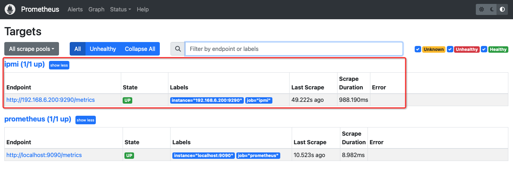
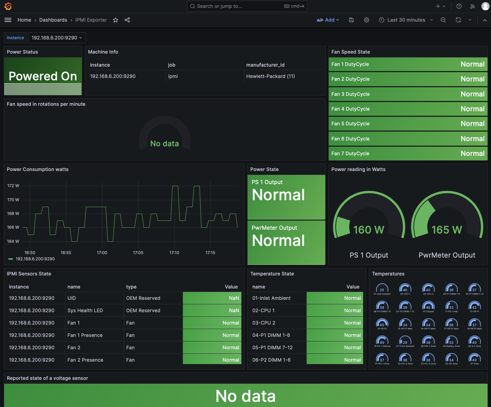
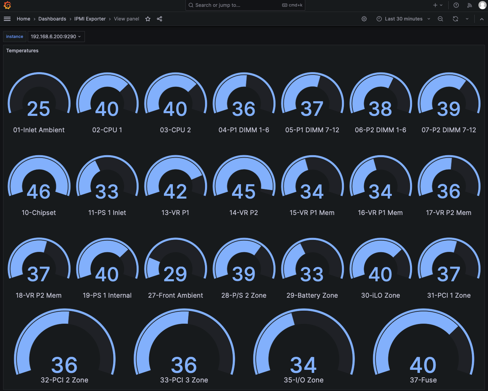

.. _ipmi_exporter:

=====================
IPMI Exporter
=====================

.. note::

   :ref:`hpe_server_monitor`

:ref:`prometheus_exporters` 有一个官方 ``ipmi_exporter`` 可以基于 :ref:`ipmi` 输出 :ref:`metrics` 。并且有一个非常完美的 :ref:`grafana` `Dashboard IPMI for Prometheus <https://grafana.com/grafana/dashboards/13177-ipmi-for-prometheus/>`_ 。这样可以用来监控大规模服务器集群，并且生成告警。

``ipmi_exporter`` 输出本地IPMI metrics到标准的 ``/metrics`` ，无需特殊配置。对于远程metrics，通用配置方法非常类似 :ref:`blackbox_exporter` (黑盒测试HTTP,HTTPS,DNS,TCP,ICMP和gRPC)，只需要简单使用 ``target`` 和 ``module`` URL参数告知IPMI设备入口即可。可以对数以千计的IPMI设备进行metrics输出。

对于本地ipmi无需密码账号，对于远程ipmi，则要提供IPMI设备的用户名和密码。此外，还提供了一个 ``blacklist`` 屏蔽掉 FreeIPMI 不支持的特殊OEM传感器。

有两个案例配置文件: ``ipmi_local.yml`` 抓取本地主机metrics，以及 ``ipmi_remote.yml`` 抓取远程IPMI接口。

.. note::

   社区 :ref:`prometheus_exporters` 的 ``ipmi_exporter`` 是采用 ``freeipmi`` 来访问IPMI获取服务器监控数据的。

   另外一种解决方案是采用 :ref:`node_exporter` 提供的 :ref:`node_exporter_ipmitool_text_plugin` 实现

安装
========

- 直接从 `Prometheus IPMI Exporter (GitHub) <https://github.com/prometheus-community/ipmi_exporter>`_ 下载release包，也可以参考该文档自己编译:

.. literalinclude:: ipmi_exporter/install_ipmi_exporter
   :caption: 安装 ``ipmi_exporter``

- 服务器安装 ``freeipmi`` (安装以后会获得 `GNU FreeIPMI <https://www.gnu.org/software/freeipmi/>`_ 全部命令，位于 ``/usr/sbin`` 目录):

.. literalinclude:: ipmi_exporter/ubuntu_install_freeipmi
   :caption: 在Ubuntu中安装FreeIPMI

- 创建一个 ``ipmi-exporter`` 用户，类似 :ref:`prometheus_startup` ，我们将限定这个用户不可登录:

.. literalinclude:: ipmi_exporter/create_ipmi-exporter_user
   :caption: 设置 ``ipmi-exporter`` 用户账号

- ``ipmi-exporter`` 用户必须能 ``sudo`` 无密码执行 ``freeipmi`` 命令，所以配置 ``/etc/sudoers`` :

.. literalinclude:: ipmi_exporter/ipmi-exporter_sudo
   :caption: 配置 ``ipmi-exporter`` 用户 sudo 权限

- 创建 ``/etc/prometheus/ipmi_remote.yml`` :

.. literalinclude:: ipmi_exporter/ipmi_remote.yml
   :language: yaml
   :caption: 创建 ``/etc/prometheus/ipmi_remote.yml``

- 创建 ``/etc/prometheus/ipmi_local.yml`` (如果是本地执行):

.. literalinclude:: ipmi_exporter/ipmi_local.yml
   :language: yaml
   :caption: 创建 ``/etc/prometheus/ipmi_local.yml``

注意，这里按照 ``/etc/sudoers`` 添加的需要执行的命令，每个都采用了 ``sudo`` 来执行，参考了 `ipmi_exporter exanmple config <https://github.com/prometheus-community/ipmi_exporter/blob/master/ipmi_remote.yml>`_

- 参考 :ref:`prometheus_startup` 方式为 ``ipmi_exporter`` 配置一个 ``/etc/systemd/system/ipmi_exporter.service`` (这里假设使用 ``/etc/prometheus/ipmi_remote.yml`` 远程访问IPMI):

.. literalinclude:: ipmi_exporter/ipmi_exporter.service
   :caption: systemd启动配置 ``/etc/systemd/system/ipmi_exporter.service``

- 启动 ``ipmi_exporter`` 服务:

.. literalinclude:: ipmi_exporter/start_ipmi_exporter.service
   :caption: 启动 ``ipmi_exporter`` 服务

debug
=======

上述运行起来 ``ipmi_exporter`` 之后，直接通过 ``wget http://127.0.0.1:9290/metrics`` 拿到的数据中关于IPMI的记录没有采集到(metrics值0表示采集异常):

.. literalinclude:: ipmi_exporter/wget_ipmi_exporter_metrics_0
   :caption: ``wget http://127.0.0.1:9290/metrics`` 检查 ``ipmi_exporter`` 显示数据采集失败，metrics 值 0 表示采集异常

检查服务 ``systemctl status ipmi_exporter`` 显示没有权限打开:

.. literalinclude:: ipmi_exporter/ipmi_exporter_services_status
   :caption: 显示 ipmi_exporter 采集因为权限不足而失败
   :emphasize-lines: 16-19

注意，这里输出错误信息实际上是每次访问 ``ipmi_exporter`` 的 ``metrics`` 时候输出的，也就是服务的控制台输出。

我调整了以下 ``ipmi-exporter`` 用户账号，允许该用户登陆( ``/bin/bash`` )，然后切换到该账号下模拟执行 ``sudo bmc-info`` 是能够正常运行输出的。所以怀疑是 ``/etc/prometheus/ipmi_local.yml`` 配置生效问题(虽然参考 `ipmi_exporter exanmple config <https://github.com/prometheus-community/ipmi_exporter/blob/master/ipmi_remote.yml>`_ 配置了命令都使用 ``sudo`` )

汗，我知道原因了:

我配置了一个 ``cloudatlas`` 模块，而不是 ``default`` ，这个模块是在 ``prometheus`` scrap 时指定模块才能使用，简单使用 ``curl`` 没有指定模块，就没有用到 ``cloudatlas`` 配置中的 ``sudo``

简化配置，修订为 ``default`` 之后，果然直接使用 ``curl http://127.0.0.1:9290/metrics`` 可以获得完整的IPMI输出信息，包括了服务器的温度，风扇是否工作正常等信息...

配置Prometheus
=================

本地metrics
----------------

本地metrics获取非常简单，只需要配置运行exporter的一个默认的metrics入口:

- 修改 ``/etc/prometheus/prometheus.yml`` 添加一段 ``scrape_configs`` 配置:

.. literalinclude:: ipmi_exporter/prometheus.yml
   :caption: 在 prometheus.yml 中 ``scrape_configs`` 段落添加 ``ipmi`` 抓取任务
   :emphasize-lines: 7-12

- 然后重启 ``prometheus`` 服务就可以在 targets 页面看到新的抓取目标:

远程metrics（待实践)
-------------------------

远程metrics需要配置2个文件，一个是指定目标，一个是配置抓取地址(这里假设远程服务器的DNS名字是 ``ipmi-exporter.internal.example.com`` ):

- 配置 ``/srv/ipmi_exporter/targets.yml`` :

.. literalinclude:: ipmi_exporter/targetes.yml
   :caption: 设置目标地址

- 在 ``/etc/prometheus/prometheus.yml`` 添加一段 ``scrape_configs`` 配置:

.. literalinclude:: ipmi_exporter/prometheus_ipmi_remote.yml
   :caption: 远程抓取配置 prometheus.yml

配置Grafana
==============

:ref:`grafana` `Dashboard IPMI for Prometheus <https://grafana.com/grafana/dashboards/13177-ipmi-for-prometheus/>`_

完成后就可以看到我的 :ref:`hpe_dl360_gen9` :ref:`hpe_server_monitor` 的功耗监控:

温度监控:

.. note::

   没有获取到风扇转速

参考
======

- `Prometheus IPMI Exporter (GitHub) <https://github.com/prometheus-community/ipmi_exporter>`_
