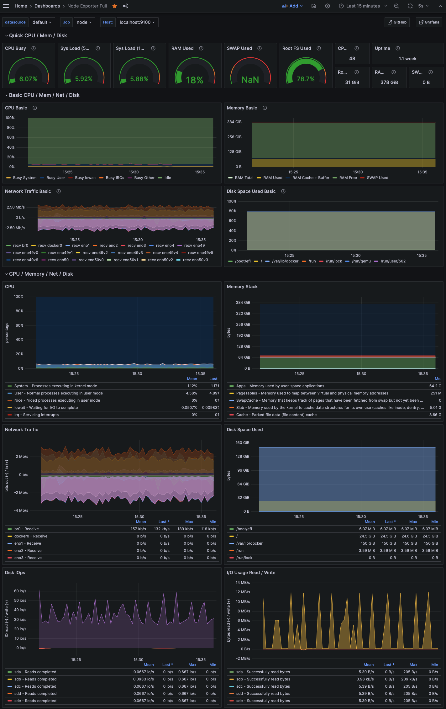

.. _node_exporter:

==========================
Node Exporter
==========================

Prometheus Node Exporter提供了一系列硬件和内核相关metric

.. note::

   要输出 :ref:`nvidia_gpu` ，需要使用 `prometheus-dcgm <https://github.com/NVIDIA/dcgm-exporter>`_

安装
========

.. note::

   采用 Prometheus 社区helm chart 完成的 :ref:`helm3_prometheus_grafana` 会自动为每个Node节点安装 Node Exporter。强烈推荐采用!!!

- 下载安装执行程序:

.. literalinclude:: node_exporter/install_node_exporter
   :caption: 安装Node Exporter执行程序

:strike:`要持续运行可以采用 screen` :

   screen -S node_exporter -dm /usr/local/bin/node_exporter

.. note::

   ``node_exporter`` 运行不需要root权限，并且会监听所有网络接口的 ``9100`` 端口，所以prometheus可以直接抓去指定服务器 ``node_exporter`` 输出的 metrics

- 参考 :ref:`prometheus_startup` 的 :ref:`systemd` 配置，为 ``Node Exporter`` 配置一个服务 ``/etc/systemd/system/node_exporter.service``

.. literalinclude:: node_exporter/node_exporter.service
   :caption: 配置 Node Exporter 服务，通过 :ref:`systemd` 运行

- 启动:

.. literalinclude:: node_exporter/systemd_node_exporter
   :caption: 通过 :ref:`systemctl` 启动 ``node_exporter`` 服务

此时观察运行状态可以看到已经运行:

.. literalinclude:: node_exporter/systemd_node_exporter_output
   :caption: 通过 :ref:`systemctl` 启动 ``node_exporter`` 服务的状态观察

检查
=======

- 一旦 ``node_exporter`` 运行起来，可以见证metrics::

   curl http://localhost:9100/metrics

配置prometheus实例
=====================

我们在 :ref:`prometheus_startup` 安装的初始配置上添加以下内容来抓取指定服务器数据:

.. literalinclude:: node_exporter/prometheus.yml
   :language: yaml
   :caption: 在 ``/etc/prometheus/prometheus.yml`` 中添加抓取node配置任务

然后重启 prometheus ，再通过浏览器观察查询一些案例表达式，例如:

- ``rate(node_cpu_seconds_total{mode="system"}[1m])`` 表示在系统模式下每秒CPU消耗平均量，记录最近1分钟(每秒)

.. figure:: ../../../../_static/kubernetes/monitor/prometheus/prometheus_exporters/node_exporter_cpu_time.png
   :scale: 70

配置Ceph节点监控
--------------------

:ref:`ceph_dashboard_prometheus` 采用的架构:

- 在每个 ceph 节点安装 :ref:`node_exporter` ，然后 :ref:`prometheus_startup` 安装配置成从各个Ceph抓取数据
- :ref:`grafana` 从 Prometheus 获取数据结合到 :ref:`ceph_dashboard_prometheus` 监控

以下为Ceph监控部署

- 在每个 Ceph 节点安装并运行 ``Prometheus`` Node Exporter::

   for i in {1..3};do ssh z-b-data-${i} "sudo apt install screen -y";done

   for i in {1..3};do scp node_exporter z-b-data-${i}:/home/huatai/;done

   for i in {1..3};do ssh z-b-data-${i} "sudo mv /home/huatai/node_exporter /usr/local/bin/node_exporter;screen -S node_exporter -dm /usr/local/bin/node_exporter";done

- 然后修订 ``z-b-mon-1`` 上 ``/etc/prometheus/prometheus.yml`` 继续在 ``job_name: "node"`` 添加受监控节点::

     - job_name: "node"
       static_configs:
       - targets: ['localhost:9100']
       - targets: ['z-b-data-1:9100']
       - targets: ['z-b-data-2:9100']
       - targets: ['z-b-data-3:9100'] 

.. note::

   这里采用主机名，是因为我已经部署 :ref:`priv_dnsmasq_ics` ，可以在任意主机上解析整个网络所有服务器

配置Grafana
===============

`Node Exporter Full <https://grafana.com/grafana/dashboards/1860-node-exporter-full/>`_ 提供了一个全面观察的Dashboard， ``Import`` 之后可以看到惊人的 29 个分类超过 192 个面板，很多观察参数以前都没有注意过，在异常分析场景下可以帮助我们对比系统问题:

部分 ``node_exporter`` 监控模块默认不启用(性能或采集消耗资源)，如果要激活指定模块，可以通过修订 ``node_exporter`` 运行参数来增加，例如::

   ExecStart=/usr/local/bin/node_exporter --collector.processes --collector.ntp

`Complete Node Exporter Mastery with Prometheus <https://devconnected.com/complete-node-exporter-mastery-with-prometheus/>`_ 推荐了2个非常有意思的prometheus监控实践分享:

- `Prometheus Monitoring for Java Developers <https://youtu.be/jb9j_IYv4cU>`_ 关于如何在Java代码中中加入Prometheus 库实现白盒监控(metrics)以及常见的Java框架性能数据bridge成Prometheus进行监控(前半部分是Prometheus的基本功能介绍可作为入门)

.. youtube:: jb9j_IYv4cU

- `How to Export Prometheus Metrics from Just About Anything <https://youtu.be/Zk09Mbu0YQk>`_ 关于如何实现 :ref:`node_exporter_textfile-collector`

.. youtube:: Zk09Mbu0YQk

参考
=========

- `MONITORING LINUX HOST METRICS WITH THE NODE EXPORTER <https://prometheus.io/docs/guides/node-exporter/>`_
- `How to Setup Prometheus Node Exporter on Kubernetes <https://devopscube.com/node-exporter-kubernetes/>`_
- `Complete Node Exporter Mastery with Prometheus <https://devconnected.com/complete-node-exporter-mastery-with-prometheus/>`_ 这篇文章较为全面，提供了详细的 `Node Exporter Full <https://grafana.com/grafana/dashboards/1860-node-exporter-full/>`_ 介绍以及使用附加模块和 :ref:`node_exporter_textfile-collector` YouTube资源
