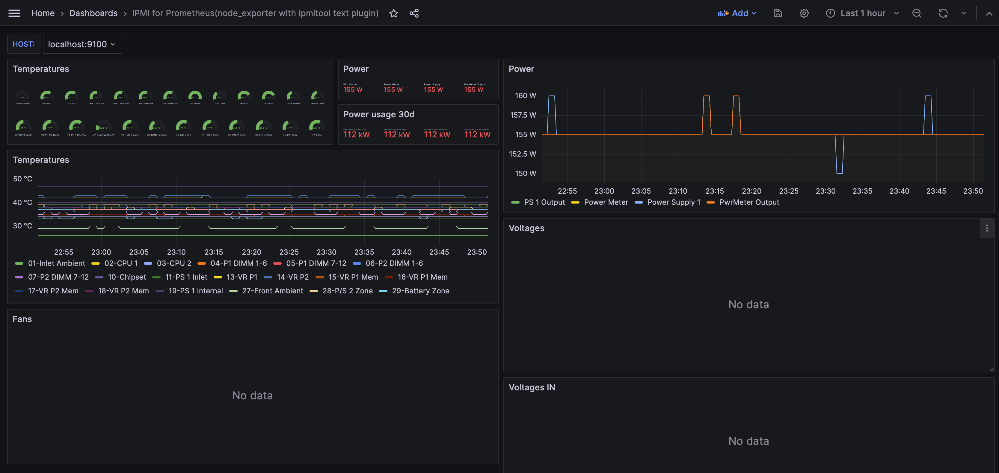

.. _node_exporter_ipmitool_text_plugin:

===================================
Node Exporter ipmitool 文本插件
===================================

通过 :ref:`node_exporter_textfile-collector` 可以将几乎所有文本转换成Prometheus的metrics，也包括 :ref:`ipmi` 。这种方式可以帮助我们监控服务器的硬件:

准备工作
==========

- 创建一个 ``/var/lib/node_exporter/textfile_collector/`` 用于存放 ``--collector.textfile.directory`` 对应的 ``*.prom`` 文件，以便转换成metrics::

   sudo mkdir -p /var/lib/node_exporter/textfile_collector
   sudo chomd 777 /var/lib/node_exporter/textfile_collector

- Prometheus社区提供了 `node-exporter-textfile-collector-scripts <https://github.com/prometheus-community/node-exporter-textfile-collector-scripts>`_ ，将这些脚本下载到服务器上:

.. literalinclude:: node_exporter_textfile-collector/git_node-exporter-textfile-collector-scripts
   :caption: 下载 ``node-exporter-textfile-collector-scripts`` 到本地( ``/etc/prometheus`` )

这里将使用 ``/etc/prometheus/node-exporter-textfile-collector-scripts/ipmitool`` **脚本** 来转换服务器的 ``ipmitool sensor`` 命令输出成 :ref:`node_exporter_textfile-collector` 可处理的兼容格式

执行脚本
=========

社区推荐使用 ``sponge`` 来自动写输出，所以先执行以下命令生成一个案例检查::

   sudo ipmitool sensor | /etc/prometheus/node-exporter-textfile-collector-scripts/ipmitool | sponge /var/lib/node_exporter/textfile_collector/ipmitool.prom

然后检查输出内容 ``/var/lib/node_exporter/textfile_collector/ipmitool.prom`` 可以看到类似::

   # HELP node_ipmi_temperature_celsius Temperature sensor reading from ipmitool
   # TYPE node_ipmi_temperature_celsius gauge
   node_ipmi_temperature_celsius{sensor="37-Fuse"} 38.000000
   node_ipmi_temperature_celsius{sensor="15-VR P1 Mem"} 34.000000
   node_ipmi_temperature_celsius{sensor="02-CPU 1"} 40.000000
   node_ipmi_temperature_celsius{sensor="16-VR P1 Mem"} 35.000000
   ...

这个文件就是 :ref:`node_exporter_textfile-collector` 可以处理的标准格式

- 检查没有问题，就配置 crontab (这里采用root用户) ::

   crontab -e

输入内容::

   * * * * * ipmitool sensor | /etc/prometheus/node-exporter-textfile-collector-scripts/ipmitool | sponge /var/lib/node_exporter/textfile_collector/ipmitool.prom

然后检查目标文件，正常是每分钟刷新一次

配置 ``node_exporter``
==========================

按照 :ref:`node_exporter` 中 :ref:`systemd` 运行服务配置，修订 ``/etc/systemd/system/node_exporter.service`` ::

   ExecStart=/usr/local/bin/node_exporter \
       --collector.textfile.directory=/var/lib/node_exporter/textfile_collector

重启 ``node_exporter`` 服务

在 :ref:`grafana` 中 ``import`` `Grafana Dashboard 13177: IPMI for Prometheus <https://grafana.com/grafana/dashboards/13177-ipmi-for-prometheus/>`_ 

完成后Dashboard:

