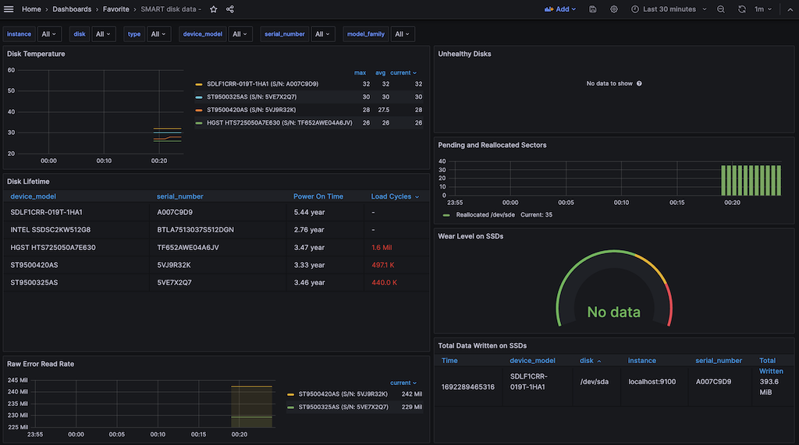

.. _node_exporter_smartctl_text_plugin:

===================================
Node Exporter smartctl 文本插件
===================================

监控磁盘 SMART 数据，原理也是采用 :ref:`node_exporter_textfile-collector` ，并且 Prometheus社区提供了 `node-exporter-textfile-collector-scripts <https://github.com/prometheus-community/node-exporter-textfile-collector-scripts>`_ 包含了 ``smartmon.sh`` 和 ``smartmon.py`` 来输出符合Prometheus文本采集的数据

准备工作
==========

.. note::

   我最初实践时求快，没有仔细琢磨配合 :ref:`node_exporter` 部署的文件权限，采用了简单粗暴的 ``chmod 777`` 方法设置目录 ``/var/lib/node_exporter/textfile_collector`` 属性(方便运行脚本后能够任意向目录写入数据)。由于 :ref:`ipmitool` 和 :ref:`smart_monitor` 都需要 ``root`` 权限，所以当时配置 ``crontab -e`` 使用的是 ``root`` 用户身份(原文未注明)。感谢网友 `he-sb <https://github.com/he-sb>`_ 指正( `《Node Exporter smartctl 文本插件》文中命令有误 #32 <《Node Exporter smartctl 文本插件》文中命令有误 #32>`_ )

- 创建一个 ``/var/lib/node_exporter/textfile_collector/`` 用于存放 ``--collector.textfile.directory`` 对应的 ``*.prom`` 文件，以便转换成metrics:

.. literalinclude:: node_exporter_textfile-collector/textfile_collector_dir
   :caption: 准备 ``/var/lib/node_exporter/textfile_collector/`` 目录

- Prometheus社区提供了 `node-exporter-textfile-collector-scripts <https://github.com/prometheus-community/node-exporter-textfile-collector-scripts>`_ ，将这些脚本下载到服务器上:

.. literalinclude:: node_exporter_textfile-collector/git_node-exporter-textfile-collector-scripts
   :caption: 下载 ``node-exporter-textfile-collector-scripts`` 到本地( ``/etc/prometheus`` )

执行脚本
==========

- 安装 :ref:`sponge` (以 :ref:`ubuntu_linux` 为例，需要独立安装 ``moreutils`` 软件包以获得 ``sponge`` ) :

.. literalinclude:: ../../../../shell/utils/sponge/apt_install_moreutils
   :language: bash
   :caption: 通过安装 ``moreutils`` 获得 ``sponge`` 工具

- 社区脚本 ``smartmon.py`` 或 ``smartmon.sh`` 都可以用于输出，注意手工执行时需要使用 ``sudo`` root权限( :ref:`smart_monitor` 以及 :ref:`ipmitool` 之类的底层命令需要超级权限)::

   sudo /etc/prometheus/node-exporter-textfile-collector-scripts/smartmon.sh | sponge /var/lib/node_exporter/textfile_collector/smartmon.prom

问题来了，我这里要在 ``crontab`` 中配置既能够切换到 ``root`` 身份执行 ``smartmon.sh`` ，又能够切换到 ``prometheus`` 身份执行 ``sponge`` ，该如何配置 :ref:`cron` 呢?

答案是结合 :ref:`cron` 的执行命令身份字段和 :ref:`sudo` (不能使用 ``su`` )。

先切换到 ``root`` 身份进行验证::

   sudo su -
   /etc/prometheus/node-exporter-textfile-collector-scripts/smartmon.sh | sudo -u prometheus sponge /var/lib/node_exporter/textfile_collector/smartmon.prom

然后检查采集到的数据::

   ls -lh /var/lib/node_exporter/textfile_collector/

可以看到正确生成了metrics文本文件，并且属主是我们期望的 ``prometheus`` ::

   -rw-rw-r-- 1 prometheus prometheus 124K Oct 10 15:10 smartmon.prom

- 检查 ``/var/lib/node_exporter/textfile_collector/smartmon.prom`` 内容无误之后，在 ``/etc/cron.d`` 目录下添加配置文件 ``node_exporter_textfile_collector`` :

.. literalinclude:: node_exporter_textfile-collector/node_exporter_textfile_collector
   :language: bash
   :caption: 配置定时执行 ``node_exporter`` 的 ``textfile`` Collectors
   :emphasize-lines: 5

.. note::

   注意，这里配置 :ref:`cron` 的第6列标明了执行脚本的用户账号是 ``root`` ，这样就能运行 ``ipmitool`` 以及 ``smartmon.sh`` 中的 ``smartctl`` 。此时，为了能够将输出结果切换到 ``prometheus`` 身份写磁盘，在管道符号后面使用了 ``sudo -u prometheus`` ，这样最终写入磁盘目录 ``/var/lib/node_exporter/textfile_collector`` 就能够以特定用户身份完成，增加安全性。

   补充一下，这里使用 ``sudo -u prometheus`` 而没有使用 ``su prometheus -c "命令"`` ，是因为 ``prometheus`` 用户账号配置了 ``/sbin/nologin`` 作为SHELL，以防止该用户账号被登陆。这种情况下， ``su`` 命令切换身份执行会报错::

      This account is currently not available.

   而使用 ``sudo -u prometheus`` 则没有问题

配置 ``node_exporter``
==========================

.. note::

   这部分准备工作我已经在 :ref:`node_exporter_ipmitool_text_plugin` 完成

按照 :ref:`node_exporter` 中 :ref:`systemd` 运行服务配置，修订 ``/etc/systemd/system/node_exporter.service`` :

.. literalinclude:: node_exporter_textfile-collector/node_exporter.service
   :caption: ``/etc/systemd/system/node_exporter.service`` 添加 textfile Collector 输出数据目录

重启 ``node_exporter`` 服务

配置 Grafana Dashboard
=========================

在 :ref:`grafana` 中 ``import`` `Grafana Dashboard 16514: SMART + NVMe status <https://grafana.com/grafana/dashboards/16514-smart-nvme-status/>`_

改进版本(推荐)
====================================

- 使用修订过的 `janw / node-exporter-textfile-collector-scripts / smartmon.sh <https://github.com/janw/node-exporter-textfile-collector-scripts/blob/master/smartmon.sh>`_

  - `Grafana Dashboard 10664: SMART disk data <https://grafana.com/grafana/dashboards/10664-smart-disk-data/>`_ 这个面板强烈推荐，我发现比使用 `Grafana Dashboard 16514: SMART + NVMe status <https://grafana.com/grafana/dashboards/16514-smart-nvme-status/>`_ 更好更详细

其他
=======

- 使用 `olegeech-me / S.M.A.R.T-disk-monitoring-for-Prometheus <https://github.com/olegeech-me/S.M.A.R.T-disk-monitoring-for-Prometheus/>`_ (从 `micha37-martins / S.M.A.R.T-disk-monitoring-for-Prometheus <https://github.com/micha37-martins/S.M.A.R.T-disk-monitoring-for-Prometheus>`_ fork出来):

  - `Grafana Dashboard 13654: S.M.A.R.T Dashboard <https://grafana.com/grafana/dashboards/13654-s-m-a-r-t-dashboard/>`_ 比较美观清晰，准备主要使用这个面板

- 使用 `micha37-martins / S.M.A.R.T-disk-monitoring-for-Prometheus <https://github.com/micha37-martins/S.M.A.R.T-disk-monitoring-for-Prometheus>`_ 采集:

  - `Grafana Dashboard 10530: S.M.A.R.T disk monitoring for Prometheus Dashboard <https://grafana.com/grafana/dashboards/10530-s-m-a-r-t-disk-monitoring-for-prometheus-dashboard/>`_ 这个概况比较好，准备使用
  - `Grafana Dashboard 10531: S.M.A.R.T disk monitoring for Prometheus Errorboard <https://grafana.com/grafana/dashboards/10531-s-m-a-r-t-disk-monitoring-for-prometheus-errorboard/>`_ 主要扩展error details

参考
======

- `Monitoring a mixed fleet of flash, HDD, and NVMe devices with node_exporter and Prometheus <https://www.wirewd.com/hacks/blog/monitoring_a_mixed_fleet_of_flash_hdd_and_nvme_devices_with_node_exporter_and_prometheus>`_ 这篇文档非常详细，并且提供了prometheus监控告警配置，可以参考用来发送告警消息
