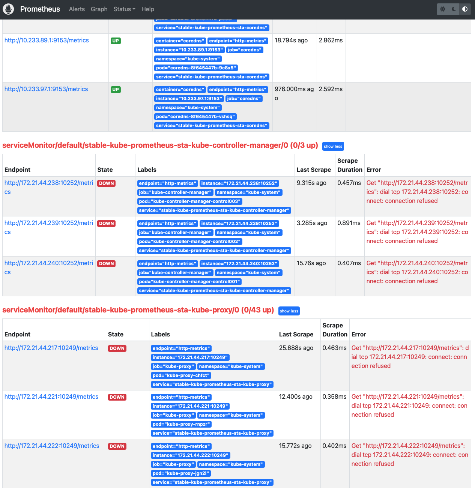

.. _prometheus_metrics_connect_refuse:

=========================================
Prometheus访问监控对象metrics连接被拒绝
=========================================

:ref:`helm3_prometheus_grafana` 后，我发现一个奇怪的现象，在 Prometheus 的 ``Status >> Targets`` 中显示的监控对象基本上都是 ``Down`` 状态的:

   Prometheus 的 ``Status >> Targets`` 中显示的监控对象 ``Down``

这里访问的对象端口:

.. csv-table:: prometheus访问监控对象端口
   :file: prometheus_metrics_connect_refuse/prometheus_metrics_ports.csv
   :widths: 20,30,50
   :header-rows: 1

这里不能访问的监控对象 ``metrics`` 通常是因为组件启用了安全配置，也就是 ``metrics`` 仅在本地回环地址上提供。例如 ``kube-proxy`` 的 ``metric-bind-address`` 配置成 ``127.0.0.1:10249``

``kube-proxy`` 暴露10249端口
=============================

解决方法举例 ``kube-proxy`` ::

   $ kubectl edit cm/kube-proxy -n kube-system
   ## Change from
       metricsBindAddress: 127.0.0.1:10249 ### <--- Too secure
   ## Change to
       metricsBindAddress: 0.0.0.0:10249

   $ kubectl delete pod -l k8s-app=kube-proxy -n kube-system

注意，删除 ``kube-proxy`` 会导致网络短暂断开，所以要迁移容器或者在业务低峰时更新

``scheduler`` 暴露10251端口
==============================

scheduler 监控采集::

   Get "http://172.21.44.238:10251/metrics": dial tcp 172.21.44.238:10251: connect: connection refused

这个问题参考 `Kubernetes 监控平面组件 scheduler controller-manager proxy kubelet etcd <https://blog.csdn.net/qq_34556414/article/details/121451439>`_ 有很好的总结。此外 `Kubectl get componentstatus fails for scheduler and controller-manager <https://forums.rancher.com/t/kubectl-get-componentstatus-fails-for-scheduler-and-controller-manager/15801>`_ 提供了一个很好的思路，就是首先检查 ``componentstatus`` (或者缩写成 ``cs`` ) ; 此外检查 ``kube-apiserver`` 也有帮助:

- 检查 ``componentstatus`` ( ``cs`` ):

.. literalinclude:: prometheus_metrics_connect_refuse/kubectl_get_cs
   :language: bash
   :caption: 执行 ``kubectl get cs`` ( ``componentstatus`` )可以获得监控异常原因

输出显示:

.. literalinclude:: prometheus_metrics_connect_refuse/kubectl_get_cs_output
   :language: bash
   :caption: 执行 ``kubectl get cs`` 输出

可以看到这个K8s集群的 ``controller-manager`` 和 ``scheduler`` 的健康状态都无法获得( ``connection refused`` )

对于 Kubernetes 高版本，例如，我遇到的项目采用了 1.18.10 版本，默认组件配置 ``apiserver`` 允许 ``metrics`` ，但是 ``controller-manager`` 和 ``scheduler`` 则关闭 ``metrics`` 。这个配置在管控服务器的 ``/etc/kubernetes/manifests`` 目录下有如下配置文件::

   kube-apiserver.yaml
   kube-controller-manager.yaml
   kube-scheduler.yaml

这3个文件决定了管控三驾马车的运行特性:

- ``kube-scheduler`` 的 ``HTTP`` 访问 ``--port int`` 默认值是 ``10251`` 。这个配置如果是 ``0`` 则根本不提供HTTP:

.. literalinclude:: prometheus_metrics_connect_refuse/kube-scheduler.yaml
   :language: yaml
   :caption: ``kube-scheduler`` 配置 ``--port=0`` 运行参数则会关闭HTTP访问，也就是无法获取默认的metrics
   :emphasize-lines: 16,19

但是，我直接在管控服务器上修改 ``/etc/kubernetes/manifests/kube-scheduler.yaml`` ::

   ...
   - --port=10251
   ...

但是重建 ``kube-scheduler`` 这个pods之后，发现运行参数还是 ``--port=0`` 。也无法直接修改 ``kubectl -n kube-system edit pods kube-scheduler-control001`` :

.. literalinclude:: prometheus_metrics_connect_refuse/kube-scheduler-control001.yaml
   :language: yaml
   :caption: ``kubectl -n kube-system edit pods kube-scheduler-control001`` 尝试修改配置 ``--port=10251`` 但是提示错误
   :emphasize-lines: 11

提示错误:

.. literalinclude:: prometheus_metrics_connect_refuse/kubectl_edit_pods_kube-scheduler_err
   :caption: ``kubectl -n kube-system edit pods kube-scheduler-control001`` 尝试修改配置 ``--port=10251`` 错误信息返回
   :emphasize-lines: 2

参考
======

- `Kube-Proxy endpoint connection refused #16476 <https://github.com/helm/charts/issues/16476>`_
- `Expose kube-proxy metrics on 0.0.0.0 by default #74300 <https://github.com/kubernetes/kubernetes/pull/74300>`_
- `Kubernetes 监控平面组件 scheduler controller-manager proxy kubelet etcd <https://blog.csdn.net/qq_34556414/article/details/121451439>`_
