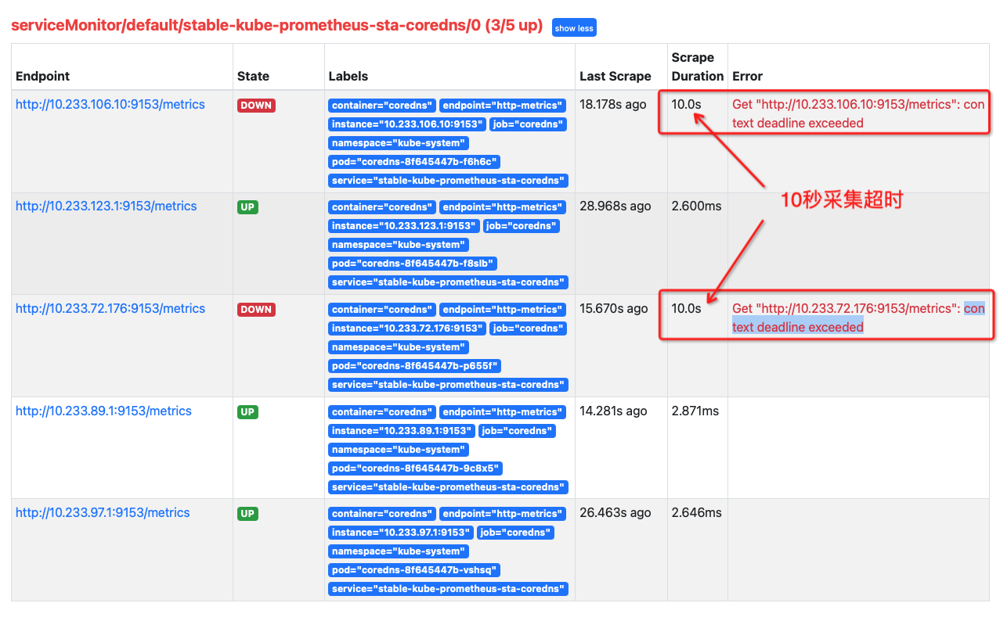
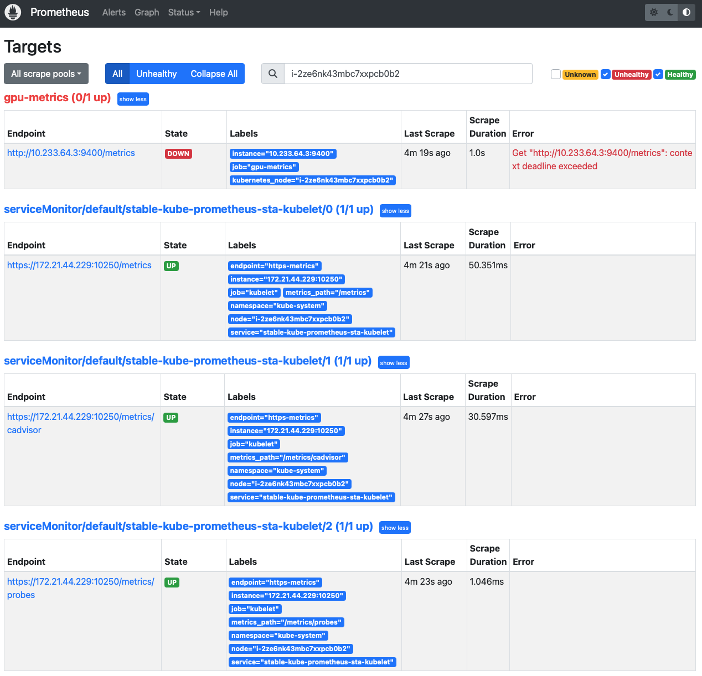

.. _prometheus_metrics_context_deadline_exceeded:

=========================================================
Prometheus监控对象metrics显示"context deadline exceeded"
=========================================================

.. _coredns_context_deadline_exceeded:

:ref:`coredns` "context deadline exceeded"
=============================================

我在排查 :ref:`prometheus_metrics_connect_refuse` 发现有的被监控对象并不是 ``connection refused`` ，而是显示错误 ``context deadline exceeded`` ，例如 :ref:`coredns` :

可以看到这2个 :ref:`coredns` 数据采集超过10秒导致报错

- 检查 :ref:`coredns` 的pods::

   # kubectl -n kube-system get pods -o wide | grep coredns
   coredns-8f645447b-9c8x5                       1/1     Running                 0          59d     10.233.89.1     i-2ze6nk43mbc7xxpcb0as       <none>           <none>
   coredns-8f645447b-f8slb                       1/1     Running                 0          59d     10.233.123.1    i-2ze6nk43mbc7xxpcb0af       <none>           <none>
   coredns-8f645447b-p655f                       1/1     Running                 0          59d     10.233.72.176   control001                   <none>           <none>
   coredns-8f645447b-t4wm5                       1/1     Running                 0          54d     10.233.78.8     control003                   <none>           <none>
   coredns-8f645447b-vshsq                       1/1     Running                 0          59d     10.233.97.1     i-2ze6nk43mbc7xxpcb0ag       <none>           <none>

- 进入异常pods检查metrics:

.. note::

   `How to get into CoreDNS pod kuberrnetes? <https://stackoverflow.com/questions/60666170/how-to-get-into-coredns-pod-kuberrnetes>`_ coredns 的容器没有提供 :ref:`shell` ，所以无法直接使用 ``kubectl exrc`` (实际上也无法使用 :ref:`nsenter` )

   此外，对于 :ref:`containerd` 维护建议采用 :ref:`crictl` 完成，接近于 :ref:`docker` 操作命令以及功能支持

一些探索见 :ref:`crictl` 和 :ref:`crictl_sidecar_debug_container` ，不过我的实践还么有成功。实际当前解决方法还是对比部署差异来解决(因为有一个节点coredns是正确获取了监控信息)

参考 `[EKS] [request]: Add kube-dns service port for metrics #965 <https://github.com/aws/containers-roadmap/issues/965>`_ (AWS的kube-dns)，实际上在coredns中，决定能否被抓取的配置可以检查:

.. literalinclude:: prometheus_metrics_context_deadline_exceeded/svc_coredns
   :language: bash
   :caption: 获取coredns的svc

这里输出信息

.. literalinclude:: prometheus_metrics_context_deadline_exceeded/svc_coredns_output
   :language: bash
   :caption: 获取coredns的svc输出信息

可以看到端口有 ``9153/TCP`` ，对应着 Prometeheus 监控抓取配置(检查yaml):

.. literalinclude:: prometheus_metrics_context_deadline_exceeded/svc_coredns_output_yaml
   :language: bash
   :caption: 获取coredns的svc输出信息yaml详情
   :emphasize-lines: 7,8

晕倒...似乎是 :ref:`coredns` 部署问题，由于不是我部署的系统，尚未摸清解决方法

.. _dcgm-exporter_context_deadline_exceeded:

:ref:`dcgm-exporter` "context deadline exceeded"
==================================================

在完成 :ref:`kube-prometheus-stack_persistent_volume` 调整( :ref:`update_prometheus_config_k8s` )，我发现集群中 ``dcgm-exporter`` 采集不正常。同样的配置在一个集群正常，另外一个集群则出现::

   1.0s
   Get "http://10.233.101.2:9400/metrics": context deadline exceeded

这里由于是局域网内部，默认配置了 ``Scrape Duration`` 是 ``1.0s`` ，超过1秒就认为采集失败。

为什么采集失败呢？

通过 ``kubectl exec`` 登陆到容器内部进行检查，我发现在 ``prometheus`` 容器内部，确实无法访问 ``dcgm-exporter`` 容器的 ``9400`` 端口。并且 ``exec`` 进入 ``dcgm-exporter`` 容器，发现一个非常异常的情况，操作没有几下，就被断开容器网络，此时终端显示输出::

   command terminated with exit code 137

这个 ``exit code 137`` 表示容器被kubernetes杀掉，通常是容器消耗了过多的内存资源。不过，我检查容器状态，发现是 ``health`` 检查没有通过::

   kubectl describe pods dcgm-exporter-1681353332-l4z8w -n nvidia-gpu

显示错误信息::

   Events:
     Type     Reason             Age                   From               Message
     ----     ------             ----                  ----               -------
     Normal   Scheduled          32m                   default-scheduler  Successfully assigned nvidia-gpu/dcgm-exporter-1681353332-l4z8w to i-2ze6nk43mbc7xxpcb0ac
     Normal   Pulled             31m (x2 over 32m)     kubelet            Container image "nvcr.io/nvidia/k8s/dcgm-exporter:2.4.6-2.6.10-ubuntu20.04" already present on machine
     Normal   Created            31m (x2 over 32m)     kubelet            Created container exporter
     Normal   Started            31m (x2 over 32m)     kubelet            Started container exporter
     Warning  Unhealthy          31m                   kubelet            Readiness probe failed: Get http://10.233.91.12:9400/health: dial tcp 10.233.91.12:9400: connect: connection refused
     Warning  Unhealthy          30m (x2 over 31m)     kubelet            Readiness probe failed: HTTP probe failed with statuscode: 503
     Normal   Killing            30m (x2 over 31m)     kubelet            Container exporter failed liveness probe, will be restarted
     Warning  MissingClusterDNS  7m46s (x79 over 32m)  kubelet            pod: "dcgm-exporter-1681353332-l4z8w_nvidia-gpu(b99740e8-7645-4c49-90ef-52ae67bc5be6)". kubelet does not have ClusterDNS IP configured and cannot create Pod using "ClusterFirst" policy. Falling back to "Default" policy.
     Warning  Unhealthy          119s (x91 over 31m)   kubelet            Liveness probe failed: HTTP probe failed with statuscode: 503

我回想了以下 :ref:`update_prometheus_config_k8s` 调整内容，我只调整了 :ref:`kube-prometheus-stack_persistent_nodeselector` 和 :ref:`kube-prometheus-stack_persistent_volume` ，不过，这个 ``kube-prometheus-stack.values`` 配置是从正常集群复制过来处理的，虽然两个集群几乎一样。

再检查了一下 ``dcgm-exporter`` 容器，发现也不是所有容器都有这个重启问题::

    kubectl get pods -A -o wide | grep dcgm

输出显示::

   nvidia-gpu    dcgm-exporter-1681353332-55rnx                           1/1     Running             0          69m     10.233.112.2    i-2ze6nk43mbc7xxpcb0aq   <none>           <none>
   nvidia-gpu    dcgm-exporter-1681353332-5p42m                           1/1     Running             0          69m     10.233.108.2    i-2ze6nk43mbc7xxpcb0ap   <none>           <none>
   nvidia-gpu    dcgm-exporter-1681353332-5tf58                           1/1     Running             0          69m     10.233.75.2     i-2ze6nk43mbc7xxpcb0b4   <none>           <none>
   nvidia-gpu    dcgm-exporter-1681353332-64gf2                           0/1     CrashLoopBackOff    18         69m     10.233.106.13   control002               <none>           <none>
   nvidia-gpu    dcgm-exporter-1681353332-6hc2b                           1/1     Running             0          69m     10.233.113.3    i-2ze6nk43mbc7xxpcb0ah   <none>           <none>
   nvidia-gpu    dcgm-exporter-1681353332-72r6s                           0/1     CrashLoopBackOff    18         69m     10.233.72.180   control001               <none>           <none>
   nvidia-gpu    dcgm-exporter-1681353332-7wljq                           1/1     Running             0          69m     10.233.123.3    i-2ze6nk43mbc7xxpcb0af   <none>           <none>
   nvidia-gpu    dcgm-exporter-1681353332-8v5f7                           1/1     Running             0          69m     10.233.64.2     i-2ze6nk43mbc7xxpcb0b2   <none>           <none>
   ...
   nvidia-gpu    dcgm-exporter-1681353332-l4z8w                           0/1     Running             69         69m     10.233.91.12    i-2ze6nk43mbc7xxpcb0ac   <none>           <none>
   ...
   nvidia-gpu    dcgm-exporter-1681353332-q6b72                           1/1     Running             0          69m     10.233.73.3     i-2ze6nk43mbc7xxpcb0b9   <none>           <none>
   nvidia-gpu    dcgm-exporter-1681353332-qd458                           0/1     Running             72         69m     10.233.93.5     i-2ze6nk43mbc7xxpcb0ad   <none>           <none>
   nvidia-gpu    dcgm-exporter-1681353332-qwzfr                           0/1     ContainerCreating   0          69m     <none>          gpu003                   <none>           <none>

可以看到有些 ``gpu-exporter`` 运行并没有出现重启

那么，来看看 ``dcgm-exporter-1681353332-8v5f7`` (10.233.64.2) 位于 i-2ze6nk43mbc7xxpcb0b2 物理主机上。登陆 ``dcgm-exporter-1681353332-8v5f7``  检查，发现本地检查 ``metrics`` 完全正常，但是 ``prometheus`` 通过网络无法访问

那么是不是 ``i-2ze6nk43mbc7xxpcb0b2`` 服务器上其他容器也有问题呢？检查所有pods::

   # kubectl get pods -o wide -A | grep i-2ze6nk43mbc7xxpcb0b2
   default       nettool-node-mcpb5                                       1/1     Running             0          17d     10.233.72.154   i-2ze6nk43mbc7xxpcb0b2   <none>           <none>
   default       stable-prometheus-node-exporter-mq4gr                    1/1     Running             0          14d     172.21.44.229   i-2ze6nk43mbc7xxpcb0b2   <none>           <none>
   kube-system   calico-node-f7drp                                        1/1     Running             0          18d     172.21.44.229   i-2ze6nk43mbc7xxpcb0b2   <none>           <none>
   kube-system   kube-proxy-xm2kk                                         1/1     Running             0          12d     172.21.44.229   i-2ze6nk43mbc7xxpcb0b2   <none>           <none>
   kube-system   nodelocaldns-62qvs                                       1/1     Running             0          18d     172.21.44.229   i-2ze6nk43mbc7xxpcb0b2   <none>           <none>
   kubemaker     codegpt-6b-tiny-294761-02041681267969-ptjob-worker-11    1/1     Running             0          27h     172.21.44.229   i-2ze6nk43mbc7xxpcb0b2   <none>           <none>
   nvidia-gpu    dcgm-exporter-1681353332-44gfw                           1/1     Running             0          130m    10.233.64.3     i-2ze6nk43mbc7xxpcb0b2   <none>           <none>
   nvidia-gpu    nvidia-device-plugin-phy-fml6h                           1/1     Running             0          18d     172.21.44.229   i-2ze6nk43mbc7xxpcb0b2   <none>           <none>
   nvidia-gpu    rdma-device-plugin-qsjs2                                 1/1     Running             0          18d     172.21.44.229   i-2ze6nk43mbc7xxpcb0b2   <none>           <none>

从 prometheus Targets 页面来年，只有 ``dcgm-exporter`` 这个pod的 ``9400`` 端口无法采集:

乌龙
-------

经过观察日志和对比排查，发现 :ref:`aliyun_starship` 实际上是包装了 :ref:`dcgm-exporter` 的综合性Agent，不能同时运行，否则就会出现上述 :ref:`dcgm-exporter` 不断crash的问题。

参考
======

- `Servicemonitor/monitor/coredns context deadline exceeded #1762 <https://github.com/prometheus-operator/kube-prometheus/issues/1762>`_ 也是coredns的监控超时，但是似乎没有解决
- `Context Deadline Exceeded - prometheus <https://stackoverflow.com/questions/49817558/context-deadline-exceeded-prometheus>`_
- `How to fix exit code 137 <https://www.airplane.dev/blog/exit-code-137>`_
