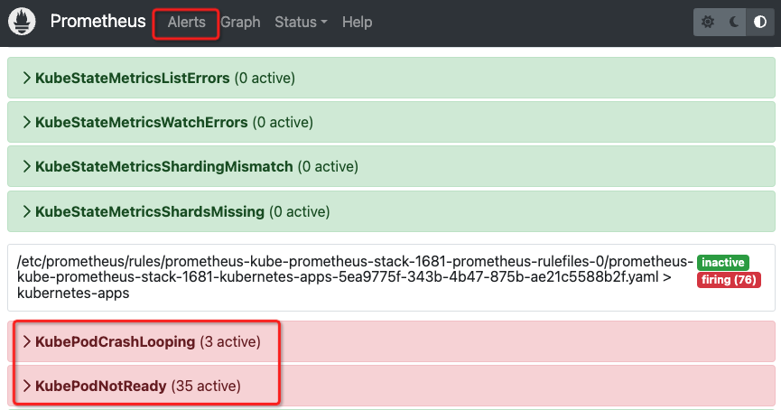

.. _prometheus_alerting_rules:

===============================
Prometheus 告警规则
===============================

Alerting rules可以根据Prometheus表达式定义条件，并将触发的报警通知发送到外部服务。当告警表达式在给定时间点产生一个或多个矢量元素(vector elements)，对于这些元素的标签集，警报(alert)将被使为活动(active)。

定义告警规则
================

- 简单的告警规则案例:

.. literalinclude:: prometheus_alerting_rules/alerting_rules_example.yaml
   :language: yaml
   :caption: 告警规则案例YAML

上述规则中各子句解释说明:

- ``for`` 子句: Prometheus在第一次遇到表达式输出向量元素(expression output vector element)和将该元素作为触发报警的等待时间。也就是说，prometheus会看这个告警是否持续存在，例如上例持续存在10分钟，才会触发报警。出于活动状态但是尚未触发报警的元素出于挂起(pending)状态。
- ``labels`` 子句: 将标签附加到报警上，任何现有冲突的标签都会被覆盖。这个标签值可以模版化
- ``annotations`` 子句: 指定一组信息标签，用于存储更长的附加信息。通常是记录报警的描述以及运行手册等，例如添加一些指导运维人员应急的手册URL链接

模版(Templating)
===================

上述 ``label`` 和 ``annotation`` 值可以采用 :ref:`go_template` 语言实现的 Console templates 来实现: ``$labels`` 变量处理 ``key/value`` 标签对作为告警实例，可以通过 ``$externalLabels`` 变量访问配置的外部标签， ``$value`` 变量保存告警实例的评估值:

- 使用模版的告警案例:

.. literalinclude:: prometheus_alerting_rules/alerting_rules_template_example.yaml
   :language: yaml
   :caption: 使用模版的告警规则案例YAML

在运行时检查告警
====================

如果需要检查哪些告警出于活跃状态( ``pending`` 或 ``firing`` )，可以通过访问 Prometheus WEB页面的 ``Alerts`` 页面，可以看到

   
   Prometheus ``Alerts`` 页面可以看到当前活跃状态告警

当配置了 ``Prometheus`` 的 ``Alert Rules`` 之后，只能在WEB界面看到，要真正发送到用户这里，需要配置 :ref:`alertmanager`

告警通知中的 ``source`` URL地址
=================================

通过 :ref:`alertmanager` 发送出来的告警通知，默认是 Kubernetes 的 SVC 名称，实际上需要修改成用户能够访问的 Prometheus 的外部域名，类似 http://prometheus.cloud-atlas.io/graph 。这个修订是修改 ``prometheus`` 的命令行参数 ``--web.external-url`` : `关于模版中GeneratorURL的定义 #20 <https://github.com/timonwong/prometheus-webhook-dingtalk/issues/20>`_

站在巨人的肩膀上: ``Awesome Prometheus alerts``
==================================================

刚开始配置 :ref:`alertmanager` 时候，如果完全从零开始，初学者会非常迷惘(说的就是我)，因为看到明明 Prometheus Targets 显示有监控对象 ``Unhealthy`` ，但是 ``Alerts`` 中却是一片空白

这个原因就是默认 :ref:`prometheus_startup` 默认配置中没有激活任何 ``rules_files`` (也因为 ``/etc/prometheus`` 目录下 ``rules`` 子目录是空的)，所以在 :ref:`alertmanager_startup` 采用 `Awesome Prometheus alerts <https://samber.github.io/awesome-prometheus-alerts/>`_ 作为起步，可以方便不断按需改进监控告警。

参考
=====

- `Prometheus Configuration: Alerting rules <https://prometheus.io/docs/prometheus/latest/configuration/alerting_rules/>`_
