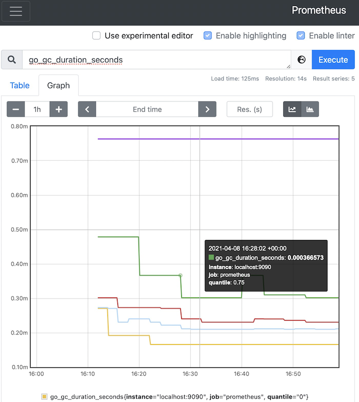

.. _prometheus_startup:

==================
Prometheus快速起步
==================

安装
====

`Prometheus官方网站提供下载 <https://prometheus.io/download/>`_ ，可以获得不同平台 （macOS, Linux, Windows）的版本:

* prometheus
* alertmanager
* 不同的exporter

提供给了二进制程序和 `Prometheus Docker镜像 <https://hub.docker.com/u/prom>`_

ARM环境安装
================

我的实践在 :ref:`arm_k8s` 的 :ref:`raspberry_pi` 主机上完成，所以安装的是 ``arm64`` 版本。

- 下载软件包并解压缩::

   wget https://github.com/prometheus/prometheus/releases/download/v2.26.0/prometheus-2.26.0.linux-arm64.tar.gz
   tar xfz prometheus-2.26.0.linux-arm64.tar.gz
   sudo cp prometheus-2.26.0.linux-arm64/prometheus /usr/local/bin/
   sudo cp prometheus-2.26.0.linux-arm64/promtool /usr/local/bin/

- 检查::

   prometheus --version

.. note::

   Prometheus甚至可以通过 :ref:`homebrew` 安装::

      brew install prometheus

配置
========

在解压缩的Prometheus软件包目录下有一个默认配置文件 ``prometheus.yml`` ，这个初始配置复制到 ``/etc/prometheus`` 目录下然后简单配置就可以启动::

   sudo mkdir -p /etc/prometheus
   sudo cp prometheus.yml /etc/prometheus/

配置
========

在解压缩的Prometheus软件包目录下有一个默认配置文件 ``prometheus.yml`` ，这个初始配置复制到 ``/etc/prometheus`` 目录下然后简单配置就可以启动::

   sudo mkdir -p /etc/prometheus
   sudo cp prometheus.yml /etc/prometheus/

配置
========

在解压缩的Prometheus软件包目录下有一个默认配置文件 ``prometheus.yml`` ，这个初始配置复制到 ``/etc/prometheus`` 目录下然后简单配置就可以启动::

   sudo mkdir -p /etc/prometheus
   sudo cp prometheus.yml /etc/prometheus/

默认配置启动运行在 ``localhost:9090`` 并且只监听本机::

   scrape_configs:
     - job_name: 'prometheus'
       static_configs:
       - targets: ['localhost:9090']

启动::

   prometheus --config.file "/etc/prometheus/prometheus.yml"

如果发生异常，则可以使用 ``prometool`` 工具检查配置文件::

   promtool check config prometheus.yml

Docker运行Prometheus
=======================

官方提供了Prometheus Docker镜像，简单运行以下命令::

   docker run -p 9090:9090 prom/prometheus

不过，上述命令使用默认配置启动，所以需要提供自定义配置和数据存储，所以可以采用如下方法::

   docker run -p 9090:9090 -v /tmp/prometheus.yml:/etc/prometheus/prometheus.yml prom/prometheus

访问Prometheus
=================

请注意，上述简单的实践是将Prometheus启动监听在本地回环地址 ``localhost:9090`` ，所以一般外部就不能访问。这样带来一定的安全保护。

我们可以通过ssh端口转发方式实现远程访问，就是在客户端执行以下命令访问服务器 ``192.168.6.11`` 开启端口转发到服务器的回环地址 ``9090`` 端口::

   ssh -L 9090:127.0.0.1:9090 192.168.6.11

或者配置 ``.ssh/config`` 配置::

   Host prometheus
       HostName 192.168.6.11
       User admin
       LocalForward 9090 127.0.0.1:9090

然后直接执行::

   ssh prometheus

通过ssh认证登陆后，在本地通过浏览器访问 http:://127.0.0.1:9090/graph 就可以看到管理配置界面(访问 http://127.0.0.1:9090 也会重定向到 ``/graph`` 路径)

如果要访问Prometheus服务器自己的metrics，则访问 http://127.0.0.1:9090/metrics

表达式浏览
===========

在表达式(也就是graph的查询栏输入需要查询的指标)，系统会自动匹配最接近的参数

例如，我们查询 ``go_gc_duration_seconds`` 指标，输入后点击 ``Execute`` 按钮执行，就看到:

.. figure:: ../../../_static/kubernetes/monitor/prometheus/prometheus_graph_1.png
   :scale: 50

我们点击 ``Graph`` 面板，就可以看到上述 ``Table`` 表格数据在一段时间，例如1小时以内数据变化趋势:

Prometheus的PromQL提供了非常灵活的表达式语言，允许查询和聚合指标。

一个简单查询所有带有 ``quantile="0.5"`` 标签的追表，则输入::

   {quantile="0.5"}

我们可以看到有很多匹配的metrics:

.. figure:: ../../../_static/kubernetes/monitor/prometheus/prometheus_graph_3.png
   :scale: 50

参考
========

- `How To Install and Configure Prometheus On a Linux Server <https://devopscube.com/install-configure-prometheus-linux/>`_
