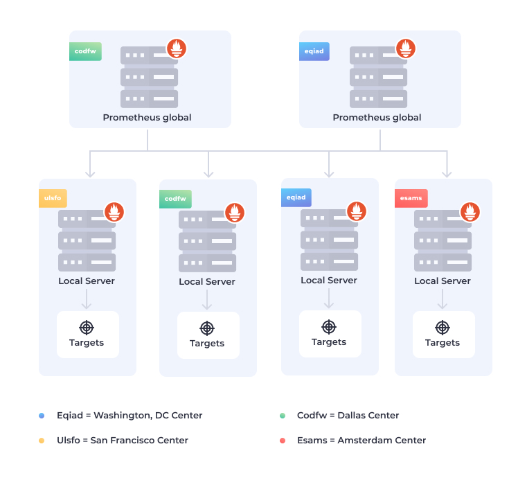
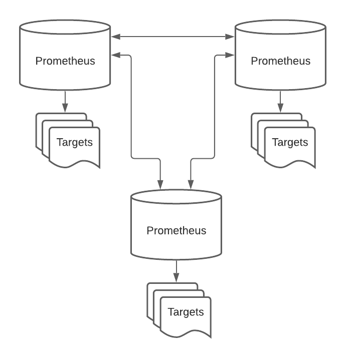

.. _prometheus_federation:

===========================
Prometheus联邦管理模式
===========================

Pormetheus有两种Fedoration模式:

- 层次化联邦(Hierarchical Federation): 每个Prometheus服务器分别从一系列Prometheus抓取数据存储在本地

- 交叉服务联邦(Cross-service federation): 和Hierarchical Federation不同，Cross-service Federation不是将多个Prometheus的数据拉取到单一高层服务器，而是同级别(sibling) Prometheus服务器拉取时序metrics，也就是所有服务器的数据都是一样的(兄弟么)，所以你就可以从任何一台Prometheus服务器查询所有数据

上述两种模式的 Prometheus Federation 都可以帮助解决分布式查询问题，并且分片式 Prometheus 特别有用:
单个Prometheus实例可以从一千台服务器(1k)抓取数据，对于超大规模集群，可以设置多个Prometheus服务器，每个服务器从集群子集抓取指标，然后设置一个中心Prometheus从各个分片Prometheus抓取数据并聚合。可以通过优化(微调)过的记录规则来使得父级Prometheus创建一个减少基数的时间序列进行抓取。

.. note::

   中心Prometheus对存储是一个巨大的挑战

Prometheus联邦管理案例
=======================

常见的Prometheus大规模解决方案是采用 层次化联邦(Hierarchical Federation):

- 每个级别仅从其下方的服务器中抓取聚合时间序列数据: 例如，每个集群中部署Prometheus分别负责自己集群的Pod数据抓取
- 在这些集群之上，部署一个上层Prometheus服务器负责从每个集群级别的Prometheus收集聚合指标
- 在集群级别，需要将Kubernetes元数据附加到每个Prometheus样本上，例如Pod标签或节点名称，这样聚合的时候能够区分所在集群以及服务器
- 注意: 将元数据添加到每个样本会增加Prometheus标签的基数从而增加Prometheus存储的时间序列的数量

参考
========

- `Prometheus federation <https://prometheus.io/docs/prometheus/latest/federation/>`_
